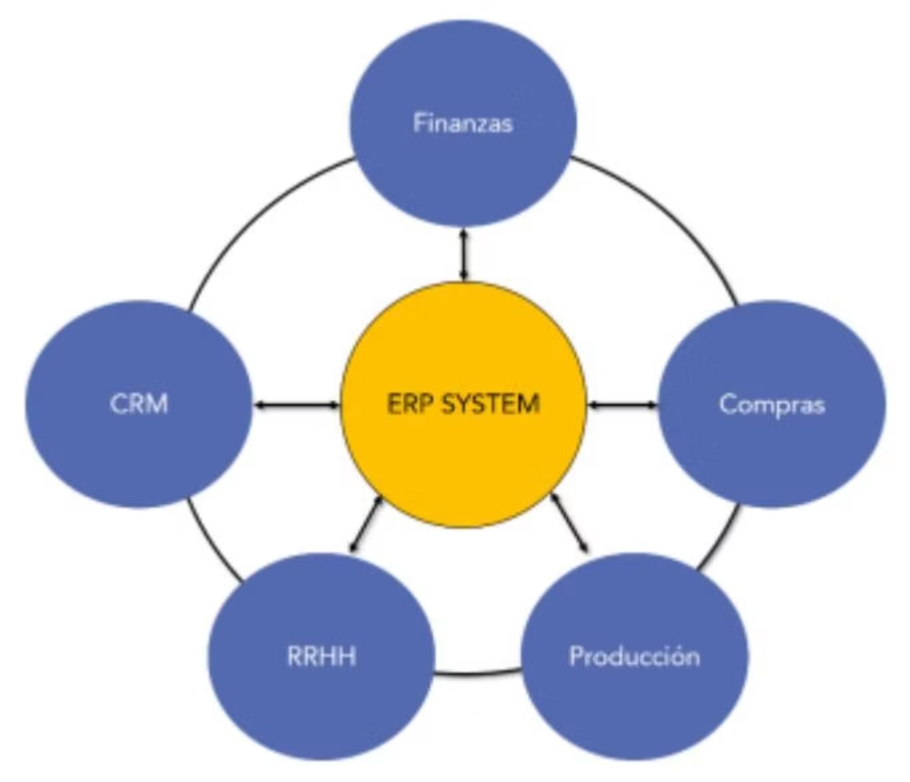
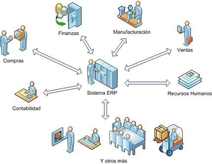
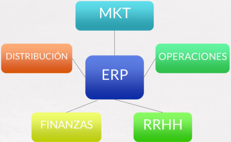
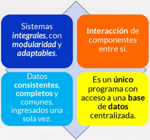
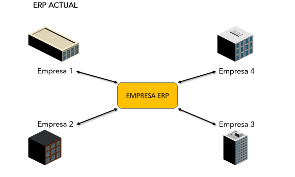
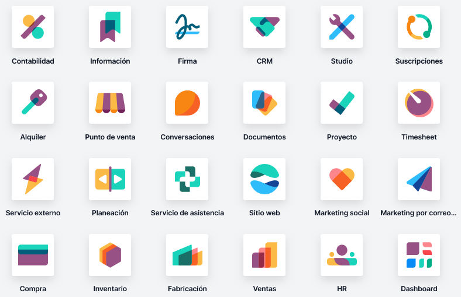
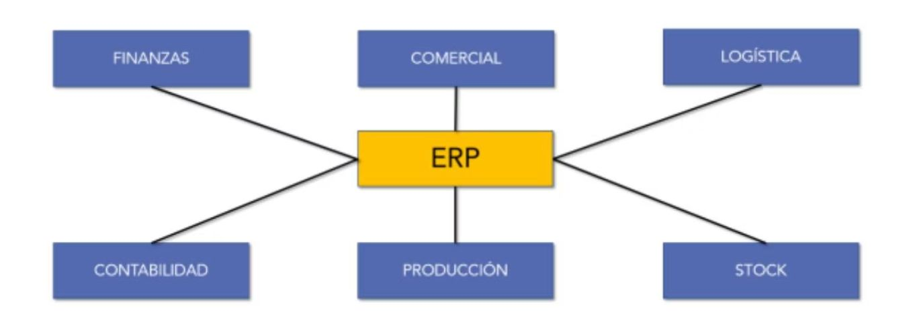
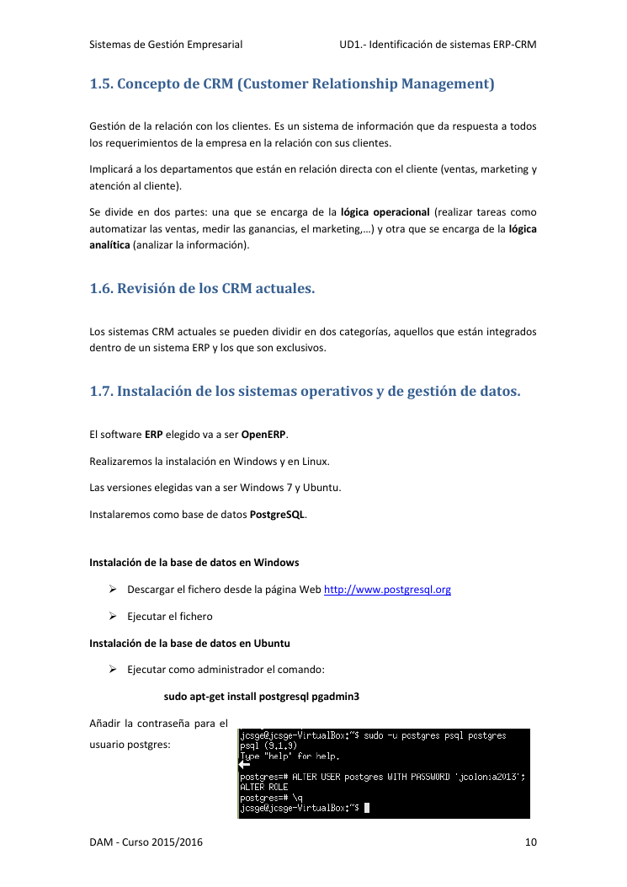

# UT1 — Identificación de sistemas ERP-CRM-BI

## Índice

1. [Concepto de ERP (Sistemas de planificación de recursos empresariales)](#1-concepto-de-erp-sistemas-de-planificacion-de-recursos-empresariales)
2. [Revisión de los ERP actuales](#2-revision-de-los-erp-actuales)
3. [Concepto de CRM (Sistemas de gestión de relaciones con clientes)](#3-concepto-de-crm-sistemas-de-gestion-de-relaciones-con-clientes)
4. [Revisión de los CRM actuales](#4-revision-de-los-crm-actuales)
5. [Tipos de licencias de los ERP-CRM](#5-tipos-de-licencias-de-los-erp-crm)
6. [Sistemas gestores de bases de datos compatibles con el software](#6-sistemas-gestores-de-bases-de-datos-compatibles-con-el-software)
7. [Instalación y configuración del sistema informático](#7-instalacion-y-configuracion-del-sistema-informatico)
8. [Verificación de la instalación y configuración de los sistemas operativos y de gestión de datos](#8-verificacion-de-la-instalacion-y-configuracion-de-los-sistemas-operativos-y-de-gestion-de-datos)
9. [Documentación de las operaciones realizadas](#9-documentacion-de-las-operaciones-realizadas)
10. [Glosario rápido](#glosario-rapido)
11. [Preguntas de repaso](#preguntas-de-repaso)

## Panorama de la unidad

Cualquier empresa que quiera funcionar con orden necesita, además de una infraestructura de hardware y de comunicaciones, un software específico para la gestión empresarial. Durante décadas ese software fue un conjunto de programas separados: uno para la contabilidad, otro para la facturación, otro para la gestión comercial, otro para las nóminas, otro para la relación con los clientes. Cada programa guardaba sus propios datos, con la consiguiente repetición de información y la dificultad de que las cifras cuadraran entre unas aplicaciones y otras. La tendencia actual es integrar todas esas piezas en un único sistema. A ese tipo de software se le llama **ERP**, y a dos de sus complementos habituales, **CRM** y **BI**.

Esta primera unidad se centra en **reconocer, describir y comparar** esos sistemas antes de instalarlos o programar sobre ellos. Se estudia qué es un ERP y qué es un CRM, cómo han evolucionado, qué grandes productos existen en el mercado (SAP, Oracle, Microsoft Dynamics, OpenBravo, Odoo, Dolibarr…), qué modelos de **licencia** utilizan (privativa frente a libre, pago por licencia frente a pago por uso), sobre qué **sistemas gestores de bases de datos** se apoyan y qué hace falta a nivel de **sistema operativo e infraestructura** para ponerlos en marcha. También se revisan las **ventajas, los inconvenientes y los retos** de implantar uno de estos sistemas, porque esa decisión afecta a toda la organización y no solo al departamento de informática.

La programación describe la unidad como una introducción a aspectos de los ERP tales como el software libre y los tipos de licencia, seguida de la instalación y configuración de dos sistemas concretos, una aproximación a la asistencia técnica remota para dar soporte a equipos alejados físicamente y una primera toma de contacto con herramientas de programación de utilidad.

Un apunte sobre el nombre: la carpeta de material se titula «Identificación de sistemas ERP-CRM-**BI**», mientras que el índice de referencia de la unidad la nombra «Identificación de sistemas ERP-CRM» y no incluye una viñeta propia de *Business Intelligence*. El material sí trata el BI como parte natural de estos sistemas, de modo que aquí se explica dentro de los apartados de concepto, pero el esqueleto del resumen sigue ese índice de referencia.

> **En las noticias — factura electrónica obligatoria en España.** Entre 2025 y 2026 se está desplegando en España la obligación (ley «Crea y Crece» y el reglamento antifraude, con sistemas como Verifactu de la Agencia Tributaria y TicketBAI en el País Vasco) de emitir facturas con software que garantice su integridad y trazabilidad. Según se ha informado, esto está empujando a muchas pequeñas empresas y personas autónomas a adoptar por primera vez un programa de gestión o un ERP en la nube. Es un ejemplo actual de por qué la visión general de esta unidad importa: a menudo la normativa acaba condicionando qué software de gestión usa una empresa.

## ¿Qué vamos a aprender?

Esta unidad trabaja la identificación de sistemas de planificación de recursos empresariales y de gestión de relaciones con clientes (ERP-CRM), reconociendo sus características y verificando la configuración del sistema informático.

En términos llanos, esto supone lo siguiente:

- Se reconocen los distintos sistemas ERP-CRM que existen en el mercado y se sabe situarlos (quién los desarrolla, para qué tamaño de empresa, con qué filosofía).
- Se identifican los tipos de licencia de esos sistemas (privativa frente a libre; pago por licencia frente a pago por uso).
- Se comparan sistemas ERP-CRM en función de sus características y sus requisitos.
- Se identifica el sistema operativo adecuado a cada sistema ERP-CRM.
- Se identifica el sistema gestor de datos adecuado a cada sistema ERP-CRM.
- Se verifican las configuraciones del sistema operativo y del gestor de datos para garantizar que el ERP-CRM funciona.
- Se documentan las operaciones realizadas.
- Se documentan las incidencias que aparecen durante el proceso.

---

## 1. Concepto de ERP (Sistemas de planificación de recursos empresariales)

**ERP** son las siglas de *Enterprise Resource Planning*, que se traduce literalmente como «sistema de planificación de recursos empresariales». En la práctica puede entenderse como un **programa de gestión empresarial integrada**: una sola aplicación que reúne elementos comunes a casi cualquier empresa —contabilidad, ventas, compras, recursos humanos, clientes, producción, logística, inventario— y los mantiene sobre una **base de datos centralizada**.

Su función principal es **unificar y ordenar toda la información de la empresa en un mismo lugar**. Un rasgo técnico decisivo es que **los datos se introducen una sola vez**: cuando el departamento comercial registra un pedido, ese mismo dato queda disponible para almacén, para facturación y para contabilidad sin volver a teclearlo. Así se reduce la redundancia, se evitan discrepancias entre aplicaciones y se acelera el flujo de información entre áreas.

El ERP utiliza una **arquitectura modular**: cada módulo se ocupa de un área concreta (comercial, producción, logística, finanzas, stock, contabilidad, recursos humanos, gestión de proyectos, pedidos, nóminas…). Los módulos comparten información entre sí a través de la base de datos común. Es habitual que cada módulo incorpore su propia lógica y herramientas para su funcionalidad específica.

*Figura: la arquitectura modular vista como un núcleo ERP rodeado de módulos que intercambian datos con él. Origen: `1_ERP_CRM_BI.pptx.pdf`.*

*Figura: representación clásica de un ERP como núcleo que recibe y entrega información a todos los departamentos de la empresa. Origen: `ApuntesU1SGE.pdf` (aparece también en `T01. Identificación de sistemas ERP-CRM-BI (1).pdf`).*

*Figura: otra forma de dibujar lo mismo. El ERP es el punto común al que se conectan marketing, distribución, operaciones, finanzas y recursos humanos. Origen: `Introduccion_a_sistemas_erp-crm.pdf`.*

### Las tres características que definen un ERP

El material insiste en tres propiedades que distinguen a un sistema de gestión empresarial integrada:

- **Integración.** El ERP abarca la mayoría de las áreas de la empresa y las trata como partes que se relacionan entre sí. Los datos se ingresan una sola vez y forman una base de datos centralizada que alimenta a todos los módulos.
- **Modularidad.** Cada módulo se corresponde con un área funcional. Se pueden activar los módulos que la empresa necesita e ir añadiendo otros más adelante. Los módulos comparten información gracias a la base de datos común.
- **Adaptabilidad.** La combinación de integración y modularidad permite ajustar el sistema a las necesidades de cada empresa. A veces, para abaratar costes, se hace el camino inverso: se adopta una solución genérica y se modifican algunos procesos de la empresa para alinearlos con el ERP.

*Figura: resumen visual de las características clave de un ERP. Origen: `1_ERP_CRM_BI.pptx.pdf` (idéntico en `Introduccion_a_sistemas_erp-crm.pdf`).*

Los objetivos que persigue un ERP, según el material, son la **optimización de los procesos empresariales**, el **acceso a toda la información de forma fiable, precisa y oportuna** (integridad de datos), la **posibilidad de compartir información** entre todos los componentes de la organización y la **eliminación de datos y operaciones innecesarias**.

### De MRP a ERP: un poco de historia

Los antecedentes de los ERP se remontan a la Segunda Guerra Mundial, cuando el gobierno de Estados Unidos trató de controlar la logística bélica con programas especializados. De ahí surgieron los primeros sistemas de planificación de requerimientos de materiales (*Material Requirements Planning*, **MRP**). A finales de los años 50, las compañías estadounidenses vieron que esos sistemas MRP servían también para controlar facturación y pagos, nóminas e inventario, aunque los ordenadores de la época eran muy limitados. Durante los años 60 y 70 los MRP evolucionaron y ayudaron a reducir costes de inventario.

En los años 80 pasaron a llamarse **MRP II** o planificación de los recursos de manufactura (*Manufacturing Resource Planning*), con una gestión que iba más allá de la disponibilidad de materiales. A principios de los años 90, el MRP II se amplió a áreas como recursos humanos, finanzas, ingeniería o gestión de proyectos, y esa ampliación es la que dio lugar al **ERP** tal como se conoce hoy.

Conviene situar también el ERP dentro de la evolución de la informática de gestión: sistemas de procesamiento de transacciones (almacenan, modifican y recuperan información sobre las transacciones de la empresa), sistemas de automatización de oficinas (procesadores de texto, hojas de cálculo, correo…), **sistemas de planificación de recursos (ERP)** y sistemas expertos (aplicaciones que emulan el conocimiento de un experto, dentro de la inteligencia artificial).

### Qué necesita gestionar un ERP actual

El material enumera los procesos que un ERP moderno debe cubrir, y que suelen aparecer con sus siglas en inglés:

- **Comercio electrónico.**
- **Gestión de clientes (CRM,** *Customer Relationship Management***).**
- **Gestión de la cadena de suministro (SCM,** *Supply Chain Management***).**
- **Gestión de relaciones con proveedores (SRM,** *Supplier Relationship Management***).**
- **Inteligencia de negocio (BI,** *Business Intelligence***).**
- **Base de conocimiento (KM,** *Knowledge Management***).**
- **Gestión de relaciones con socios (PRM,** *Partner Relationship Management***).**
- **Ciclo de vida del producto (PLM,** *Product Lifecycle Management***).**

(Una de las fuentes escribe la cadena de suministro como «CSM»; el resto y el uso habitual es **SCM**.)

### Por qué el ERP, el CRM y el BI van juntos

Por sus características, el CRM y el BI han sido **complementos naturales del ERP**. Hoy la mayoría de los sistemas ERP integran ambos, y además incorporan sistemas de *plugins* modulares para ampliarse de muchas formas. Por eso es frecuente llamar «Sistemas ERP», sin más, a soluciones que en realidad incluyen las partes de ERP, de CRM y de BI. En este resumen se sigue esa convención salvo cuando interese distinguir.

Los dos elementos técnicos más importantes en la estructura de un ERP-CRM son una **base de datos relacional** y una **arquitectura cliente-servidor**. En ese modelo, los clientes solicitan servicios al servidor cuando no pueden realizarlos por sí mismos, típicamente consultas a la base de datos, y se comunican con él a través de la red corporativa o de Internet. El servidor administra el acceso a la base de datos compartida y a los periféricos.

*Figura: un ERP también facilita el flujo de información entre empresas relacionadas (clientes, proveedores, socios), aumentando la colaboración entre ellas. Origen: `T01. Identificación de sistemas ERP-CRM-BI (1).pdf`.*

> **Ejemplo actual — un pedido que recorre la empresa una sola vez.** El propio material describe el circuito: mantenimiento genera una solicitud de compra de un repuesto; pasa por una ruta de aprobación (compras, jefatura…); al autorizarse, el sistema envía el pedido al proveedor; el proveedor entrega en almacén, que registra en el ERP un número de confirmación y da entrada al inventario; con ese número, el proveedor solicita el pago y finanzas tiene constancia de que el producto ya se recibió. En un conjunto de programas separados, cada uno de esos pasos exigiría volver a introducir los datos; en un ERP, el dato viaja solo.

### Ideas clave de esta sección

- Un ERP es un único programa de gestión integrada sobre una base de datos centralizada; el dato se introduce una vez y sirve a todos los módulos.
- Sus tres rasgos definitorios son integración, modularidad y adaptabilidad.
- Procede de la evolución MRP → MRP II → ERP a lo largo de la segunda mitad del siglo XX.
- Un ERP actual cubre además comercio electrónico, CRM, SCM, SRM, BI, KM, PRM y PLM.
- Técnicamente se apoya en una base de datos relacional y en una arquitectura cliente-servidor.

## 2. Revisión de los ERP actuales

El número de soluciones ERP en el mercado es enorme, y una primera clasificación las separa entre **propietarias** (requieren pagar una licencia para usarlas) y de **software libre u** *open source*. El material señala que el mercado global está dominado por **SAP, Oracle y Microsoft**, y que en España han tenido peso soluciones como **Navision** y **Axapta**, diseñadas en Dinamarca para un tejido empresarial similar al español. La mayoría de los proveedores han optado tradicionalmente por la plataforma **Windows** para desarrollar sus ERP, aunque **Linux** ha ido ganando terreno, sobre todo en grandes empresas con capacidad para probar varias plataformas. A ello se suma la modalidad **SaaS** (*software como servicio*), compatible tanto con ERP propietarios como *open source*, que consiste en dar acceso al software a través de la red.

### ERP propietarios

- **SAP.** Creado en Alemania en los años 70. Es el líder por ventas de soluciones ERP y ofrece productos según el tamaño y el tipo de empresa:
  - **SAP Business Suite:** para medianas y grandes empresas; apoya procesos de finanzas, fabricación, aprovisionamiento, ventas, servicio, gestión de la cadena de suministro y recursos humanos; permite interconexión con otro software SAP o de otros proveedores.
  - **SAP Business One:** para la pequeña empresa; incluye contabilidad y finanzas, gestión de almacén y producción, relaciones con el cliente, compras y operaciones e informes; destaca por su rapidez de implantación.
  - **SAP Business All-in-One:** arquitectura modular que el cliente adapta a sus necesidades; incorpora como base ERP, CRM y BI, funcionalidades específicas del sector y la tecnología **SAP NetWeaver**.
  - **SAP Business ByDesign:** orientado a la gestión basada en aplicaciones *online* (nube); incluye contabilidad y finanzas, recursos humanos, CRM y ERP.
- **Oracle.** Nace a finales de los años 70 con productos de bases de datos, sector en el que se convirtió en líder. En 2005 cambió de estrategia y adquirió empresas de sistemas empresariales competidoras de SAP. Desde entonces, **SAP y Oracle son las dos compañías que más facturan** en el entorno ERP. Su producto integral es **JD Edwards Enterprise One**, con la lógica necesaria para la gestión integral de la empresa; también ofrece soluciones individuales de ERP, CRM y BI.
- **Microsoft.** En 2001 creó una línea de negocio orientada a la gestión empresarial. Su software de ERP es **Microsoft Dynamics**, con **Dynamics NAV** (Navision) para dar soporte a empresas medianas.

### ERP de software libre / código abierto

- **OpenBravo.** Desarrollado en España en los años 90; el material lo describe como el único ERP con origen español que ha logrado una gran implantación mundial. Orientó su interfaz a **navegadores web** en lugar de a clientes de escritorio. Se organiza en dos proyectos: uno de la comunidad con licencia libre (**OpenBravo Public License**) y otro propietario; para el soporte y las características avanzadas se necesita licencia comercial. Módulos principales: ventas, compras, proyectos, CRM, además de numerosos módulos de pago. Su arquitectura cliente permite la integración con otros productos *open source*. Incluye **OpenBravo POS**, un software de punto de venta para empresas hoteleras o comerciales que se integra con el ERP.
- **Odoo** (antes **OpenERP**). Nace como proyecto *open source* alternativo a los grandes sistemas como SAP, y destaca por su flexibilidad y su capacidad de adaptación. Integra multitud de aplicaciones o módulos: Ventas y Compras, CRM, Gestión de Proyectos, Gestión de Almacenes, Manufactura, Contabilidad (financiera y analítica), Puntos de Venta, Gestión de Activos, Recursos Humanos, Inventario, Soporte Técnico, Marketing Digital y automatización de flujos de trabajo, más un ecosistema de aplicaciones complementarias bajo licencias libres (**AGPL**) o comerciales. Su punto fuerte es la enorme cantidad de módulos comunitarios y oficiales. Arquitectura **cliente-servidor**: el servidor está escrito en **Python** y es donde se construyen y personalizan los módulos; el cliente usa servicios web (**XML-RPC** y, más adelante, **JSON-RPC**) para comunicarse con el servidor, y ofrece tanto interfaz web como integraciones con otros sistemas. Desde la versión 6 (aún como OpenERP) existe la opción en la nube; hoy se concreta en **Odoo Online (SaaS)** y **Odoo.sh**, junto con la instalación local (*on-premise*). Se distribuye en dos ediciones: **Enterprise** (requiere licencia) y **Community** (código abierto), con pago por usuario y por módulo en la edición de pago. El material lo toma como ERP de trabajo de referencia.
- **Dolibarr.** Aparece citado como otro ERP-CRM de software libre / código abierto, junto a Odoo y OpenBravo.

*Figura: catálogo de módulos de Odoo. Cada icono es un área funcional que se activa o no según la empresa; ilustra la idea de modularidad. Origen: `Introduccion_a_sistemas_erp-crm.pdf` (también en `1_ERP_CRM_BI.pptx.pdf`).*

*Figura: esquema de bloques de un ERP y sus áreas funcionales típicas. Origen: `1_ERP_CRM_BI.pptx.pdf`.*

### Comparativa OpenBravo frente a OpenERP (Odoo)

El material recoge esta tabla comparativa, útil como ejemplo de cómo se contrastan dos ERP:

| Aspecto | OpenBravo | OpenERP (Odoo) |
| --- | --- | --- |
| Tecnología | Java, JavaScript, SQL, PL/SQL, XML, XHTML | Python, SQL y PL/SQL, XML |
| Arquitectura | WAD, Application Dictionary, MDD, MVC | MVC, servidor de base de datos **PostgreSQL**, servidor de aplicaciones, cliente Open Object web |
| Licencia | Mozilla con cláusulas | GPL |
| Cliente | Solo web | Web y aplicación de escritorio |
| Rendimiento | Menor | Mayor |
| Personalización | Complicada | Sencilla |

### Factores para elegir un ERP

Según el material, al escoger un ERP conviene valorar que:

- Dé soporte a **todas las áreas** que la empresa necesita.
- Use **estándares** establecidos y sea fácil de usar.
- Tenga un proceso de **migración y adaptación** fácil y rápido.
- Permita la **integración** con sistemas de otros proveedores.
- Proporcione **informes y análisis**.
- Sea **seguro**.
- Permita **aprovechar el hardware y el software** que la empresa ya tiene.
- Sea compatible con el **sistema operativo** disponible y con las **bases de datos** obligatorias en la implantación.
- Cuente con una empresa de **reputación** solvente detrás.
- Tenga un **método y un tiempo de formación** asumibles.
- Ofrezca **garantía, actualizaciones y servicio de soporte**.

> **En las noticias — fin de soporte de SAP ECC y migración a S/4HANA.** SAP ha fijado el fin del mantenimiento estándar de su ERP clásico (Business Suite 7 / ECC) para 2027, con soporte extendido de pago hasta 2030. Según se ha informado, esto ha generado una gran ola de proyectos de migración a **SAP S/4HANA** y al modelo «RISE with SAP» en la nube. Es un caso real del factor «garantía, actualizaciones y soporte» de la lista anterior: el calendario del fabricante obliga a miles de empresas a planificar un cambio costoso.

> **Ejemplo actual — Odoo como alternativa consolidada.** En los últimos años Odoo ha crecido con fuerza entre pymes: publica una versión anual (Odoo 17 en 2023, Odoo 18 en 2024) y, según se informó, alcanzó una valoración de varios miles de millones de euros tras rondas de inversión en 2023. Ilustra bien la categoría de «ERP *open source* con edición Community gratuita y edición Enterprise de pago» descrita en el material.

### Ideas clave de esta sección

- El mercado se reparte entre ERP propietarios (SAP, Oracle, Microsoft) y ERP libres (OpenBravo, Odoo, Dolibarr).
- SAP ofrece distintos productos según el tamaño de empresa; Oracle gira en torno a JD Edwards Enterprise One; Microsoft, en torno a Dynamics.
- OpenBravo tiene origen español e interfaz web; Odoo destaca por su enorme catálogo de módulos y su servidor en Python.
- La elección de un ERP combina criterios funcionales, técnicos (SO, base de datos), económicos y de soporte.

## 3. Concepto de CRM (Sistemas de gestión de relaciones con clientes)

**CRM** son las siglas de *Customer Relationship Management*, «gestión de la relación con los clientes». Es un sistema de información que da respuesta a las necesidades de la empresa en su trato con los clientes actuales y potenciales. Automatiza procesos como la **gestión de los datos de clientes**, la **gestión y el seguimiento de ventas** y la **gestión y el seguimiento de campañas**. Implica sobre todo a los departamentos que tratan directamente con el cliente: **ventas, marketing y atención al cliente**.

El material distingue en un CRM **dos partes**:

- **Lógica operacional:** ejecuta tareas como automatizar las ventas, medir ganancias o llevar el marketing.
- **Lógica analítica:** analiza la información acumulada para extraer conocimiento útil.

### Características de un CRM

- Ayuda a **tomar decisiones en tiempo real** y a aumentar la rentabilidad de cada cliente, porque obtiene información útil a partir de datos complejos: identifica con facilidad a los clientes que compran y a los que no muestran interés, y permite actuar en consecuencia.
- Exige que **todos los sistemas estén integrados** y que la base de datos de clientes esté **unificada**. Así el CRM recoge información de áreas como la comercial, la financiera, la administración de ventas o las operaciones, y a su vez alimenta a la dirección comercial, el marketing y la administración de ventas, generando informes de actividad.
- **Fomenta relaciones a largo plazo** con los clientes y transforma la forma de vender, aprovechando cada oportunidad.
- **Reduce la longitud de los ciclos de venta** y ayuda en las decisiones de inversión.
- Permite que **el propio usuario haga adaptaciones sin necesidad de cambiar el código fuente**.

### Ventajas e inconvenientes de un CRM

Ventajas que persigue:

- Reducir costes y mejorar las ofertas.
- Identificar a los clientes potenciales que más beneficio generan.
- Mejorar la información y el servicio al cliente.
- Personalizar y optimizar los procesos.
- Aumentar la cuota de gasto de los clientes y localizar nuevas oportunidades de negocio.
- Aumentar la retención de clientes e incrementar las ventas.

El material advierte de que el éxito de un proyecto CRM no es solo tecnológico. Depende de cuatro factores estratégicos: **estrategia** (alineada con las necesidades y la estrategia corporativa), **personas** (formación del personal y comunicación interna; toda la organización debe orientarse al cliente), **procesos** (redefinir los procesos de negocio para mejorar la relación con los clientes) y **tecnología** (la solución dependerá de las necesidades y de los recursos disponibles). En resumen, implantar un CRM supone un **esfuerzo económico importante y un rediseño de los procesos de negocio** vigentes.

### Ideas clave de esta sección

- Un CRM gestiona toda la relación de la empresa con sus clientes, sobre todo desde ventas, marketing y atención al cliente.
- Tiene una parte operacional (ejecuta y automatiza) y una parte analítica (extrae conocimiento).
- Necesita una base de datos de clientes unificada e integrada con el resto de sistemas.
- Su éxito depende tanto de la tecnología como de la estrategia, las personas y los procesos.

## 4. Revisión de los CRM actuales

El material trata este punto de forma breve. Ofrece dos clasificaciones complementarias.

Por su **relación con el ERP**, los CRM actuales se dividen en:

- Los que están **integrados dentro de un sistema ERP** (un módulo más del ERP).
- Los que son **exclusivos**, es decir, productos independientes especializados solo en la relación con el cliente.

Por su **tipo de funcionalidad**, los sistemas globales de CRM se dividen en:

- **Aplicaciones electrónicas para los canales de distribución:** dan a los canales herramientas para coordinar y mejorar su relación con los clientes.
- **Centros de atención telefónica (*call centres*):** ayuda telefónica para resolver problemas y dudas.
- **Autoservicio hacia los clientes:** el propio cliente gestiona sus requerimientos.
- **Gestión electrónica de las actividades que afectan a clientes y ventas:** proporciona información para conocer mejor las necesidades del cliente.

Los grandes ERP revisados en la sección 2 incluyen su propio módulo de CRM (SAP, Oracle, Microsoft Dynamics, OpenBravo, Odoo), de acuerdo con la primera clasificación.

> **Ejemplo actual — CRM independientes muy conocidos.** Fuera del mundo ERP, los CRM «exclusivos» más reconocibles hoy son **Salesforce** (líder del CRM en la nube), **HubSpot** (con una versión gratuita muy usada por pymes) y **Zoho CRM**. Encajan en la categoría de «CRM exclusivos» que describe el material, frente al «CRM como módulo del ERP» de Odoo o SAP.

> **En las noticias — asistentes de IA dentro del CRM.** Desde 2023-2024, los principales fabricantes han incorporado asistentes de inteligencia artificial generativa a sus CRM: Salesforce con Einstein/Agentforce, Microsoft con Copilot en Dynamics 365 y HubSpot con sus funciones de IA. Según se ha informado, el objetivo es redactar correos, resumir conversaciones con clientes y priorizar oportunidades de venta automáticamente. Es una evolución directa de la «lógica analítica» del CRM descrita en la sección anterior.

### Ideas clave de esta sección

- Los CRM actuales pueden venir integrados en un ERP o ser productos exclusivos e independientes.
- Por funcionalidad se distinguen aplicaciones para canales de distribución, *call centres*, autoservicio del cliente y gestión electrónica de actividades de venta.
- El material desarrolla poco este punto; la revisión detallada de productos concretos se apoya en los ERP de la sección 2 y en ejemplos de CRM independientes.

## 5. Tipos de licencias de los ERP-CRM

Al elegir un ERP-CRM existente, un aspecto central es la **licencia de software** con la que se distribuye. El material lo plantea como una disyuntiva entre licencia **privativa (cerrada)** y licencia **libre**, y añade la distinción entre **pagar por licencia** y **pagar por uso**.

### Licencia privativa frente a licencia libre

- **Licencia privativa o cerrada.** El código no está disponible y el uso depende de una única empresa. Esto genera **dependencia del desarrollador**, con riesgos asociados: cambios de tarifas, cierre de la empresa proveedora, trabas para migrar a otro sistema. Ejemplos de ERP con licencia privativa citados en el material: SAP, Microsoft (Dynamics), **Solmicro**, JD Edwards de Oracle, Microsoft Dynamics NAV (Navision).
- **Licencia libre.** El código está disponible y varias empresas pueden desarrollar y dar soporte para el mismo ERP. Esto reduce la dependencia de un proveedor concreto: si una empresa deja el proyecto, otra (o la propia organización) puede continuar. Ejemplos de ERP con licencia libre o gratuita citados en el material: **Dolibarr**, **Odoo**, **OpenBravo**.

El material recomienda, con carácter general, **implantar ERP con licencia libre**, y advierte de que, si se opta por una licencia privativa, hay que **estudiar y evaluar a conciencia los riesgos** de depender de un software vinculado a una sola empresa.

Sobre las licencias libres concretas que aparecen en el material:

- **GPL** (*General Public License*): licencia con la que se distribuye OpenERP/Odoo en la comparativa recogida.
- **AGPL** (*Affero GPL*): licencia bajo la que Odoo distribuye buena parte de su ecosistema de módulos, como alternativa a las licencias comerciales.
- **OpenBravo Public License**: licencia propia del proyecto comunitario de OpenBravo.
- **Mozilla con cláusulas**: licencia atribuida a OpenBravo en la tabla comparativa.

(El material no ofrece una enumeración cerrada y sistemática de todas las familias de licencias; las anteriores son las que aparecen citadas al hablar de productos concretos.)

### Pagar por licencia frente a pagar por uso (nube)

Tradicionalmente los ERP se han alojado en las instalaciones de la organización que compra las licencias de la aplicación, un modelo llamado **on-premise** (y, en menor grado, *in-house*). Con la llegada del *cloud computing* han aparecido modelos de servicio que conviven con el tradicional:

- **IaaS** (*Infrastructure as a Service*): se contrata solo la infraestructura (proceso, almacenamiento, comunicaciones); el usuario instala encima sus sistemas operativos y aplicaciones y tiene control total sobre ellos, pero ninguno sobre la infraestructura.
- **PaaS** (*Platform as a Service*): se contrata una plataforma con herramientas de desarrollo para alojar y desarrollar aplicaciones propias o licenciadas; el usuario controla sus aplicaciones, pero no la plataforma ni la infraestructura. Ejemplos del material: Google Cloud Platform, AWS, Azure.
- **SaaS** (*Software as a Service*): se contrata el uso de una aplicación sobre la que solo se pueden hacer las acciones de configuración y parametrización que permita el proveedor; no se adquiere ninguna licencia, sino prestaciones (número de usuarios y funcionalidades). Ejemplos del material: Dropbox, Gmail, Office 365.

El material distingue con cuidado dos situaciones que se confunden: tener una aplicación **propia (con licencias compradas) alojada en Internet** (modelos IaaS o PaaS) no es lo mismo que **contratar el uso de una aplicación que otro tiene alojada** (modelo SaaS), donde solo se pagan prestaciones.

Beneficios del modelo SaaS que recoge el material: integración probada de servicios en red, prestación a nivel mundial, ninguna inversión en hardware, implementación rápida y sin riesgos, puesta en marcha limitada a la configuración permitida por el proveedor, actualizaciones automáticas rápidas y seguras y uso eficiente de la energía. Inconvenientes: dependencia del proveedor, disponibilidad ligada a la de Internet, temor a la sustracción de datos sensibles que no residen en la empresa, riesgo de monopolios, imposibilidad de personalizar más allá de lo permitido, actualizaciones periódicas que afectan al aprendizaje de los usuarios y posibles focos de inseguridad en los canales si no se usan protocolos seguros (**HTTPS**). El material concluye que el SaaS es la tendencia actual y de futuro, sobre todo para pymes, mientras que las grandes empresas disponen de recursos para mantener el hardware en local.

> **Ejemplo actual — «open source» no es «gratis total».** Odoo se distribuye bajo AGPL en su edición Community, pero su edición Enterprise requiere una licencia de pago por usuario y por módulo, y su versión SaaS (Odoo Online) se factura por uso. Es un recordatorio de que, en los ERP-CRM libres, el coste se desplaza del pago de licencia al pago por servicios, soporte, alojamiento o módulos avanzados.

### Ideas clave de esta sección

- La primera decisión es privativa frente a libre; el material recomienda, en general, la libre para reducir la dependencia de un único proveedor.
- ERP privativos citados: SAP, Microsoft Dynamics/Navision, Solmicro, JD Edwards. ERP libres citados: Odoo, OpenBravo, Dolibarr.
- Licencias libres nombradas: GPL, AGPL, OpenBravo Public License, «Mozilla con cláusulas».
- La segunda decisión es pago por licencia (on-premise, IaaS, PaaS) frente a pago por uso (SaaS).
- El SaaS reduce inversión inicial y mantenimiento, a cambio de dependencia del proveedor y menor personalización.

## 6. Sistemas gestores de bases de datos compatibles con el software

Todo ERP-CRM se apoya en un **sistema gestor de bases de datos (SGBD)**: el programa que almacena, organiza y sirve los datos de la empresa. El material indica que el **modelo relacional** es el más utilizado en los SGBD y que la **base de datos relacional**, junto con la arquitectura cliente-servidor, es uno de los dos pilares técnicos de un ERP-CRM. Las aplicaciones del ERP consultan, actualizan o eliminan datos a través de ese gestor.

Sobre gestores concretos, el material aporta lo siguiente:

- **PostgreSQL** es el SGBD que utiliza **OpenERP / Odoo**: en la comparativa aparece explícitamente el «servidor de base de datos PostgreSQL» como parte de su arquitectura, y en la parte práctica se instala PostgreSQL como base de datos del ERP.
- **OpenBravo** trabaja con **SQL y PL/SQL** dentro de una tecnología basada en Java, JavaScript, XML y XHTML.
- Con carácter general, toda instalación de un ERP solicita **la ubicación de la base de datos, un usuario, una contraseña de administrador y un puerto** para las comunicaciones, lo que refleja que el SGBD suele ejecutarse como un servicio al que el ERP se conecta por red.

La compatibilidad concreta entre cada ERP-CRM y cada SGBD es, por tanto, un criterio de selección (aparece en la lista de factores de la sección 2: «las bases de datos obligatorias en la implantación»). El material desarrolla este punto sobre todo alrededor de PostgreSQL, por ser el gestor del ERP que se usa como referencia; no ofrece una tabla exhaustiva de qué gestor admite cada producto.

*Figura: fragmento del material donde se fija el escenario práctico: ERP OpenERP sobre PostgreSQL, instalado en Windows y en Linux. Abajo, la orden `ALTER USER postgres WITH PASSWORD` en la consola `psql`. Origen: `ApuntesU1SGE.pdf`.*

### Ideas clave de esta sección

- Un ERP-CRM necesita un SGBD; el modelo relacional es el habitual.
- PostgreSQL es el gestor asociado a OpenERP/Odoo y el que se usa en la parte práctica del material.
- Toda instalación pide ubicación de la base de datos, usuario, contraseña de administrador y puerto.
- La lista de SGBD admitidos por cada producto es un criterio de selección; el material lo trata de forma parcial.

## 7. Instalación y configuración del sistema informático

El material plantea un escenario práctico concreto: se elige el ERP **OpenERP**, se instala **tanto en Windows como en Linux** (con las versiones **Windows 7** y **Ubuntu**) y se utiliza **PostgreSQL** como base de datos. La instalación del gestor de datos se describe así:

- **En Windows:** descargar el instalador desde `http://www.postgresql.org` y ejecutarlo.
- **En Ubuntu:** ejecutar como administrador `sudo apt-get install postgresql pgadmin3` y, a continuación, asignar una contraseña al usuario `postgres` (por ejemplo con `ALTER USER postgres WITH PASSWORD '...'` desde `psql`).

El material subraya que las instalaciones de estos sistemas **suelen estar muy automatizadas**, pero que en todas se solicitan siempre cuatro datos: **la ubicación de la base de datos, un usuario, una contraseña para el administrador y un puerto para las comunicaciones**. Estos son, por tanto, los parámetros mínimos de configuración de la conexión entre el ERP y su SGBD.

### Elegir el sistema operativo adecuado

Identificar el sistema operativo adecuado a cada ERP-CRM es uno de los puntos que trabaja esta unidad. El material aporta como guía que **la mayoría de los proveedores han optado por Windows** para desarrollar sus ERP, mientras que **Linux** se ha ido potenciando, sobre todo en grandes empresas. En el escenario práctico se cubren las dos familias (Windows y Ubuntu), y productos como OpenBravo (interfaz web) u Odoo (servidor Python) admiten despliegue en ambas.

### Fases de implantación del sistema

Más allá de la instalación técnica, el material describe la **implantación de un ERP como un proyecto** con estas fases:

1. Análisis del cambio organizativo.
2. Entrega de una visión completa de la solución que se va a implantar.
3. Implementación del sistema.
4. Controles de calidad.
5. Auditoría del entorno técnico y del entorno de desarrollo.
6. Definición de los objetivos del sistema.
7. Definición del modelo de negocio y de gestión.
8. Definición de la estrategia.
9. Alineamiento de la estructura y de la plataforma tecnológica.

### Ventajas, inconvenientes y retos de implantar un ERP

**Ventajas** de un ERP frente a varios programas de gestión independientes:

- Una sola instalación, configuración y mantenimiento.
- Facilidad para personalizar la empresa.
- Sistema integrado: no hay que desarrollar software de comunicación entre aplicaciones.
- Nuevas funcionalidades de forma modular, mediante *plugins*.
- Medidas de seguridad centralizadas (actualizaciones, protección, cifrado).
- Datos integrados que facilitan el análisis para la toma de decisiones (BI).
- Además: consistencia de datos y acceso inmediato, información actualizada en tiempo real, eliminación de redundancias, mayor control de la actividad y de los departamentos, reducción de inventarios y de los tiempos de los ciclos de vida de los productos.

**Inconvenientes**:

- Para empresas pequeñas, un ERP puede quedar **sobredimensionado**.
- La instalación y configuración inicial puede resultar más costosa que unas pocas aplicaciones sencillas.
- Al ser un sistema único, un ataque con éxito puede **dejar expuesta toda la información**.
- Disponer de más recursos de los necesarios puede generar confusión y dificultar el uso.
- Si la estructura de la empresa cambia, hay que modificar el ERP; algunos productos presentan dificultades de integración; una vuelta atrás tras un fallo puede ser muy costosa; suele haber reticencia de empleados y departamentos a compartir información.

**Retos** habituales al implantar un ERP:

- **Problemas técnicos:** en software, hardware o infraestructura de red.
- **Problemas con los datos:** dificultades para migrar los datos existentes (problemas técnicos, errores de organización, datos incompletos o erróneos, codificaciones de caracteres heterogéneas, datos cifrados).
- **Problemas de mentalidad empresarial:** cargos que no ven las ventajas del ERP; la solución pasa por mostrar las oportunidades e integrarlas en la estrategia.
- **Resistencia de los empleados:** preferencia por sistemas antiguos, falta de formación, miedo a perder el puesto; la solución pasa por comunicación, retroalimentación y formación completa en horario laboral.

### Programar el ERP a medida o personalizar uno existente

Programar un ERP a medida da margen de personalización, pero exige un esfuerzo enorme para lograr un software robusto y con funcionalidad amplia. Para la mayoría de las organizaciones, **adoptar un ERP existente y de cierta entidad** aporta garantía de robustez, funcionalidad y soporte, y suele ser la opción recomendable. Estos sistemas ya ofrecen amplias opciones de personalización, tanto **funcionales** (módulos y *plugins*) como **visuales** (temas).

> **Ejemplo actual — despliegue en contenedores.** Hoy es habitual instalar Odoo o Dolibarr con **Docker**: una imagen para el servidor de aplicación y otra para PostgreSQL, enlazadas entre sí. Encaja con lo que dice el material —instalaciones muy automatizadas que solo piden ubicación de la base de datos, usuario, contraseña y puerto— y facilita mantener separados los entornos de pruebas y de producción.

### Ideas clave de esta sección

- Escenario del material: OpenERP + PostgreSQL, sobre Windows 7 y Ubuntu.
- Toda instalación pide ubicación de la base de datos, usuario, contraseña de administrador y puerto.
- Windows ha sido la plataforma mayoritaria de los ERP; Linux gana peso, sobre todo en grandes empresas.
- Implantar un ERP es un proyecto con fases de análisis, implementación, control de calidad y alineamiento con la estrategia.
- Las ventajas (integración, seguridad centralizada, BI) conviven con inconvenientes (coste inicial, sobredimensión, punto único de fallo) y retos (migración de datos, resistencia al cambio).

## 8. Verificación de la instalación y configuración de los sistemas operativos y de gestión de datos

**Verificar las configuraciones del sistema operativo y del gestor de datos** para garantizar que el ERP-CRM funciona es otro de los puntos que trabaja esta unidad. El material trata este punto de forma escueta y sobre todo de manera implícita, a partir del escenario práctico; a continuación se ordena lo que aporta.

La verificación consiste en comprobar que las piezas sobre las que se apoya el ERP están operativas y bien configuradas **antes** de dar por buena la instalación:

- **Servicio del gestor de datos activo.** Que el servicio de PostgreSQL (o del SGBD que corresponda) está arrancado y escuchando. En el material se ilustra con una conexión de prueba a `psql` que muestra el indicador `postgres=#`, señal de que el servidor responde.
- **Credenciales y puerto correctos.** Que el usuario, la contraseña de administrador y el puerto definidos durante la instalación permiten realmente conectarse. Son los cuatro datos que toda instalación solicita (ubicación de la base de datos, usuario, contraseña, puerto).
- **Contraseña del usuario administrador del SGBD establecida.** En Ubuntu, el paso de asignar contraseña al usuario `postgres` es parte de dejar el gestor listo para que el ERP se autentique.
- **Conexión cliente-servidor.** Que el cliente (navegador o aplicación de escritorio, según el producto) alcanza al servidor por la red corporativa o por Internet y puede lanzar consultas contra la base de datos.
- **Requisitos del sistema operativo.** Que la versión del sistema operativo es una de las admitidas por el ERP y que dispone de los paquetes y permisos necesarios (por ejemplo, ejecutar la instalación con privilegios de administrador).

El resultado esperado de esta fase es un sistema **instalado y verificado**: el ERP arranca, se conecta a su base de datos y responde a través de su interfaz. El material no ofrece un protocolo de pruebas cerrado ni herramientas específicas de verificación en esta unidad; la comprobación sistemática del rendimiento y la monitorización se abordan más adelante en el módulo.

> **Ejemplo actual — comprobaciones mínimas tras instalar.** En un despliegue típico de Odoo, la verificación práctica se reduce a: confirmar que el servicio de base de datos está activo, abrir el navegador contra el puerto del servidor (por defecto 8069), crear una base de datos de prueba desde el asistente e iniciar sesión con el usuario administrador. Si los cuatro datos de conexión son correctos y el sistema operativo cumple los requisitos, el asistente completa la creación sin errores.

### Ideas clave de esta sección

- Verificar es comprobar que el SGBD y el sistema operativo están operativos y bien configurados antes de dar por válida la instalación.
- Puntos a revisar: servicio del gestor activo, credenciales y puerto, contraseña del administrador del SGBD, conexión cliente-servidor y requisitos del sistema operativo.
- El objetivo es un ERP instalado y verificado: arranca, se conecta a su base de datos y responde.
- El material desarrolla poco este contenido de forma explícita.

## 9. Documentación de las operaciones realizadas

**Documentar las operaciones realizadas** y **documentar las incidencias producidas durante el proceso** es otro de los puntos que trabaja esta unidad. El material de esta unidad menciona la documentación como requisito, pero no incluye una plantilla ni un procedimiento detallado; lo que sigue reúne y ordena su sentido.

Documentar el proceso de identificación, instalación y configuración de un ERP-CRM significa dejar por escrito, de forma que otra persona pueda reproducir o auditar el trabajo:

- **Decisiones y su justificación:** qué ERP-CRM se ha elegido y por qué (con los factores de comparación de la sección 2), qué tipo de licencia tiene y qué modelo de despliegue se adopta (on-premise o nube).
- **Entorno de partida:** sistema operativo y versión, hardware disponible, software previo que se aprovecha, requisitos del producto.
- **Pasos de instalación:** orden exacto de las acciones, comandos ejecutados (por ejemplo, la instalación de PostgreSQL y `pgadmin`), rutas y ficheros descargados, versiones instaladas.
- **Parámetros de configuración:** ubicación de la base de datos, usuario, puerto y política de contraseñas (sin anotar las contraseñas en claro), servicios y arranque automático.
- **Verificaciones realizadas:** qué comprobaciones se han hecho (servicio activo, conexión de prueba, acceso por navegador) y con qué resultado, con capturas de pantalla cuando aporten prueba.
- **Incidencias y su resolución:** errores encontrados durante el proceso, causa identificada, solución aplicada y, si procede, medidas para evitar que se repitan. Este registro es lo que corresponde documentar expresamente.

Una buena documentación cumple varias funciones: permite **repetir la instalación** en otro equipo o entorno, sirve de **base para el soporte** posterior, facilita la **migración** futura a otra versión o a otro producto y deja **trazabilidad** de quién hizo qué y cuándo. Conviene mantenerla **actualizada** a medida que el sistema cambia, ya que una configuración que se documenta en un momento dado deja de ser fiable si el sistema evoluciona y el documento no.

> **Ejemplo actual — documentación como código.** Muchos equipos ya no redactan la instalación en un documento aparte, sino que la expresan en ficheros versionados: un `docker-compose.yml` o un cuaderno de Ansible describen el servicio de aplicación, el de PostgreSQL, los puertos y las variables de entorno. El propio fichero es la documentación, y su historial en el control de versiones hace de registro de cambios e incidencias.

### Ideas clave de esta sección

- Hay que documentar tanto las operaciones realizadas como las incidencias y su resolución.
- El registro debe recoger decisiones, entorno, pasos, parámetros, verificaciones e incidencias.
- Sirve para reproducir la instalación, dar soporte, migrar en el futuro y dejar trazabilidad.
- El material exige la documentación, pero no aporta un modelo concreto en esta unidad.

---

## Glosario rápido

| Término | En una frase |
| --- | --- |
| **ERP** (*Enterprise Resource Planning*) | Programa de gestión empresarial integrada que reúne todas las áreas de la empresa en una base de datos centralizada, con arquitectura modular. |
| **CRM** (*Customer Relationship Management*) | Sistema que gestiona la relación con los clientes (datos, ventas, campañas) desde ventas, marketing y atención al cliente. |
| **BI** (*Business Intelligence*) | Inteligencia de negocio: herramientas para analizar y visualizar datos del pasado, el presente y el futuro y apoyar la toma de decisiones. |
| **Módulo** | Parte del ERP que gestiona un área funcional concreta (ventas, compras, contabilidad, RRHH…) y comparte datos con las demás. |
| **Integración / Modularidad / Adaptabilidad** | Las tres características que definen un ERP: todo conectado, por piezas activables, ajustable a cada empresa. |
| **MRP / MRP II** | Antecedentes del ERP: planificación de materiales (MRP) y de recursos de manufactura (MRP II) entre los años 60 y 90. |
| **SCM / SRM / KM / PRM / PLM** | Cadena de suministro / relaciones con proveedores / base de conocimiento / relaciones con socios / ciclo de vida del producto: procesos que cubre un ERP actual. |
| **Arquitectura cliente-servidor** | Modelo en el que los clientes piden servicios (sobre todo consultas de datos) a un servidor que controla la base de datos compartida. |
| **SGBD** | Sistema gestor de bases de datos; el ERP-CRM se apoya en uno, habitualmente relacional (por ejemplo PostgreSQL). |
| **Licencia privativa / libre** | Cerrada y dependiente de una sola empresa, frente a abierta y desarrollable por varias; el material recomienda en general la libre. |
| **GPL / AGPL** | Licencias libres citadas en el material; AGPL es la de buena parte del ecosistema de Odoo. |
| **On-premise** | Software alojado en las instalaciones de la propia organización, con licencias compradas. |
| **IaaS / PaaS / SaaS** | Modelos de nube: se contrata infraestructura / plataforma de desarrollo / uso de la aplicación; en SaaS se paga por prestaciones, no por licencia. |
| **NetWeaver** | Tecnología base de SAP en la solución Business All-in-One. |
| **OpenERP / Odoo** | ERP *open source* con servidor en Python y base de datos PostgreSQL; ediciones Community (código abierto) y Enterprise (de pago). |
| **OpenBravo POS** | Módulo de punto de venta de OpenBravo para comercio y hostelería, integrado con el ERP. |
| **Implantación** | Proyecto completo de puesta en marcha de un ERP: análisis, instalación, configuración, calidad y alineamiento con la estrategia. |

## Preguntas de repaso

1. ¿Qué diferencia hay entre un ERP y un conjunto de programas de gestión independientes?
2. Enumera y explica las tres características que definen a un ERP.
3. ¿Cómo se llega desde el MRP hasta el ERP actual? Sitúa las etapas en el tiempo.
4. ¿Qué procesos, además de la planificación de recursos, debe cubrir un ERP moderno?
5. ¿Qué es un CRM y a qué departamentos afecta principalmente? Distingue su parte operacional de la analítica.
6. ¿De qué dos formas se clasifican los CRM actuales según el material?
7. Cita dos ERP propietarios y dos ERP de software libre, con un rasgo distintivo de cada uno.
8. ¿Qué riesgos tiene una licencia privativa y qué ventaja aporta una licencia libre?
9. Diferencia on-premise, IaaS, PaaS y SaaS. ¿Cuándo se paga por licencia y cuándo por uso?
10. ¿Qué SGBD utiliza OpenERP/Odoo y qué cuatro datos pide siempre la instalación para conectarse a la base de datos?
11. ¿Qué se comprueba al verificar la instalación y configuración del sistema operativo y del gestor de datos?
12. ¿Qué debe recoger la documentación de las operaciones y de las incidencias, y para qué sirve?

Respuestas

1. En un ERP los datos se introducen una sola vez en una base de datos centralizada y todos los módulos los comparten; con programas independientes cada uno tiene sus datos, hay redundancia y las cifras no cuadran (sección 1).
2. Integración (todas las áreas conectadas), modularidad (cada módulo cubre un área y se puede activar por separado) y adaptabilidad (el sistema se ajusta a cada empresa, o la empresa alinea sus procesos con el sistema) (sección 1).
3. MRP (planificación de materiales) en los años 40-70, a partir de la logística militar de EE. UU.; MRP II (recursos de manufactura) en los años 80; ampliación a RRHH, finanzas, ingeniería y proyectos a principios de los 90, que da lugar al ERP (sección 1).
4. Comercio electrónico, CRM, SCM (cadena de suministro), SRM (proveedores), BI, KM (conocimiento), PRM (socios) y PLM (ciclo de vida del producto) (sección 1).
5. Un CRM gestiona la relación con los clientes actuales y potenciales; afecta sobre todo a ventas, marketing y atención al cliente. La parte operacional ejecuta y automatiza tareas (ventas, marketing, medición de ganancias); la analítica extrae conocimiento de la información acumulada (sección 3).
6. Por su relación con el ERP: integrados en un ERP o exclusivos. Por funcionalidad: aplicaciones para canales de distribución, *call centres*, autoservicio del cliente y gestión electrónica de actividades de venta (sección 4).
7. Propietarios: SAP (líder por ventas, productos según tamaño de empresa) y Microsoft Dynamics/Navision (soporte a medianas empresas). Libres: OpenBravo (origen español, interfaz web) y Odoo (servidor Python, gran catálogo de módulos). También valen Oracle JD Edwards y Dolibarr (sección 2).
8. La privativa crea dependencia de una sola empresa: subidas de tarifas, cierre del proveedor, trabas para migrar. La libre permite que varias empresas desarrollen y den soporte para el mismo ERP, reduciendo esa dependencia (sección 5).
9. On-premise: software con licencia comprada, alojado en la propia organización. IaaS: se contrata solo la infraestructura. PaaS: se contrata una plataforma de desarrollo. SaaS: se contrata el uso de la aplicación y se pagan prestaciones, no licencias. Se paga por licencia en on-premise, IaaS y PaaS; por uso en SaaS (sección 5).
10. PostgreSQL. La instalación pide la ubicación de la base de datos, un usuario, una contraseña de administrador y un puerto de comunicaciones (secciones 6 y 7).
11. Que el servicio del SGBD está activo, que el usuario, la contraseña y el puerto permiten conectarse, que la contraseña del administrador del gestor está establecida, que el cliente alcanza al servidor y lanza consultas, y que el sistema operativo cumple los requisitos del ERP (sección 8).
12. Decisiones y su justificación, entorno de partida, pasos de instalación, parámetros de configuración, verificaciones hechas e incidencias con su causa y solución. Sirve para reproducir la instalación, dar soporte, migrar en el futuro y dejar trazabilidad (sección 9).

