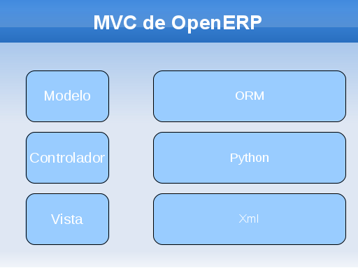
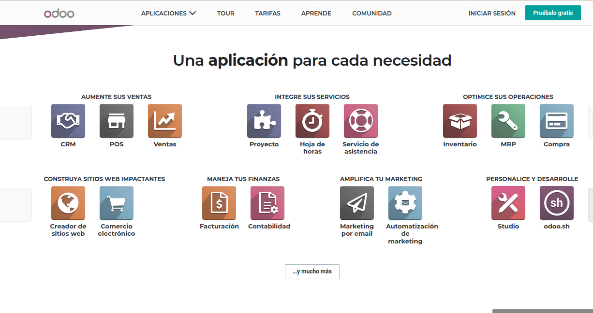
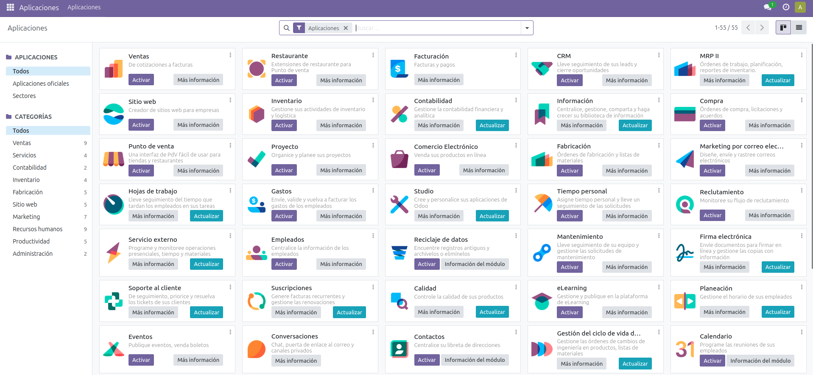
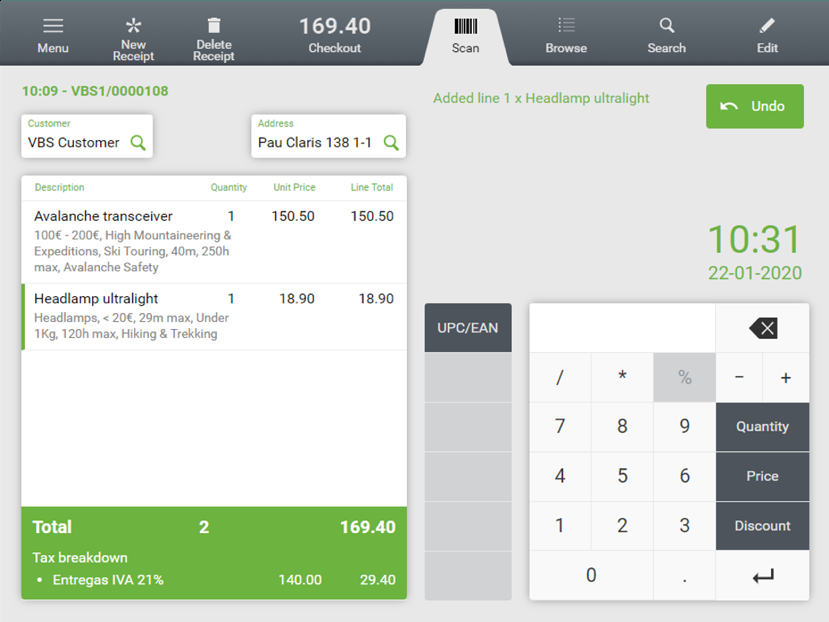
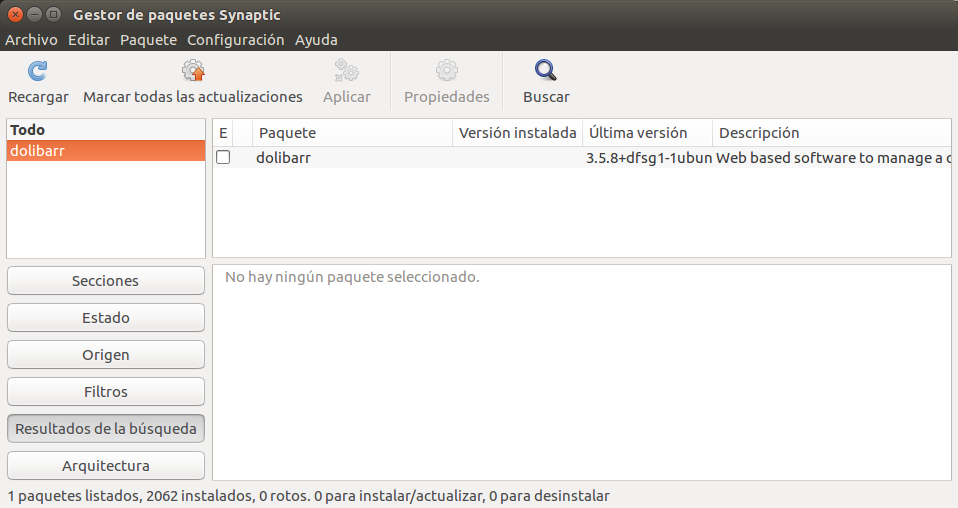
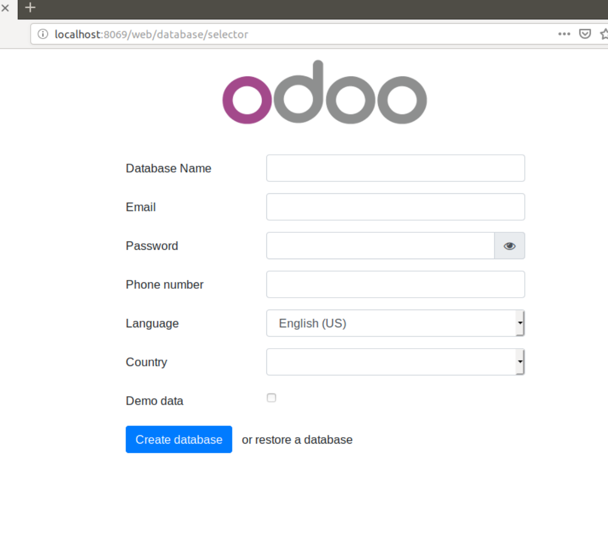
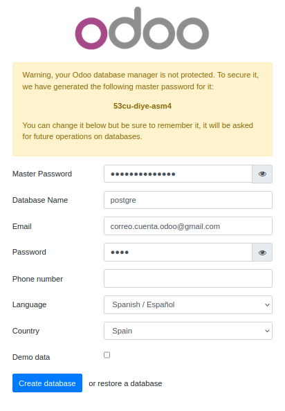
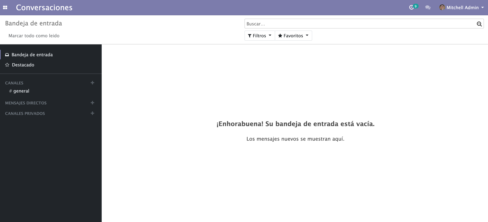

# UT2 — Instalación y configuración de sistemas ERP-CRM

## Índice

1. [Tipos de instalación. Monopuesto. Cliente/servidor](#1-tipos-de-instalacion-monopuesto-clienteservidor)
2. [Módulos de un sistema ERP-CRM: descripción, tipología e interconexión entre módulos](#2-modulos-de-un-sistema-erp-crm-descripcion-tipologia-e-interconexion-entre-modulos)
3. [Procesos de instalación del sistema ERP-CRM](#3-procesos-de-instalacion-del-sistema-erp-crm)
4. [Parámetros de configuración del sistema ERP-CRM: descripción, tipología y uso](#4-parametros-de-configuracion-del-sistema-erp-crm-descripcion-tipologia-y-uso)
5. [Actualización del sistema ERP-CRM y aplicación de actualizaciones](#5-actualizacion-del-sistema-erp-crm-y-aplicacion-de-actualizaciones)
6. [Servicios de acceso al sistema ERP-CRM: características y parámetros de configuración, instalación](#6-servicios-de-acceso-al-sistema-erp-crm-caracteristicas-y-parametros-de-configuracion-instalacion)
7. [Entornos de desarrollo, pruebas y explotación](#7-entornos-de-desarrollo-pruebas-y-explotacion)
8. [Glosario rápido](#glosario-rapido)
9. [Preguntas de repaso](#preguntas-de-repaso)

## Panorama de la unidad

Una vez identificado qué es un ERP y qué es un CRM, el paso siguiente es ponerlos en marcha. Esta unidad se centra en el trabajo previo y en el proceso técnico que lleva un sistema ERP-CRM desde el paquete descargado hasta una instalación funcionando y adaptada a una empresa concreta. Se parte de una decisión que condiciona todo lo demás: no se va a desarrollar un ERP desde cero (algo caro en coste y recursos), sino que se utiliza uno ya existente, y en particular soluciones de licencia libre que suponen coste cero de licencia para el cliente, que solo paga los servicios de implantación y adaptación.

Los materiales trabajan sobre todo con un ERP libre concreto, **Odoo** (antiguo OpenERP), y con **PostgreSQL** como sistema gestor de base de datos, ejecutándose sobre **Ubuntu**. También aparecen **Dolibarr** y **Openbravo** como alternativas. Conviene tener claro desde el principio que Odoo es *un* ERP de ejemplo: los conceptos generales (tipos de instalación, módulos, parámetros, actualizaciones, servicios de acceso, entornos) valen para cualquier sistema ERP-CRM, aunque los nombres de ficheros, puertos y comandos cambien de un producto a otro.

El recorrido de la unidad abarca: los tipos de licencia de software y el papel del software libre en el mercado ERP; los tipos de instalación (monopuesto y cliente/servidor, con sus variantes en local y en la nube); la estructura modular de estos sistemas y cómo se interconectan sus módulos; el proceso de instalación en sí y su configuración mediante parámetros; la aplicación de actualizaciones; los servicios que permiten a los usuarios acceder al sistema, incluida la asistencia técnica remota; y la separación de entornos de desarrollo, pruebas y explotación. Como cierre, se presentan algunas herramientas de programación útiles para desarrollar módulos más adelante.

En la vida real, cualquier tienda, taller o pequeña asesoría que sustituye sus hojas de cálculo y su programa de facturación por un ERP pasa exactamente por este proceso: alguien decide el modelo (servidor propio o servicio contratado), instala el software y la base de datos, activa los módulos que necesita (ventas, compras, almacén, contabilidad, TPV), configura los impuestos y el plan contable de su país, forma al personal y mantiene el sistema actualizado.

## ¿Qué vamos a aprender?

Esta unidad trabaja la implantación de sistemas ERP-CRM: interpretar la documentación técnica e identificar las diferentes opciones y módulos.

En términos llanos, esto supone ser capaz de leer la documentación de un ERP-CRM, entender qué piezas lo componen y dejarlo instalado y en marcha de varias formas distintas, ajustándolo a lo que pide una empresa. En concreto:

- Se identifican los módulos que componen el ERP-CRM y para qué sirve cada uno.
- Se realizan distintos tipos de instalación (por ejemplo monopuesto y cliente/servidor, en máquina virtual, con paquetes del sistema o con contenedores).
- Se configuran los módulos instalados mediante sus parámetros.
- Se hacen instalaciones adaptadas a necesidades planteadas en supuestos diferentes (una PYME comercial, una empresa de servicios, etc.).
- Se verifica que el ERP-CRM funciona correctamente después de instalarlo y configurarlo.
- Se documentan las operaciones realizadas y las incidencias que aparecen durante el proceso.

---

## 1. Tipos de instalación. Monopuesto. Cliente/servidor

Antes de instalar hay que elegir *cómo* se va a instalar y *dónde* van a residir las tres piezas de un ERP-CRM: la **base de datos** (donde se guarda la información), los **programas del servidor** (la lógica de la aplicación) y la **aplicación cliente** (lo que usa la persona). El tipo de instalación depende de la plataforma (Windows, Linux…) y del propio ERP.

**Formas de obtener e instalar el software:**

- **Instalación mediante máquina virtual.** La aplicación y todo lo que necesita se entregan en una máquina virtual lista para arrancar. No es apta para un entorno de producción; sirve para una primera evaluación del producto. Instalar Odoo en una máquina virtual (por ejemplo VirtualBox) resulta cómodo cuando conviene poder reinstalar con facilidad si algo se rompe.
- **Instalación de paquetes bajo entorno gráfico.** Las aplicaciones se instalan con el entorno gráfico del sistema operativo, usando asistentes que resuelven las dependencias entre paquetes (por ejemplo el gestor de paquetes Synaptic en Ubuntu). Puede usarse en producción, pero los paquetes pueden no estar en la última versión.
- **Instalación personalizada.** Se descargan los paquetes fuente desde la web y se instalan con comandos. Da más control sobre lo que se instala y sus dependencias, pero es más compleja. Es la vía para tener una versión más reciente que la de los repositorios.
- **No instalar y acceder a la aplicación en línea.** Algunos ERP ofrecen demostraciones o el servicio completo desde un servidor en Internet; no se instala nada en local. Es la opción de los proveedores que ofrecen **SaaS** (software como servicio).

**Cómo trabaja el cliente:** un ERP puede usarse mediante una **aplicación de escritorio** (se lanza desde un menú) o mediante una **aplicación web** (se abre en el navegador). En ambos casos hay que indicar a qué servidor conectarse, y aquí aparecen las dos opciones clave del temario:

- **Monopuesto.** La base de datos, los programas del servidor y la aplicación cliente están en el **mismo equipo**. La conexión se hace a `localhost` (el propio ordenador). Todo el software está en una única máquina y solo el usuario de ese sistema accede a la gestión.
- **Cliente/servidor.** El equipo donde se ejecuta el cliente es **distinto** del equipo donde están los datos y los programas del servidor. Ese equipo servidor "provee los servicios" al cliente. En lugar de `localhost` se indica la **dirección IP del servidor**. Los datos y su gestión quedan centralizados en un ordenador y se accede a ellos desde varios puntos de la organización.
- **Cliente/servidor web.** Variante del anterior en la que el servidor presenta una interfaz basada en estándares web, de modo que cualquier navegador de la máquina cliente sirve para acceder y gestionar.
- **SaaS.** El servidor no está en la infraestructura de la empresa: reside en una empresa externa que se encarga del software y del mantenimiento (está "en la nube").

**Organización por capas.** Un sistema como OpenERP/Odoo se programa con una estructura **cliente-servidor organizada en capas**, y para modularizar el código utiliza el patrón **MVC** (Modelo-Vista-Controlador). En estos sistemas el Modelo se apoya en un **ORM** (mapeo objeto-relacional, la capa que traduce entre los objetos del programa y las tablas de la base de datos), el Controlador se escribe en el lenguaje del ERP (Python en Odoo) y la Vista se define con XML.

*Figura: correspondencia entre las capas del patrón MVC y las tecnologías de OpenERP/Odoo (Modelo → ORM, Controlador → Python, Vista → XML). Ayuda a entender por qué la instalación separa base de datos, servidor de aplicación y cliente. Origen: `ApuntesU2SGE.pdf`.*

**Servidor propio o en la nube.** Sobre la ubicación física del servidor, los materiales describen la evolución histórica (del *mainframe* al PC, de este a los servidores con arquitectura de PC, y de ahí a Internet y la nube) y contraponen dos modelos:

- **Sistema en la propia empresa (on-premise).** Exige una inversión inicial en hardware; el escalado es problemático (hay que aumentar prestaciones del servidor —escalado vertical— o comprar más equipos —escalado horizontal—) y suele haber hardware infrautilizado; el mantenimiento, el suministro eléctrico y la seguridad son responsabilidad y gasto de la empresa. Como ventaja, los datos no salen de la organización, lo que reduce riesgos como el espionaje industrial.
- **Sistema en la nube.** La empresa paga una cuota (fija, por tiempo de cómputo, por uso…) y a cambio se ahorra los gastos de hardware y de electricidad, reduce mucho el mantenimiento y la seguridad, facilita el acceso (basta un dispositivo con conexión a Internet) y puede contratar más potencia cuando la necesita. Inconvenientes: en algunos casos sale más caro que montar la infraestructura propia, los datos están físicamente en servidores de otra empresa y se depende de la conexión y del buen funcionamiento del proveedor.

Los tres tipos de servicio en la nube que recoge el temario son: **IaaS** (infraestructura como servicio: acceso a servidores, máquinas virtuales o contenedores; hay que instalar y asegurar el sistema operativo y el ERP; un VPS es un ejemplo), **PaaS** (plataforma como servicio: el sistema operativo y algunos programas ya vienen configurados y encima se despliega el ERP; el "hosting tradicional" con PHP y MySQL es el ejemplo) y **SaaS** (software como servicio: el ERP ya está instalado y solo se consume según lo contratado —número de usuarios, almacenamiento, copias…—; equivale a usar servicios tipo Gmail o Google Drive).

Un factor decisivo para elegir entre nube y servidor propio es el **cumplimiento de la normativa de protección de datos**: en Europa rige el **RGPD** y en España la **LOPDGDD**, y almacenar determinados datos en ciertos servicios en la nube podría incumplir la ley. También pesan el precio de la electricidad y del hardware.

> **Ejemplo actual — Una tienda de barrio que estrena ERP.** Una tienda de informática que hasta ahora facturaba con una hoja de cálculo y un programa antiguo decide pasarse a Odoo. Durante las pruebas monta una instalación **monopuesto** en un portátil (todo en `localhost`) para trastear sin miedo. Cuando lo adopta de verdad, pone el servidor Odoo y PostgreSQL en un mini-PC de la trastienda y los dos ordenadores del mostrador entran por el navegador a `http://IP_del_servidor:8069`: es una instalación **cliente/servidor**. Si más adelante abre una segunda tienda, se plantea contratar Odoo en la nube (**SaaS**) para no gestionar servidores en cada local.

> **En las noticias — El fin de las licencias perpetuas de VMware.** Tras la compra de VMware por Broadcom a finales de 2023, se informó de la retirada de las licencias perpetuas de sus productos de virtualización y del paso a un modelo de suscripción con paquetes reagrupados. Muchas empresas con ERP alojados en servidores propios virtualizados con VMware revisaron sus costes y aceleraron la evaluación de alternativas (hipervisores libres, contenedores) o el traslado a la nube. Ilustra cómo la decisión "servidor propio o nube" también depende del precio del software de base, no solo del hardware.

### Ideas clave de esta sección
- Un ERP-CRM tiene tres piezas: base de datos, servidor de aplicación y cliente; el tipo de instalación decide dónde va cada una.
- **Monopuesto**: todo en un equipo, se conecta a `localhost`. **Cliente/servidor**: cliente y servidor separados, se conecta a la IP del servidor.
- Formas de instalar: máquina virtual (evaluación), paquetes con asistente (posible en producción), instalación personalizada (más control), o acceso en línea (SaaS).
- El servidor puede estar en la empresa (on-premise) o en la nube (IaaS, PaaS, SaaS); la protección de datos (RGPD, LOPDGDD) y los costes marcan la elección.
- Estos sistemas se estructuran en capas cliente-servidor y usan el patrón MVC.

## 2. Módulos de un sistema ERP-CRM: descripción, tipología e interconexión entre módulos

Toda la funcionalidad de un ERP está repartida en **módulos**. Un módulo es un programa que cubre una función concreta de la aplicación. Hay **módulos básicos**, que se cargan automáticamente en la instalación inicial, y **módulos adicionales**, que se instalan después desde el propio programa o desde la web del ERP, solo si se necesitan. Esta es la idea de sistema **modular**: un núcleo imprescindible rodeado de un gran número de módulos que se van activando según necesidades.

**Características comunes de los módulos funcionales:**

- Se instalan y desinstalan mediante asistentes.
- Se configuran o parametrizan para adaptarlos al entorno de producción.
- Cada módulo puede generar sus propios informes.
- Incorporan niveles de seguridad: hay módulos accesibles solo para el administrador.
- Están **interconectados**: la información se introduce una sola vez y se comparte entre módulos, en lugar de teclearla varias veces.
- Permiten añadir textos y comentarios en las opciones del programa.
- Los menús de cada módulo se pueden adaptar a las necesidades de cada usuario.

*Figura: catálogo de aplicaciones (módulos) de Odoo agrupadas por área funcional —ventas, servicios, operaciones, finanzas, marketing, desarrollo—. Cada icono es un módulo que se activa cuando se necesita. Origen: `DAM_SGE02_Instalación y configuración de sistemas ERP-CRM.pdf`.*

**El módulo base.** Contiene lo imprescindible para que la aplicación funcione: configuración de la aplicación, gestión de los **datos maestros** (los datos básicos sobre los que se apoyan todos los procesos), establecimiento del idioma o importación de traducciones, seguridad (gestión de usuarios y de accesos) y administración de módulos (para instalar nuevos). En Odoo, el módulo base se compone de dos únicos módulos: **Ajustes** (que actúa como ficha de cliente) y **Aplicaciones** (que sirve para añadir más módulos).

**Módulos adicionales más importantes:**

- **Gestión contable y financiera.** Recoge y automatiza las operaciones contables. Debe estar integrado con compras y ventas para no duplicar datos y tener información en tiempo real: así se obtienen facturas de clientes y proveedores automáticamente desde los pedidos o los albaranes. La integración llega al resto de módulos; por ejemplo, si contabilidad marca a un cliente como moroso, queda bloqueado en toda la aplicación. Funcionalidades: contabilidad general, contabilidad analítica o de costes, gestión de impuestos, presupuestos, facturas de clientes y proveedores, extractos bancarios e informes contables.
- **Aprovisionamiento: Compras y Almacén.** *Compras* gestiona solicitudes de presupuesto a proveedor, recepción de precios y pedidos de compra, con seguimiento de tarifas, conversión de tarifas en órdenes, entregas parciales, reclamaciones y borradores automáticos de pedido. *Almacén* gestiona las existencias: definición de múltiples almacenes, rotación de inventario y niveles de stock, traspasos entre almacenes, codificación de productos y compra de un mismo producto a varios proveedores.
- **Gestión comercial (Ventas).** Funciona como compras pero con documentos de venta: creación de pedidos, revisión de estados, confirmación de envío, formas de pago y fecha de facturación por pedido, cálculo de gastos de envío y albaranes automáticos (también de envíos parciales).
- **Facturación, cobros y pagos.** Genera facturas de venta, albaranes y tarifas, y contempla formas de cobro y pago como contado, transferencia, pagaré o giro. Incluye facturas automáticas desde pedido o albarán, efectos de cobro y pago, recibos y órdenes de pago, importación de extractos bancarios, envío telemático de remesas al banco y gestión de bancos propios, de clientes y de proveedores. Habitualmente las facturas nacen en estado **Borrador** desde otros procesos y un usuario las aprueba antes de enviarlas.
- **Gestión de personal.** Nóminas, altas, bajas, contratos, control de horarios, datos de personal, remuneraciones y comisiones por ventas. Gestiona empleados, calendario de vacaciones, contratos, beneficios, ausencias, rendimiento y perfiles. Si la aplicación no trae un módulo de RRHH como tal, la gestión de personal se resuelve con conceptos contables y con las comisiones del módulo comercial.
- **Gestión de la relación con el cliente (CRM).** Registra todo lo relativo a la relación comercial con clientes y clientes potenciales: ficha del contacto, productos de interés, histórico de pedidos, ventas, contactos mantenidos y facturación. El objetivo es tener la información centralizada. Funcionalidades: datos identificativos del contacto, segmentación de clientes por múltiples criterios, distinción entre clientes reales y potenciales, gestión de llamadas, calendario de encuentros, campañas de marketing y su seguimiento, seguimiento de acciones comerciales, enlace con otros documentos de la aplicación, herramientas de productividad (editor de documentos, sincronización de contactos y calendario, envíos masivos de correo, sms o fax) y estadísticas. Los CRM más avanzados incorporan una **Extranet** para que clientes y proveedores consulten la información que la empresa les autorice. Existe CRM libre como **OroCRM**, **SuiteCRM** y **SugarCRM**; Odoo trae un módulo CRM independiente.
- Otros módulos citados: Productos, Inventario, Proveedores, Gestión de Proyectos y Gestión de Informes y Estadísticas.

*Figura: gestor de aplicaciones de Odoo. Desde aquí se instalan (Activar) y actualizan los módulos; a la izquierda se filtran por categoría (Ventas, Servicios, Contabilidad, Inventario, Fabricación, Recursos humanos…). Origen: `Instalación y configuración de un ERP - P2.pdf`.*

**Interconexión entre módulos.** Es lo que diferencia a un ERP de un conjunto de programas sueltos: el resultado de un proceso desencadena el siguiente sobre una **base de datos común**. La oportunidad de un cliente en el CRM genera un pedido de venta, el pedido genera un albarán, el albarán genera una factura y la factura genera el apunte contable, sin volver a introducir los datos. Esa integración evita duplicidades e incoherencias.

**Módulo de localización del país.** Es un módulo (o conjunto de archivos) que adapta el ERP a las leyes de cada país. Para España incluye el **Plan General Contable español**, el módulo de impuestos (por ejemplo los tipos de IVA), la validación de datos (CIF, NIF, número de cuenta bancaria), datos maestros como las provincias y la traducción al español. En Odoo, al indicar el país durante la instalación se instala automáticamente el módulo de localización correspondiente; después se puede comprobar buscando "España" en la lista de módulos, donde aparece el Plan General Contable de España de 2008.

> **Ejemplo actual — Activar solo lo necesario.** Una asesoría que factura servicios instala Odoo y activa únicamente *Contactos*, *Ventas*, *Facturación* y *Contabilidad*, más la localización española. No activa *Inventario* ni *Fabricación* porque no vende productos físicos. Meses después incorpora *Hojas de trabajo* para imputar horas a cada cliente y que esas horas se conviertan en líneas de factura automáticamente: es la interconexión de módulos trabajando.

*Figura: módulo de Punto de Venta (TPV) de Odoo. Cada venta cerrada aquí descuenta stock en Inventario y genera el asiento en Contabilidad, sin reintroducir datos. Origen: `DAM_SGE02_Instalación y configuración de sistemas ERP-CRM.pdf`.*

> **En las noticias — Asistentes de IA integrados en los módulos.** En 2023 y 2024 los grandes fabricantes anunciaron copilotos de inteligencia artificial generativa dentro de sus suites: Microsoft con Copilot en Dynamics 365, SAP con Joule y Salesforce con Einstein y, después, con agentes autónomos. Se presentaron como una capa transversal que redacta correos comerciales en el CRM, resume incidencias o propone asientos, aprovechando precisamente que los módulos comparten una base de datos común.

### Ideas clave de esta sección
- La funcionalidad de un ERP está en **módulos**: un módulo base imprescindible y módulos adicionales que se activan según necesidad.
- Módulos adicionales típicos: contabilidad y finanzas, compras y almacén, ventas, facturación, personal y CRM.
- Los módulos se **interconectan** sobre una base de datos común: un proceso dispara el siguiente sin reintroducir datos.
- El **módulo de localización del país** adapta el ERP a la legislación (en España: PGC, IVA, validación de CIF/NIF, traducción).
- El **CRM** centraliza la relación con el cliente; existen CRM libres como SuiteCRM, SugarCRM u OroCRM.

## 3. Procesos de instalación del sistema ERP-CRM

Si la empresa contrata un servicio **SaaS**, no hace falta ningún proceso de instalación propio: lo proporciona todo el proveedor externo. En cualquier otro caso, hay que instalar el sistema. El proceso completo de instalación e implantación de un ERP incluye estas tareas:

1. **Diseño de la instalación.** Estudio previo de las necesidades de la empresa y de cómo las resolverá el ERP: tablas que hay que adaptar, datos, formularios e informes necesarios.
2. **Instalación de equipos servidores y clientes.** Instalar, revisar o actualizar el hardware para que cumpla los requisitos mínimos. Alternativamente, contratar servicios SaaS de una empresa externa.
3. **Instalación del software.** Tanto la aplicación ERP como el software que necesita para funcionar.
4. **Adaptación y configuración del programa.** Configurar el software y adaptarlo a la empresa cliente.
5. **Migración de datos.** Traspasar clientes, proveedores, contabilidad y facturación desde el sistema anterior. Es un proceso crítico y de gran volumen; a veces hay que hacerlo de forma manual si no se puede automatizar.
6. **Realización de pruebas.** Suele haber un periodo de transición en el que conviven el ERP nuevo y el sistema antiguo; hay que verificar con pruebas que los resultados son correctos.
7. **Documentación del sistema.** Elaborar manuales y ponerlos a disposición de la organización (tablón de anuncios, correo electrónico, Intranet).
8. **Formación de usuarios.** Formación inicial para los responsables del proyecto y formación para los usuarios finales.

**El proceso técnico de instalación del software** depende del sistema operativo: en Windows suele ofrecerse un archivo autoinstalable y en Linux se accede a varios ERP de software libre a través de los **repositorios** de la distribución. Recomendaciones del temario:

- Escoger la **última versión del sistema operativo**, para que la del ERP también sea la más actual y con mejor funcionalidad. En entornos de producción conviene una versión del sistema operativo con mayor tiempo de soporte, siempre que no obligue a usar un ERP demasiado antiguo.
- Antes de instalar, asegurarse de que están **activados los repositorios necesarios**; si no, pueden quedar dependencias sin resolver o no aparecer ningún ERP para instalar.
- La instalación suele ser **asistida**, con intervención mínima. Conlleva tres tareas: instalar el ERP, instalar y configurar el **servidor de base de datos** que contendrá la información, e instalar los **servicios de acceso** para los clientes.

*Figura: instalación de un ERP (Dolibarr) desde los repositorios con el gestor gráfico Synaptic en Ubuntu. El asistente resuelve las dependencias entre paquetes. Origen: `DAM_SGE02_Instalación y configuración de sistemas ERP-CRM.pdf`.*

**Preparación del equipo servidor.** Las necesidades de potencia dependen de la cantidad de datos, el número de usuarios simultáneos, la tecnología del ERP y el sistema operativo. Se recomienda hardware de servidor (memoria RAM con ECC, buena refrigeración, componentes de calidad), que es más estable que un PC doméstico o placas como Raspberry Pi o Arduino; los usuarios sí pueden conectarse con PC, tablet o smartphone. Medidas básicas: un **SAI** que mantenga encendido el servidor ante un corte eléctrico, un dimensionamiento por encima del mínimo sin excederse (más hardware es más gasto y más consumo), **redundancia de discos** con RAID o con sistemas de archivos como ZFS o BTRFS, y una política de **copias de seguridad externas** al sistema. Sobre el servidor se elige un sistema operativo base (para Odoo se recomienda **Ubuntu Server**) y, opcionalmente, virtualización: **máquinas virtuales con hipervisor** (tipo VirtualBox), que simulan todo el hardware y pierden algo de rendimiento, o **contenedores** (LXD para contenedores de sistema, **Docker** para contenedores de aplicación), con rendimiento cercano al nativo. Sistemas como **Proxmox** simplifican la gestión de máquinas virtuales, contenedores, copias y almacenamiento en red.

**Ejemplos concretos de instalación de Odoo en los materiales:**

- **Odoo sobre Ubuntu con paquetes.** Instalación asistida desde los repositorios de Ubuntu (con Synaptic se instala también PostgreSQL). Es el enfoque de la versión de los apuntes centrada en Odoo 13; el acceso se hace por el puerto 8069.
- **Odoo 17 mediante instalación manual en Ubuntu Server**, siguiendo la documentación oficial del producto.
- **Odoo 17 con Docker.** Se crean dos contenedores: uno con **PostgreSQL 15** y otro con **Odoo 17**. El contenedor de PostgreSQL se lanza definiendo variables de entorno `POSTGRES_USER`, `POSTGRES_PASSWORD` y `POSTGRES_DB`, montando un volumen para que los datos de la base de datos persistan en la máquina anfitriona. El contenedor de Odoo se lanza publicando el puerto `8069:8069` y enlazándolo con el de la base de datos.
- **Odoo 17 con Docker Compose** (opción recomendada en ese material). Un fichero `docker-compose.yml` define los dos servicios (`web` con la imagen `odoo:17` y `db` con `postgres:15`), sus volúmenes y variables de entorno; el servicio completo se arranca con `docker compose up -d` y se para con `docker compose down`.

El material más antiguo describe además una instalación de **OpenERP 7.0 en Ubuntu**, con creación de una base de datos y copia de los módulos necesarios al directorio `addons`.

> **Ejemplo actual — Un entorno reproducible con Docker Compose.** Un pequeño estudio de desarrollo prepara la implantación de Odoo para un cliente. En lugar de instalar Odoo y PostgreSQL "a mano" en cada portátil, guarda un `docker-compose.yml` en el repositorio del proyecto. Cualquier persona del equipo clona el repositorio, ejecuta `docker compose up -d` y en un par de minutos tiene el mismo Odoo con la misma versión de PostgreSQL. Si algo se corrompe, `docker compose down`, se borran los volúmenes y se vuelve a levantar limpio.

> **En las noticias — Docker Desktop pasa a ser de pago para empresas grandes.** Se informó de que, desde 2021-2022, Docker Desktop requiere una suscripción de pago para empresas por encima de cierto tamaño o facturación, mientras sigue siendo gratuito para uso personal, educativo y pequeñas empresas. El motor Docker en Linux (el que se usa en servidores) no se ve afectado. El cambio empujó a algunos equipos hacia alternativas como Podman o hacia trabajar directamente sobre Docker en Linux.

### Ideas clave de esta sección
- Con SaaS no hay instalación propia; en el resto de casos el proceso va del **diseño** a la **formación de usuarios**, pasando por instalación, configuración, migración de datos, pruebas y documentación.
- En Linux el ERP se instala desde **repositorios**; conviene usar versiones recientes del sistema operativo y tener los repositorios activados.
- La instalación asistida cubre tres partes: el ERP, el **servidor de base de datos** y los **servicios de acceso**.
- El servidor necesita hardware fiable, SAI, redundancia de discos y copias externas; se puede virtualizar con hipervisor o con contenedores.
- Odoo se puede instalar con paquetes, de forma manual o con **Docker / Docker Compose** (Odoo + PostgreSQL en contenedores separados).

## 4. Parámetros de configuración del sistema ERP-CRM: descripción, tipología y uso

Tras instalar, viene la **configuración**: modificar o establecer una serie de parámetros para garantizar el funcionamiento correcto del sistema. A veces la configuración implica instalar módulos nuevos. Los tipos de parámetros que recoge el temario son:

- **Conexión con servidores.** Parámetros del programa cliente para conectarse al servidor donde está la aplicación. Ese servidor puede ser el mismo equipo, otro de la misma red local o un equipo remoto fuera de la red.
- **Acceso a la base de datos.** Parámetros para acceder a los datos a través del sistema gestor de base de datos. El servidor de base de datos también puede ser local o remoto.
- **Configuración del idioma.** Cambiar el idioma de menús y elementos de la aplicación, editando archivos de configuración o instalando el módulo de idioma correspondiente.
- **Archivos de localización del país.** Módulos específicos que adaptan el sistema a las leyes y necesidades de cada país; la localización española incluye, entre otras cosas, el Plan General Contable español.

*Figura: configuración inicial de Odoo 13 al entrar por primera vez en `localhost:8069`. Aquí se fija el nombre de la base de datos, el usuario administrador, el idioma, el país (que dispara la localización) y si se cargan datos de demostración. Origen: `DAM_SGE02_Instalación y configuración de sistemas ERP-CRM.pdf`.*

**Configuración inicial de Odoo (versión 13 de los apuntes).** Se accede con un navegador al puerto **8069** del equipo donde está Odoo (`localhost:8069` en local, o `IP:8069` en otra máquina) y se rellenan:

- Nombre de la base de datos.
- Usuario con **rol de administrador**. El campo pide un correo electrónico, aunque vale un nombre de usuario; usar correo permite dar de alta usuarios y enviarles sus credenciales por email.
- Contraseña.
- Número de teléfono (no obligatorio).
- Idioma (para ver los menús traducidos).
- País (necesario, entre otras cosas, para sincronizar la hora y aplicar la localización).
- Cargar **datos Demo** (datos de prueba; recomendable para practicar).

**Ficheros de configuración de Odoo 13 (sobre Ubuntu).**

- Configuración de PostgreSQL: `/etc/postgresql/11/main/pg_hba.conf`. Si se modifica, hay que **reiniciar el servidor de base de datos** para que acepte los cambios: el script está en `/etc/init.d/` y se llama `postgresql`; se le pasa `restart`.
- Debe existir un usuario dentro de la base de datos; en los apuntes se llama `postgres` con contraseña `postgres`.
- Parámetros de conexión con la base de datos: archivo `/etc/odoo/odoo.conf`. El script de arranque y parada del servidor Odoo está en `/etc/init.d/` y se llama `odoo`: `sudo /etc/init.d/odoo restart` para reiniciarlo y `sudo /etc/init.d/odoo stop` para pararlo.
- Algunos parámetros de `odoo.conf`: `db_name` (nombre de la base de datos; vacío no fuerza ninguna), `db_user` (usuario de la base de datos), `db_password` (su contraseña), `log_file` (archivo donde se guardan los mensajes del servidor) y `addons_path` (ruta de los módulos; por ejemplo `/usr/lib/python3/dist-packages/odoo/addons`).

*Figura: puesta en marcha de Odoo 17. El sistema genera un **Password maestro** para el gestor de bases de datos; conviene guardarlo, porque se pide para operaciones sobre bases de datos. Origen: `Instalación y configuración de un ERP - P2.pdf`.*

**Configuración inicial de Odoo 17.** Al entrar en `http://localhost:8069` se muestra un **Password maestro** (master password), que se puede cambiar y que hay que **guardar en lugar seguro** porque se pedirá para futuras operaciones sobre bases de datos. Si se pierde, se puede dejar en blanco editando `/etc/odoo/odoo.conf` (o el fichero `.odoorc` del *home*) y eliminando o comentando con `#` el campo `admin_password`; al reiniciar el servicio, Odoo pedirá crear uno nuevo. Después se configura el usuario administrador, el país (aplica adaptaciones para empresas locales), el idioma y si se cargan datos de demostración; al pulsar "Create database" se inicializa Odoo (tarda unos minutos).

En despliegues con **Docker/Docker Compose** de Odoo 17, la configuración pasa por **variables de entorno**: `POSTGRES_USER`, `POSTGRES_PASSWORD` y `POSTGRES_DB` para el contenedor de la base de datos, y `HOST`, `USER` y `PASSWORD` para el contenedor de Odoo, además de parámetros de arranque como `--dev=all` para tareas de desarrollo.

**Configurar los módulos.** La actividad de referencia del material más antiguo muestra en qué consiste configurar módulos en un supuesto real (una PYME española, tienda de informática con OpenERP): crear una base de datos propia; añadir los módulos de CRM, gestión de almacenes, compras, ventas y contabilidad y finanzas; instalarlos en español; instalar módulos de localización como `l10n_es_pyme_account`, `l10n_es_toponymus_region` y `l10n_es_hr_nominas`; crear el ejercicio fiscal y los periodos; configurar los diarios de pago (por ejemplo el diario de Efectivo con la cuenta 570000 "Caja, euros" y el de Tarjeta con la 572000); dar de alta varios usuarios además del administrador; crear las categorías de producto; y hacer una copia de seguridad de la base de datos.

> **Ejemplo actual — El país lo cambia todo.** Al crear la base de datos de un cliente en Andalucía, marcar "España" como país hace que Odoo instale automáticamente el plan contable español y los tipos de IVA vigentes, y valide los NIF de los clientes. La misma instalación para un cliente en Portugal, cambiando solo el país, carga otro plan de cuentas y otras reglas fiscales. Un único parámetro de configuración arrastra un módulo entero de localización.

### Ideas clave de esta sección
- **Configurar** es ajustar parámetros (y a veces instalar módulos) para que el sistema funcione correctamente.
- Tipos de parámetros: conexión con servidores, acceso a la base de datos, idioma y localización del país.
- En Odoo, la configuración inicial se hace en el navegador (puerto **8069**): base de datos, usuario administrador, contraseña, idioma, país y datos demo.
- Los ficheros clave en Odoo sobre Ubuntu son `odoo.conf` (con `db_name`, `db_user`, `db_password`, `log_file`, `addons_path`) y `pg_hba.conf` para PostgreSQL; tras tocarlos hay que **reiniciar el servicio**.
- Odoo 17 añade un **Password maestro** del gestor de bases de datos; en contenedores la configuración va por variables de entorno.

## 5. Actualización del sistema ERP-CRM y aplicación de actualizaciones

Las actualizaciones de un ERP-CRM se comportan de dos maneras según su alcance:

- **Actualización automática entre versiones secundarias o parches.** Son versiones que dependen de la misma versión base. Por ejemplo, la 6.0.15 sería la decimoquinta versión secundaria de la 6.0. Este tipo de actualización suele ser automática.
- **Cambio de versión.** Cuando los cambios son importantes, no se pasa a una versión secundaria sino a otra versión base (por ejemplo, de la 6.0.15 a la 7.0.0). Aquí hay dos opciones: **esperar** a que la nueva versión llegue al repositorio del sistema operativo, o hacer una **instalación manual** de la nueva versión con el terminal si incorpora mejoras que no se quieren esperar.

En **entornos de producción**, el cambio de versión no es automático ni inmediato: la decisión se toma tras analizar la repercusión en el funcionamiento de la empresa y en los datos actuales, la formación de usuarios que exige, el coste y la política de la empresa. Cuando **no es posible la actualización automática**, el proceso requiere un **traspaso de datos** entre la versión antigua y la nueva, y se suele establecer un periodo intermedio de **coexistencia** de ambas versiones hasta que la nueva queda implantada.

Los propios materiales reflejan esta idea de versiones: los apuntes centrados en Odoo hablan de la **versión 13** (con PostgreSQL 11), mientras que material más reciente usa **Odoo 17** (con PostgreSQL 15) y el más antiguo trabajaba con **OpenERP 7.0**. Cada salto entre esas versiones es un cambio de versión base, no un parche.

> **Ejemplo actual — Odoo saca una versión nueva cada año.** Odoo publica una versión mayor anualmente: la 17 corresponde a 2023 y la 18 a 2024. Una empresa que va por Odoo 15 no actualiza "sin pensar": monta una copia de la base de datos en un entorno de pruebas, ejecuta el proceso de migración (que adapta la estructura de datos), comprueba que sus módulos propios y la localización siguen funcionando y solo entonces planifica el salto en producción, normalmente en fin de semana.

> **En las noticias — SAP pone fecha al fin del soporte de su ERP clásico.** Se ha informado reiteradamente de que SAP mantiene el soporte estándar de su ERP tradicional (SAP Business Suite 7 / ECC) hasta 2027, con soporte extendido de pago hasta 2030, empujando a los clientes a migrar a S/4HANA y a modelos en la nube. Es un ejemplo a gran escala de "cambio de versión" con traspaso de datos, coexistencia y un calendario que condiciona a miles de empresas.

### Ideas clave de esta sección
- **Parches y versiones secundarias**: misma versión base, actualización normalmente automática.
- **Cambio de versión**: nueva versión base; se espera al repositorio o se instala manualmente.
- En producción, actualizar es una decisión meditada (impacto en datos, formación, coste) y suele implicar traspaso de datos y un periodo de coexistencia.
- Los saltos entre OpenERP 7, Odoo 13 y Odoo 17 son cambios de versión base, no parches.

## 6. Servicios de acceso al sistema ERP-CRM: características y parámetros de configuración, instalación

Para que las personas usen el ERP hay que instalar y configurar los **servicios de acceso**. El principal es el **servicio web**: se instala un **servidor web** de modo que los clientes entren con un navegador estándar, indicando la **IP del servidor** en instalaciones cliente/servidor o `localhost` en instalaciones monopuesto. En Odoo, ese acceso se hace por el **puerto 8069**; el equipo cliente puede tener Windows o Linux y basta cualquier navegador (por ejemplo `http://192.168.1.128:8069`). La instalación de estos servicios de acceso es una de las tres tareas de la instalación asistida, junto con el ERP y el servidor de base de datos.

*Figura: cliente web de Odoo funcionando en el navegador tras la instalación. El acceso por navegador al puerto 8069 es el servicio de acceso estándar del sistema. Origen: `DAM_SGE02_Instalación y configuración de sistemas ERP-CRM.pdf`.*

**Asistencia técnica remota.** Otro servicio relacionado con el acceso es el **soporte remoto**, que permite controlar un equipo físicamente distante como si se estuviera sentado delante de él. Sirve, por ejemplo, para que una empresa dé asistencia inmediata a clientes alejados sin desplazarse, revisando o corrigiendo la configuración del ERP, instalando programas o ejecutando los existentes. Se basa en programas cliente/servidor que usan el **protocolo VNC** (VNC *viewer* / VNC *server*):

- El **cliente** es el equipo desde el que se controla; el **servidor** es el equipo a controlar. Al ejecutar el visor VNC en el cliente aparece una ventana con el escritorio del servidor.
- Aplicaciones VNC libres y gratuitas: en Windows, **RealVNC**, **UltraVNC**, **TightVNC**; en macOS, **Vine Server** (servidor) y **Chicken of the VNC** (cliente); en GNU/Linux, **VINO** (servidor), **RealVNC** y **TightVNC** (cliente).

**Configuración e instalación del soporte remoto:**

- **Servidores Ubuntu.** Ubuntu incluye el servidor **VINO**; se configura desde la Configuración del Sistema (Escritorio remoto), donde se decide si otros usuarios solo ven el escritorio o también lo controlan, y si se exige contraseña. Si no hay visor instalado, se puede instalar con `sudo apt-get install vncviewer`, y se accede con `vncviewer IP_servidor`. Como los servidores Ubuntu no suelen tener entorno gráfico en ejecución, lo habitual es acceder a ellos mediante un **terminal remoto seguro por SSH** (con el paquete SSH server instalado).
- **Servidores Windows.** Al instalar **UltraVNC** se obtienen cliente y servidor. El servidor se activa desde el menú Inicio y muestra un icono junto al reloj; lo más importante de su configuración es establecer la **contraseña de conexión**. Desde el cliente se indica `Ip_Servidor:0`, donde el `0` es el número de ventana del servidor remoto.

**Parámetros de red del acceso remoto:**

- **Equipos en la misma red:** se usa la **IP privada** del servidor (se consulta con `ifconfig` en Linux o `ipconfig` en Windows).
- **Equipos en redes separadas por un router:** se usa la **IP pública** de la red del servidor (la asigna el operador y suele cambiar con el tiempo). Hay que entrar en el router y **abrir los puertos 5900-5999** para permitir el acceso VNC desde el exterior. Un **cortafuegos (firewall)** puede bloquear estas conexiones.

> **Ejemplo actual — Resolver una incidencia sin ir a la empresa.** Un cliente llama porque su Odoo no arranca tras un corte de luz. El técnico de soporte se conecta por VNC (o por SSH al servidor Ubuntu), comprueba que el servicio `odoo` está parado, revisa el `log_file` indicado en `odoo.conf`, ve que PostgreSQL no había levantado, lo reinicia con el script de `/etc/init.d/` y deja el ERP operativo en diez minutos, sin coger el coche.

> **En las noticias — Herramientas de acceso remoto en el punto de mira de la seguridad.** En los últimos años se han publicado numerosos avisos sobre ataques que abusan de escritorios remotos mal protegidos (VNC o RDP expuestos a Internet sin contraseña fuerte ni doble factor). La recomendación general que se ha repetido es no publicar estos puertos directamente, usar VPN o túneles cifrados y limitar el acceso por IP, justo lo contrario de "abrir los puertos 5900-5999" sin más protección.

### Ideas clave de esta sección
- El servicio de acceso estándar es el **web**: servidor web + navegador del cliente contra la **IP del servidor** (o `localhost`); en Odoo, puerto **8069**.
- El **soporte remoto** con **VNC** permite controlar un equipo lejano: cliente (visor) y servidor (el equipo controlado).
- Ubuntu usa el servidor **VINO** y, al no tener entorno gráfico, se administra por **SSH**; Windows usa **UltraVNC** (cliente y servidor).
- En la misma red se usa la IP privada; entre redes, la IP pública y hay que abrir los **puertos 5900-5999** en el router (ojo al firewall y a la seguridad).

## 7. Entornos de desarrollo, pruebas y explotación

Para administrar un ERP-CRM de forma seria no se trabaja con una única instalación, sino con **tres entornos** separados:

- **Entorno de desarrollo.** Está configurado con el hardware y el software necesarios para **crear software**: desarrollar y modificar módulos. Es para programadores y usuarios muy avanzados, con el hardware mejor dotado y las últimas tecnologías. Aquí se "rompen cosas": es habitual reiniciar servicios, borrar la base de datos y volver a construirla.
- **Entorno de pruebas.** Es un entorno de producción **limitado y simulado** para tareas de mantenimiento y administración **antes** de llevar los cambios al sistema real. Sirve para validar una actualización de versión, un módulo nuevo o una migración de datos con una copia de los datos reales.
- **Entorno de explotación (producción).** Son los sistemas que dan soporte a la actividad de la empresa y que usan a diario los usuarios finales. Es el entorno que debe permanecer estable; cualquier cambio llega aquí solo después de pasar por pruebas.

Este esquema encaja con el proceso de instalación (que prevé un periodo de transición y pruebas antes de dar por buena la implantación) y con el de actualización (que en producción exige análisis previo y a veces coexistencia de versiones). En el trabajo con contenedores, los materiales distinguen explícitamente un **contenedor de producción** —pensado para arrancar, hacer pocas paradas, mantener su contenido y del que se hacen copias completas para restaurar en caso de urgencia— de un **contenedor de desarrollo** —que se reinicia, se borra y se reconstruye con frecuencia, y que monta **volúmenes** para dar persistencia a los directorios de módulos (`addons`), sesiones y ficheros, de modo que se pueda programar con un IDE instalado en la máquina anfitriona—.

**Herramientas de programación para módulos.** Como preparación para desarrollar módulos más adelante, el temario nombra algunas herramientas útiles:

- **Entorno de programación (IDE).** Aplicación para desarrollar módulos del ERP-CRM: edición, compilación, detección de errores, prueba y ejecución. A veces necesita *plugins* o extensiones para el lenguaje del ERP. Se citan **NetBeans** y **Eclipse**.
- **Dia.** Programa para crear diagramas, entre ellos diagramas **UML**; permite crear módulos `uml-dia` escritos en Python que luego se ejecutan como módulos de Odoo.
- **Gedit.** Editor de texto para programar; con un *plugin* facilita crear o modificar módulos.
- **OpenOffice.** Forma rápida de crear y modificar **informes** del ERP con un entorno conocido, añadiendo campos y expresiones a informes existentes.
- **iReport.** Diseñador visual de informes que facilita crearlos en formato **JasperReports**.

> **Ejemplo actual — Tres copias del mismo ERP.** Un equipo que mantiene el Odoo de un cliente tiene: *producción* (el que usan cada día en la empresa), *pruebas* (una copia que se refresca cada semana con los datos reales anonimizados, donde se ensaya la subida de versión) y *desarrollo* (en el portátil de cada programador, con Docker Compose y datos de demostración). Un cambio en un informe se programa en desarrollo, se valida en pruebas con datos realistas y solo entonces se publica en producción.

> **En las noticias — El coste de no tener entorno de pruebas.** Varias caídas sonadas de servicios en los últimos años se atribuyeron públicamente a cambios aplicados directamente en producción sin pasar por un entorno de pruebas equivalente. El sector ha reforzado el mensaje de mantener entornos separados y despliegues reversibles también para los sistemas de gestión internos, no solo para las aplicaciones de cara al público.

### Ideas clave de esta sección
- Se trabaja con tres entornos: **desarrollo** (crear y romper), **pruebas** (validar sobre una copia realista) y **explotación/producción** (estable, uso diario).
- Los cambios (módulos, actualizaciones, migraciones) van de desarrollo a pruebas y de pruebas a producción, nunca directos a producción.
- Con contenedores se separa un contenedor de producción (estable, con copias) de uno de desarrollo (efímero, con volúmenes para persistir `addons` y sesiones).
- Herramientas para programar módulos e informes: IDE como NetBeans o Eclipse, y utilidades como Dia, Gedit, OpenOffice e iReport.

---

## Glosario rápido

| Término | En una frase |
| --- | --- |
| ERP | Sistema de planificación de recursos empresariales: gestión integrada y flexible de todos los recursos sobre una base de datos común. |
| CRM | Gestión de la relación con el cliente: centraliza contactos, oportunidades, ventas e histórico de cada cliente. |
| Monopuesto | Instalación con la base de datos, el servidor y el cliente en el mismo equipo; se conecta a `localhost`. |
| Cliente/servidor | Instalación con el cliente en un equipo y los datos y programas en otro (el servidor); se conecta a su IP. |
| SaaS | Software como servicio: el ERP ya instalado en la nube de un proveedor; la empresa solo lo consume. |
| IaaS / PaaS | Infraestructura / plataforma como servicio: la nube ofrece máquinas (IaaS) o un sistema ya configurado (PaaS) sobre el que se despliega el ERP. |
| On-premise | Servidor instalado en la propia empresa, con su hardware, energía y seguridad a cargo de ella. |
| Módulo | Programa que cubre una función del ERP; hay un módulo base y módulos adicionales que se activan según necesidad. |
| Módulo base | Núcleo imprescindible: configuración, datos maestros, idioma, seguridad y administración de módulos. |
| Localización del país | Módulo que adapta el ERP a la ley de un país (en España: PGC, IVA, validación de CIF/NIF, provincias, traducción). |
| Datos maestros | Datos básicos (clientes, proveedores, productos, cuentas) sobre los que se apoyan todos los procesos. |
| Interconexión de módulos | Los módulos comparten la base de datos: un proceso desencadena el siguiente sin reintroducir datos. |
| SGBD | Sistema gestor de base de datos; en los materiales, PostgreSQL para Odoo (Oracle o PostgreSQL para Openbravo). |
| Licencia GPL / LGPL | Licencias libres de la FSF; obligan a mantener la libertad del código. Odoo usa LGPL. |
| Licencia BSD / MIT / Apache | Licencias libres permisivas; su exigencia principal es dar crédito a los autores. |
| Licencia privativa / EULA | El uso, copia o modificación están restringidos y requieren autorización (por ejemplo SAP). |
| Repositorio | Colección de paquetes de software de una distribución desde la que se instala y actualiza el ERP. |
| Parámetro de configuración | Valor que se ajusta tras instalar (conexión a servidores, acceso a la base de datos, idioma, localización). |
| `odoo.conf` | Fichero de configuración del servidor Odoo: `db_name`, `db_user`, `db_password`, `log_file`, `addons_path`. |
| Puerto 8069 | Puerto por el que se accede a Odoo desde el navegador. |
| Password maestro | Contraseña del gestor de bases de datos de Odoo 17; se pide para operaciones sobre bases de datos. |
| Parche / versión secundaria | Actualización sobre la misma versión base; suele ser automática. |
| Cambio de versión | Salto a otra versión base; requiere planificación y a veces traspaso de datos y coexistencia. |
| VNC | Protocolo de escritorio remoto (visor/servidor) para dar asistencia técnica a equipos distantes. |
| SSH | Terminal remoto cifrado; forma habitual de administrar servidores Ubuntu sin entorno gráfico. |
| Contenedor / Docker | Empaquetado ligero de una aplicación y sus dependencias; Odoo y PostgreSQL pueden ir en contenedores separados. |
| Docker Compose | Herramienta que levanta varios contenedores a partir de un fichero `docker-compose.yml`. |
| Entorno de desarrollo / pruebas / explotación | Instalaciones separadas para crear software, validarlo sobre datos realistas y usarlo a diario en producción. |

## Preguntas de repaso

1. ¿Qué tres piezas de un ERP-CRM se reparten entre los equipos y cómo se distribuyen en una instalación monopuesto frente a una cliente/servidor?
2. Enumera las cuatro formas de instalar el software descritas (máquina virtual, paquetes con entorno gráfico, personalizada y acceso en línea) e indica para qué es adecuada cada una.
3. ¿Qué diferencia hay entre IaaS, PaaS y SaaS? Pon un ejemplo de cada uno.
4. ¿Qué normativa de protección de datos condiciona la decisión de llevar un ERP a la nube en la Unión Europea y en España?
5. ¿Qué contiene el módulo base de un ERP y qué dos módulos lo forman en Odoo?
6. Explica con un flujo de documentos (oportunidad, pedido, albarán, factura, asiento) qué significa la interconexión entre módulos.
7. ¿Qué aporta el módulo de localización española y qué ocurre en Odoo al indicar el país durante la instalación?
8. Ordena las tareas del proceso de instalación e implantación, desde el diseño hasta la formación de usuarios.
9. ¿Cuáles son las tres tareas que cubre la instalación asistida del software?
10. ¿Qué parámetros se configuran en el primer acceso a Odoo por el puerto 8069?
11. ¿Para qué sirven los ficheros `odoo.conf` y `pg_hba.conf` y qué hay que hacer tras modificarlos?
12. ¿Qué diferencia una actualización por parche de un cambio de versión, y cómo se afronta un cambio de versión en producción?
13. En una conexión VNC, ¿qué equipo ejecuta el visor y qué equipo ejecuta el servidor? ¿Qué puertos hay que abrir en el router para acceder entre redes distintas?
14. ¿Por qué los servidores Ubuntu se administran normalmente por SSH y no por escritorio remoto gráfico?
15. Define los entornos de desarrollo, pruebas y explotación y explica en qué orden viaja un cambio entre ellos.

Respuestas

1. Base de datos, servidor de aplicación y aplicación cliente. En monopuesto están en el mismo equipo y se conecta a `localhost`; en cliente/servidor el cliente está en un equipo y los datos y programas en otro, y se conecta a la IP del servidor (sección 1).
2. Máquina virtual: primera evaluación, no producción. Paquetes con entorno gráfico: instalación asistida que resuelve dependencias, válida en producción aunque los paquetes puedan no ser la última versión. Personalizada: paquetes fuente por comandos, más control y más complejidad, para versiones recientes. Acceso en línea: sin instalar nada, propio del SaaS (sección 1).
3. IaaS: te dan servidores/máquinas/contenedores y tú instalas y aseguras el sistema operativo y el ERP (ejemplo: un VPS). PaaS: el sistema operativo y algunos programas ya están configurados y encima despliegas el ERP (ejemplo: hosting tradicional PHP/MySQL). SaaS: el ERP ya está instalado y solo lo consumes (ejemplo: servicios tipo Gmail o Google Drive) (sección 1).
4. En la UE, el RGPD; en España, la LOPDGDD (sección 1).
5. Configuración de la aplicación, gestión de datos maestros, idioma/traducciones, seguridad (usuarios y accesos) y administración de módulos. En Odoo lo forman Ajustes y Aplicaciones (sección 2).
6. La oportunidad del CRM genera un pedido de venta, el pedido genera un albarán, el albarán genera una factura y la factura genera el asiento contable, todo sobre la misma base de datos y sin reintroducir datos (sección 2).
7. Aporta el Plan General Contable español, el módulo de impuestos (IVA), la validación de CIF/NIF y cuentas, datos maestros como las provincias y la traducción. Al indicar el país, Odoo instala automáticamente el módulo de localización correspondiente (secciones 2 y 4).
8. Diseño de la instalación, instalación de equipos servidores y clientes, instalación del software, adaptación y configuración, migración de datos, realización de pruebas, documentación del sistema y formación de usuarios (sección 3).
9. Instalar el ERP, instalar y configurar el servidor de base de datos e instalar los servicios de acceso para los clientes (sección 3).
10. Nombre de la base de datos, usuario administrador, contraseña, número de teléfono (opcional), idioma, país y si se cargan datos de demostración (sección 4).
11. `odoo.conf` guarda los parámetros de conexión del servidor Odoo con la base de datos (`db_name`, `db_user`, `db_password`, `log_file`, `addons_path`); `pg_hba.conf` es la configuración de acceso de PostgreSQL. Tras modificarlos hay que reiniciar el servicio correspondiente (`odoo` o `postgresql`) (sección 4).
12. El parche o versión secundaria depende de la misma versión base y suele actualizarse solo; el cambio de versión salta a otra versión base. En producción se decide tras analizar impacto en datos, formación y coste, y suele implicar traspaso de datos y un periodo de coexistencia de ambas versiones (sección 5).
13. El visor (cliente) lo ejecuta el equipo desde el que se controla; el servidor VNC lo ejecuta el equipo que se quiere controlar. Entre redes distintas hay que abrir los puertos 5900-5999 en el router (sección 6).
14. Porque normalmente no tienen un entorno gráfico en ejecución, así que el escritorio remoto no aporta nada y se accede con un terminal remoto seguro por SSH (sección 6).
15. Desarrollo: crear y modificar software, se rompe y se reconstruye. Pruebas: entorno de producción simulado y limitado para validar cambios sobre datos realistas. Explotación: sistema estable de uso diario. El cambio va de desarrollo a pruebas y de pruebas a explotación (sección 7).

