# UT3 — Realización de operaciones de gestión

## Índice

1. [Definición de campos](#1-definicion-de-campos)
2. [Consultas de acceso a datos](#2-consultas-de-acceso-a-datos)
3. [Interfaces de entrada de datos y de procesos. Formularios](#3-interfaces-de-entrada-de-datos-y-de-procesos-formularios)
4. [Informes y listados de la aplicación](#4-informes-y-listados-de-la-aplicacion)
5. [Cálculos de pedidos, albaranes, facturas, asientos predefinidos, trazabilidad, producción, entre otros](#5-calculos-de-pedidos-albaranes-facturas-asientos-predefinidos-trazabilidad-produccion-entre-otros)
6. [Gráficos](#6-graficos)
7. [Herramientas de monitorización y de evaluación del rendimiento](#7-herramientas-de-monitorizacion-y-de-evaluacion-del-rendimiento)
8. [Incidencias: identificación y resolución](#8-incidencias-identificacion-y-resolucion)
9. [Procesos de extracción de datos en sistemas de ERP-CRM y almacenes de datos](#9-procesos-de-extraccion-de-datos-en-sistemas-de-erp-crm-y-almacenes-de-datos)
10. [Inteligencia de negocio (Business Intelligence)](#10-inteligencia-de-negocio-business-intelligence)
11. [Glosario rápido](#glosario-rapido)
12. [Preguntas de repaso](#preguntas-de-repaso)

## Panorama de la unidad

Una vez que un sistema ERP-CRM está instalado y configurado, empieza el trabajo diario:
introducir datos, consultarlos, sacar listados, imprimir facturas, vigilar que el servidor
responda y llevarse información a otras herramientas para analizarla. Esta unidad describe
cómo está organizada la información dentro de una aplicación de gestión y qué mecanismos
ofrece la propia aplicación para trabajar con ella. El punto de partida es que en un ERP
moderno **todo es un objeto**: las tablas de la base de datos, pero también los
formularios, los informes, los menús y los procesos automáticos. Entender esa organización
permite después consultar, personalizar y explotar los datos sin romper nada.

El recorrido va de lo más cercano a la base de datos a lo más cercano a la dirección de la
empresa. Primero, cómo se definen los campos y los objetos y cómo se consultan los datos,
ya sea con lenguaje SQL a través del gestor de base de datos o con los asistentes de la
aplicación. Después, cómo se presentan esos datos: formularios para editar un registro,
listados para ver muchos, informes para imprimir y gráficos para visualizar tendencias. A
continuación, los procesos de negocio que hacen cálculos sobre los datos: pedidos,
albaranes, facturas, asientos contables, control de almacén y trazabilidad. Y por último,
la parte de administración y análisis: monitorización del rendimiento del servidor,
resolución de incidencias a partir de los registros del sistema, extracción de datos hacia
almacenes de datos y cuadros de mando, e inteligencia de negocio.

Los materiales de la unidad se apoyan sobre todo en **Odoo** (y, de forma puntual, en
**Openbravo**), con **PostgreSQL** como gestor de base de datos y **pgAdmin 4** como
herramienta gráfica de administración. Odoo se usa como ejemplo por tener un módulo base
sencillo, formado solo por Empresas y Administración. El supuesto práctico que acompaña a
la unidad sitúa la implantación en un pequeño bar ("La Taberna de Moe") que decide
modernizar su gestión con Odoo 17 Community Edition por ser software libre y gratuito.
Todo lo que se explica con un producto concreto es un ejemplo: el concepto general
(definir campos, consultar, informar, extraer, analizar) es común a cualquier ERP-CRM del
mercado.

## ¿Qué vamos a aprender?

Esta unidad trabaja realizar operaciones de gestión, consulta y análisis de la información siguiendo
las especificaciones de diseño y utilizando las herramientas que proporciona el propio
sistema ERP-CRM.

En términos llanos, esto supone ser capaz de moverse con soltura por los
datos de un ERP-CRM: sacarles información con consultas, montar formularios e informes,
llevarse los datos fuera del sistema de forma automatizada y comprobar que el servidor
rinde como debe. En concreto:

- **a)** Se utilizan las herramientas y los lenguajes de consulta y manipulación de datos
  que ofrece el sistema (por ejemplo, SQL a través del gestor de base de datos, o los
  constructores y asistentes de la aplicación).
- **b)** Se generan formularios de entrada y consulta de datos.
- **c)** Se generan informes y listados.
- **d)** Se exportan datos e informes a formatos reutilizables.
- **e)** Se automatizan las extracciones de datos mediante procesos (procedimientos
  almacenados, eventos de servidor, acciones planificadas).
- **f)** Se verifica el rendimiento del sistema ERP-CRM con herramientas de
  monitorización.
- **g)** Se documentan las operaciones realizadas y las incidencias observadas.
- **h)** Se obtiene información relevante a partir de los datos procesados, incluida la
  obtenida mediante inteligencia de negocio.

---

## 1. Definición de campos

En un sistema de planificación empresarial desarrollado con un lenguaje orientado a
objetos, cualquier dato es accesible **a través de objetos**. Un objeto es, en sentido
amplio, todo elemento que forma parte de la aplicación y que permite acceder a sus datos:
las tablas y vistas de la base de datos, los disparadores y acciones que operan sobre esas
tablas, los formularios, los informes, las ventanas y los asistentes. En Odoo hay un
objeto `res.partner` para los datos de socios y colaboradores, un objeto `account.invoice`
para las facturas, etcétera. El prefijo (`res.`, `account.`) indica el módulo al que
pertenece el objeto: es una **nomenclatura** que los desarrolladores deben respetar para
mantener la coherencia del código y del esquema de la base de datos. Otra convención
habitual es marcar como obligatorios ciertos campos de una tabla para asegurar el
funcionamiento de la aplicación.

Cualquier método que actúe sobre un objeto necesita un parámetro que indique sobre qué
registro concreto opera. Por ejemplo, para enviar un correo a los colaboradores 1 y 5 de
la tabla `res.partner`:

```
res.partner.send_email(..., [1,5], ...)
```

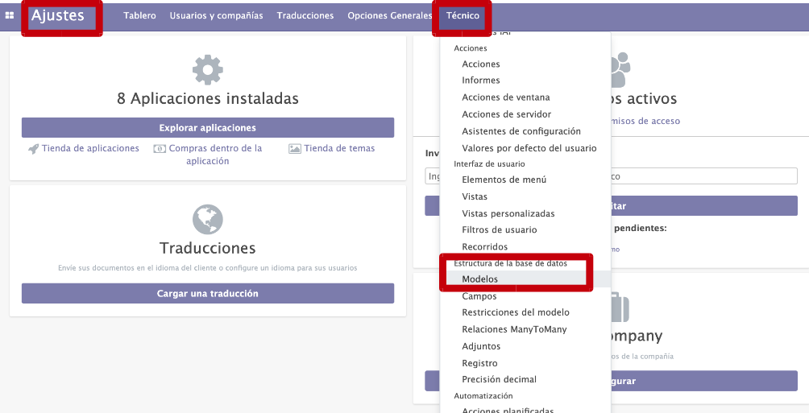
*Figura: en Odoo, los objetos se consultan desde Ajustes → Técnico → Estructura de la base
de datos → Modelos. Los objetos principales son Modelos (las tablas con las que trabaja la
aplicación), Vistas (los formularios que muestran los datos), Menús (la estructura de
navegación) y Acciones (los métodos que abren las vistas). Origen: DAM_SGE03,
Organización, consulta y tratamiento de la información.*

En **Openbravo**, todos los objetos con los que trabaja la aplicación se llaman
**metadatos** y se administran de forma centralizada en el módulo **Diccionario de
Datos**, donde se dan de alta formularios, informes, procesos, tablas y campos (columnas).

### Tablas, registros y campos

Una **tabla** es una estructura de datos organizada en filas y columnas: cada columna es
un **campo** (o atributo) y cada fila un **registro**. En el modelo `res.users`, cada
registro es un usuario y sus atributos son `nombre`, `login`, `password`, etc. Una
**vista** es una "tabla virtual": tiene la misma estructura de filas y columnas y se
consulta igual que una tabla, pero **no almacena datos físicamente**, sino que se apoya en
otras tablas. Las vistas son útiles cuando conviene que un perfil de usuario vea solo una
parte de los datos de una base de datos grande.

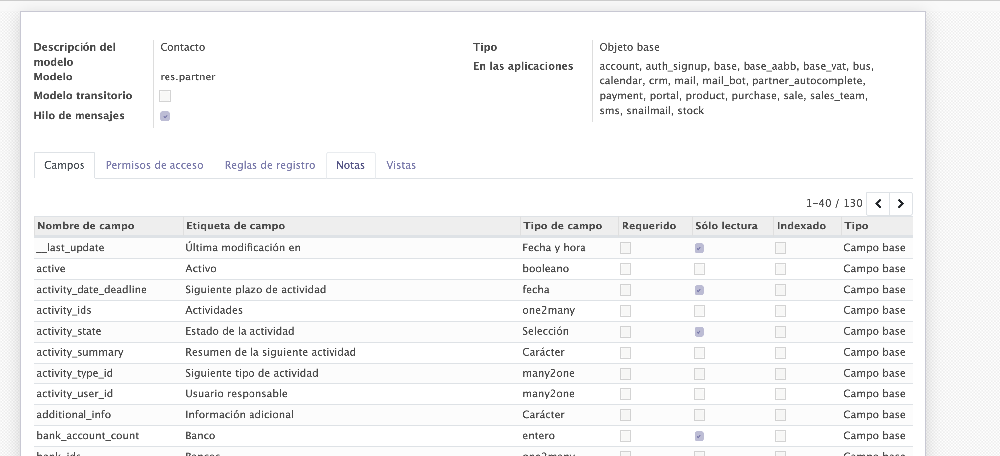
*Figura: pestaña Campos del modelo `res.partner` (Contacto). Para cada campo se indica su
nombre interno, su etiqueta visible, su tipo (carácter, booleano, fecha, `one2many`,
`many2one`, selección…) y si es requerido, de solo lectura o indexado. Origen: DAM_SGE03,
Organización, consulta y tratamiento de la información.*

### Definición de campos en XML

En Odoo, tomado como ejemplo, los objetos y sus vistas se describen en archivos **XML**. Un
objeto está formado por campos, y los campos son la información que se muestra en pantalla. Una vista de tipo formulario con dos
campos se describe así:

```xml
<?xml version="1.0"?>
<form string="Empresa">
   <field name="name"/>
   <field name="title"/>
</form>
```

La etiqueta `form` indica que se describe un formulario; dentro, la etiqueta `field`
representa cada campo. Las etiquetas empiezan por `<` y terminan por `/>`. En las vistas de
tipo formulario, los campos se colocan de izquierda a derecha en el orden en que se
declaran en el XML.

Hay un tipo especial de campo, los campos de relación **`one2many`**, que reflejan una
relación de uno a muchos entre dos objetos. El campo `address` dentro de `res.partner` es
`one2many` y enlaza con `res.partner.address`: una empresa puede tener muchas direcciones
(contactos). Se describe así:

```xml
<field mode="form,tree" name="address">
   <!-- aquí, los campos que forman parte de res.partner.address -->
</field>
```

Además de los campos, existen **elementos de diseño** para personalizar las vistas `form`
y `tree`:

| Elemento | Para qué sirve |
| --- | --- |
| `mode` | Tipos de vista que permitirá el objeto (`form`, `tree`…). |
| `name` | Nombre del campo tal y como aparece en el objeto. |
| `separator` | Añade una línea de separación: `<separator string="link" colspan="4"/>`. `string` define su etiqueta y `colspan` su tamaño. |
| `notebook` | Distribuye los campos en pestañas: `<notebook colspan="4">...</notebook>`. |

Y a la etiqueta `field` se le pueden añadir atributos:

| Atributo | Efecto |
| --- | --- |
| `colspan="4"` | Número de columnas por las que se extiende el campo. |
| `readonly="1"` | Campo de solo lectura. |
| `invisible="True"` | Oculta el campo y su etiqueta. |
| `password="True"` | Sustituye la entrada por el símbolo `•`. |
| `string="..."` | Etiqueta que aparece junto al campo. |

Las interfaces pueden ser **estáticas** (definidas en el código de la aplicación, no
modificables) o **dinámicas** (modificables por el usuario, porque su descripción se
guarda en un lenguaje como XML). No hace falta ser experto en XML: se pueden crear objetos
sencillos tomando como plantilla otros ya existentes, y muchas aplicaciones permiten
generar la descripción de forma gráfica sin escribir código.

### Datos mínimos antes de empezar

Al instalar el perfil mínimo de Odoo conviene comprobar que existen (y, si no, darlos de
alta) al menos estos objetos, necesarios para poder registrar empresas:

- **Título**: tipo de empresa o tratamiento de una persona de contacto. Se distingue con
  el campo *Dominio*, que vale `"Empresa"` o `"Contacto"`.
- **Función**: listado de cargos de las personas de contacto.
- **Provincias**: listado de provincias por país.

> **Ejemplo actual — modelos y campos "a medida" sin tocar código.** En Odoo 17 y 18
> (2023-2024), el modo desarrollador incluye Studio, una herramienta visual para añadir
> campos nuevos a un modelo, colocarlos en el formulario arrastrando y crear vistas sin
> escribir XML a mano. El XML sigue estando debajo: Studio lo genera. Es el mismo patrón
> que ofrecen Salesforce (con sus *custom fields* y *objects*) o Microsoft Dynamics 365,
> donde una parte del trabajo de "definición de campos" se hace desde un editor de
> pantalla y otra parte, la más fina, sigue requiriendo tocar metadatos.

### Ideas clave de esta sección
- En un ERP orientado a objetos, tablas, vistas, formularios, informes y menús son todos
  objetos, identificados por un prefijo de módulo.
- Una tabla guarda datos (filas = registros, columnas = campos); una vista es una tabla
  virtual que no almacena nada.
- Las vistas y sus campos se describen en XML mediante etiquetas `form`, `tree`, `field`,
  `notebook`, `separator` y atributos como `readonly`, `invisible` o `string`.
- El campo `one2many` modela relaciones de uno a muchos entre dos objetos.

---

## 2. Consultas de acceso a datos

Las **consultas de acceso a datos** permiten obtener la información guardada en las tablas
y vistas: indican al sistema gestor de la base de datos que devuelva un extracto de la
información en forma de un **conjunto de registros**. Los pasos para construir una consulta
son:

1. Seleccionar las tablas o vistas sobre las que va a actuar.
2. Establecer la relación entre ellas, si la aplicación no la proporciona.
3. Seleccionar los campos que se van a mostrar.
4. Ejecutar la consulta.

Una consulta puede actuar sobre una o varias tablas y vistas, y se puede guardar para
reutilizarla. Se construye de dos formas: **escribiendo el código** en el lenguaje de
consulta (típicamente **SQL**) o mediante **asistentes y constructores gráficos**, útiles
para consultas poco complejas. En unos casos la propia aplicación permite lanzar consultas;
en otros hay que **conectarse directamente al gestor de la base de datos**.

### pgAdmin 4 y PostgreSQL

Para administrar una base de datos PostgreSQL de forma gráfica se usa **pgAdmin 4**. La
conexión se define con estos datos:

| Dato | Valor habitual |
| --- | --- |
| Nombre | El que se quiera dar a la conexión. |
| Servidor | Dirección IP o nombre del servidor. |
| Puerto | 5432 (por defecto en PostgreSQL). |
| Base de datos de mantenimiento | `postgres`. |
| Nombre de usuario | Usuario de la base de datos (en los materiales, `userbd`). |
| Contraseña | La clave del usuario. |

Conviene tener presente que pgAdmin 4 permite **visualizar gráficamente** el plan de una
consulta, pero **no crear la consulta de forma gráfica** (esa función existía en la
versión anterior, pgAdmin III). La base de datos de un ERP es de gran envergadura —tablas,
vistas, funciones, disparadores—, de ahí la importancia de la nomenclatura y de conocer
algo de SQL para navegarla.

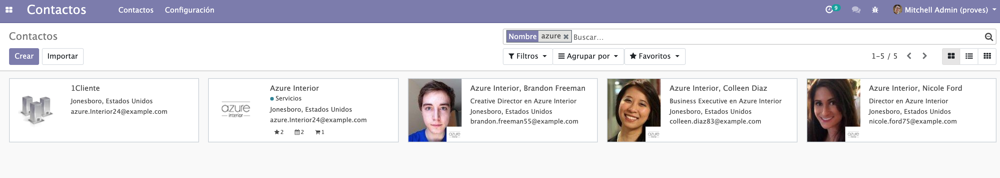
*Figura: la lista de Contactos de Odoo filtrada por el criterio "Nombre contiene azure".
Los criterios se escriben en la parte superior y debajo aparece una vista de tipo árbol
con los registros coincidentes; también se pueden aplicar Filtros predefinidos y Agrupar
por. Origen: DAM_SGE03, Organización, consulta y tratamiento de la información.*

### Búsqueda de información desde la aplicación

Además de las consultas "técnicas", el ERP incorpora **motores de búsqueda** en cada
ventana. Suele haber búsquedas **básicas** sobre los campos principales y búsquedas
**avanzadas** por campos más específicos. En Odoo, los criterios se introducen en la parte
superior de la ventana y debajo se muestra la vista de tipo árbol con el listado, que se
reduce a los registros coincidentes; se pueden aplicar filtros, seleccionar registros y
pasar al modo formulario para ver y editar todos sus datos. Para acceder a Odoo se usa la
dirección IP del servidor seguida del puerto (`localhost:8069` en local, `puerto 8069` por
defecto).

> **Ejemplo actual — el lenguaje de consulta lo pone el ERP.** Odoo no obliga a escribir
> SQL para las operaciones normales: su ORM traduce a SQL expresiones como
> `env['sale.order'].search([('state','=','sale')])`. Aun así, para informes y análisis
> pesados sigue siendo habitual conectar una herramienta externa directamente a
> PostgreSQL. Es el mismo reparto que en otros sistemas: Salesforce tiene su propio
> lenguaje SOQL, y Microsoft Dynamics expone los datos vía Dataverse y OData además del
> acceso directo a SQL Server.

### Ideas clave de esta sección
- Una consulta devuelve un subconjunto de registros de una o varias tablas o vistas.
- Se puede escribir en SQL o construir con asistentes gráficos; se ejecuta desde la
  aplicación o conectando al gestor de base de datos.
- pgAdmin 4 administra PostgreSQL (puerto 5432, base `postgres`); visualiza el plan de una
  consulta pero no la diseña gráficamente.
- La aplicación ofrece además búsquedas básicas y avanzadas con filtros y agrupaciones en
  cada ventana.

---

## 3. Interfaces de entrada de datos y de procesos. Formularios

Todos los datos del programa están almacenados en objetos; para mostrarlos al usuario se
utilizan **interfaces**. Cada objeto tiene su propia interfaz: no se presentan igual los
datos de una empresa que los de una factura. Las interfaces dinámicas se construyen a
partir de una **descripción XML** de la pantalla del cliente. Este es un ejemplo de
descripción de un objeto en Odoo:

```xml
<?xml version="1.0" encoding="utf-8"?>
<form string="Partner">
    <field name="name"/>
    <field name="title"/>
    <field name="ref"/>
    <field name="lang"/>
    <field name="customer"/>
    <field name="supplier"/>
</form>
```

Ese código crea una interfaz para introducir y consultar datos con seis campos: nombre,
tratamiento, código, idioma y dos campos booleanos que indican si es cliente o proveedor.

### Tipos de interfaz

Según cómo se distribuyan los campos, se distinguen principalmente:

- **Formularios**: muestran **un solo registro**, con los campos distribuidos de izquierda
  a derecha y de arriba a abajo, en el orden en que se describen en la vista. Sirven para
  dar de alta y editar.
- **Árboles** (listas): muestran **un conjunto de registros** en modo lista. Son útiles
  para ver muchos registros a la vez y buscar sobre ellos.
- **Gráficos**: presentan los datos de un formulario en varios formatos y tipos para
  visualizarlos mejor.

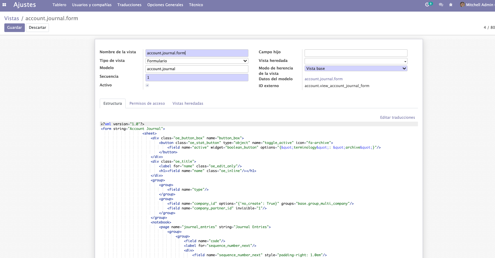
*Figura: edición del XML de la vista `account.journal.form`. Se aprecian las etiquetas
`form`, `sheet`, `group`, `notebook` y `page`, y campos con atributos como `widget`,
`options`, `groups` o `invisible`. La cabecera indica el modelo asociado (`account.journal`)
y el tipo de vista (Formulario). Origen: DAM_SGE03, Organización, consulta y tratamiento de
la información.*

### Personalización de vistas

En Odoo las interfaces se llaman **Vistas** y se pueden personalizar de dos maneras:

1. **Escribiendo código XML** desde Ajustes → Técnico → Interfaz de usuario → Vistas (hay
   que ser superusuario).
2. **Modificando el fichero XML del módulo**. La ruta de los módulos difiere según el
   sistema operativo: en Linux, `/usr/lib/python3/dist-packages/odoo/addons`; en Windows,
   `\archivos de programa\odoo\addons`.

Tras modificar una vista conviene **actualizar la aplicación** desde el menú Aplicaciones
(buscar la aplicación y, en el menú de los tres puntos, seleccionar Actualizar).

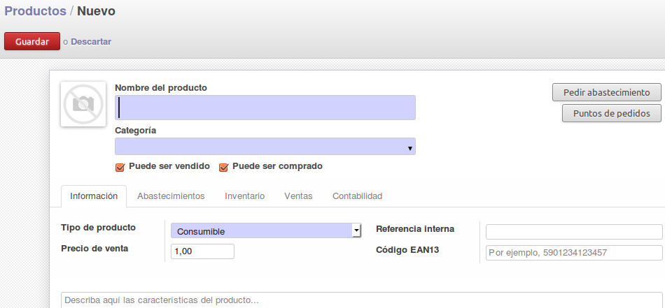
*Figura: formulario de creación de un producto. Un formulario muestra un único registro;
las pestañas (Información, Abastecimientos, Inventario, Ventas, Contabilidad) organizan los
campos —el elemento `notebook` del XML—. Origen: ApuntesU3SGE, Uso del sistema ERP-CRM
(Parte 1).*

### Menús y acciones

Para llegar a los objetos hay que definir **menús** y las **acciones** asociadas. Los
menús se editan desde Ajustes → Técnico → Interfaz de usuario → Elementos de menú; para
crear un menú secundario basta con indicar su menú padre. Cada menú tiene asociada una
acción; las más importantes son:

- **`ir.actions.act_window`**: abre una vista en una nueva ventana.
- **`ir.actions.report`**: imprime un informe.

Al crear una acción que abre una vista hay que indicar, como mínimo, el nombre de la
acción, su tipo y los datos de la vista (tipo —árbol, formulario…— y nombre).

> **Ejemplo actual — formularios web y de escritorio con la misma definición.** Odoo 17
> renovó su interfaz web (framework OWL) manteniendo la idea de que la vista se declara y
> el cliente la "pinta". Herramientas equiparables: Microsoft Power Apps genera
> formularios sobre Dataverse a partir de una definición, y Salesforce usa el Lightning
> App Builder. En todos, el desarrollador describe qué campos y en qué disposición, y el
> sistema se encarga de renderizar en navegador y en móvil.

### Ideas clave de esta sección
- La interfaz de un objeto se describe en XML; los tipos básicos son formulario (un
  registro), árbol (lista de registros) y gráfico.
- En Odoo las vistas se editan por XML desde Técnico → Vistas o en el fichero del módulo, y
  después se actualiza la aplicación.
- Los menús se enlazan con acciones: `ir.actions.act_window` abre vistas,
  `ir.actions.report` imprime informes.

---

## 4. Informes y listados de la aplicación

Los **informes y listados** son una forma de presentar los datos para mejorar su
visualización y poder imprimirlos o archivarlos. Muchos vienen ya creados y son accesibles
desde los menús de la aplicación. Algunos ejemplos:

- Informes contables.
- Albaranes, pedidos y recibos.
- Reclamaciones a proveedores o clientes.
- Informes estadísticos.
- Generación de etiquetas para un conjunto de registros.
- **Informes de agrupamiento**: muestran los registros existentes para un mismo valor de
  un campo.
- Impresión de documentos del sistema.

Los informes que incorpora la aplicación se pueden usar tal cual, **adaptar su diseño a la
imagen corporativa** de la empresa, o **añadir nuevos** instalándolos como módulos
independientes. En Odoo, los módulos que contienen exclusivamente informes llevan la
etiqueta **`report`** en su nombre. Conviene tener claro que un ERP **no** trae de fábrica
la mayor parte de los informes que necesita una empresa concreta: muchos se elaboran
después de la instalación, en la fase de implantación. Para informes complejos también se
recurre a herramientas externas como **Jasper Reports**.

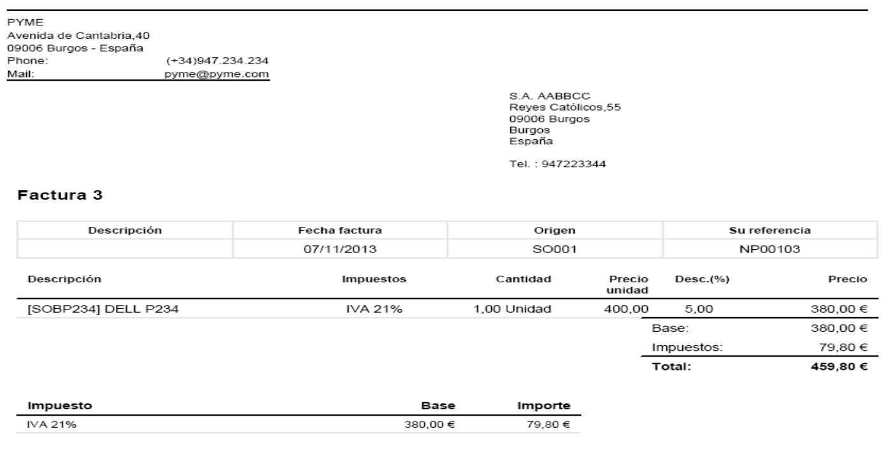
*Figura: salida impresa de una factura de venta, con las líneas de producto, el descuento,
la base, el desglose de IVA al 21 % y el total. Los informes contables se generan como
ficheros PDF listos para imprimir. Origen: ApuntesU3SGE, Uso del sistema ERP-CRM
(Parte 1).*

### Informes en la práctica

En la parte de compras y ventas, los materiales usan la pestaña **Informes** con
**Análisis de ventas**, **Análisis de compras** y **Análisis de recepciones**: en todos se
puede ver el listado, filtrarlo por un criterio y pasar a una **vista de gráfico** con el
botón correspondiente. En contabilidad, los **informes contables** incluyen el **libro
mayor**, el **balance de sumas y saldos**, la cuenta de **pérdidas y ganancias** y la
**hoja de balance**; se lanzan con un asistente y se generan en PDF. Hay además informes
sobre los **diarios** (individualizados, solo los generales o un diario centralizado) y un
**análisis de facturas** (Informes → Contabilidad → Análisis de facturas) con filtros,
agrupaciones y vista gráfica.

> **En las noticias — factura electrónica obligatoria y software "certificado".** En
> España, el desarrollo del Reglamento que regula los sistemas informáticos de facturación
> (conocido como Verifactu, RD 1007/2023) y la futura obligación de factura electrónica
> entre empresas de la Ley Crea y Crece están empujando a los ERP a rehacer sus informes
> de factura: registro inalterable, encadenamiento de registros, código QR y envío a la
> Agencia Tributaria. Según se ha informado, la obligación se aplica de forma escalonada a
> partir de 2026 según el tamaño de la empresa. Fabricantes como Odoo, Holded, Sage o SAP
> han ido publicando módulos y adaptaciones para cumplirlo.

### Ideas clave de esta sección
- El ERP trae informes predefinidos (contables, albaranes, pedidos, estadísticos, de
  agrupamiento), personalizables o ampliables como módulos `report`.
- La mayoría de informes útiles se construyen en la implantación, no vienen de fábrica.
- Los informes contables típicos son libro mayor, sumas y saldos, pérdidas y ganancias y
  hoja de balance; se exportan a PDF.
- Herramienta externa de referencia para informes: Jasper Reports.

---

## 5. Cálculos de pedidos, albaranes, facturas, asientos predefinidos, trazabilidad, producción, entre otros

El **tratamiento de la información** se lleva a cabo mediante **procesos**, que son las
operaciones que ejecuta la aplicación y que tratan de cubrir todas las áreas de la
empresa. Antes de poder ejecutar ningún proceso hay que introducir la información propia de
la compañía: cuentas contables, cuentas bancarias, diarios de compras, ventas y caja o
banco, impuestos y, después, clientes, proveedores y productos con su información mínima.
Si está instalado el módulo de contabilidad, al crear un cliente o proveedor hay que
asociarle cuentas de cobro y de pago, que deben existir de antemano.

### Compras y ventas

Los procesos de negocio más habituales encadenan documentos:

- **Operaciones de compra**: crear una orden de compra (pedido de compra) → recibir los
  bienes → controlar la factura de compra → registrar el pago al proveedor.
- **Operaciones de venta**: crear una orden de venta (pedido de venta) y recibir la
  conformidad del cliente → preparar los bienes y hacer el albarán y la entrega → realizar
  la factura de venta → registrar el cobro.

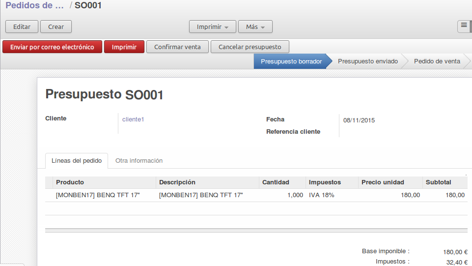
*Figura: presupuesto de venta SO001. La barra superior marca el ciclo del documento
(Presupuesto borrador → Presupuesto enviado → Pedido de venta); en las líneas del pedido se
calculan cantidad, impuestos, precio unitario y subtotal, y al pie la base imponible y los
impuestos. Origen: ApuntesU3SGE, Uso del sistema ERP-CRM (Parte 1).*

En el flujo de compra, una vez creada la orden se calculan los costes totales con el botón
**Calcular** y se valida con **Convertir a pedido de compra** (Confirmar pedido): ese paso
**crea la factura y el albarán de entrada** en el almacén. Al llegar la mercancía se
localiza el albarán en Almacén → Albaranes de entrada y se valida (**Recibir**), con lo
que las cantidades se contabilizan en el stock. El pago de la factura tiene tres fases:
**Validar**, **Pagar** (Efectivo o Tarjeta) y comprobar que el estado pasa a **Pagado**.

El pedido de venta siempre tiene dos partes imprescindibles: una para el almacén (**albarán
de salida**) y otra para el cliente (**factura**). Según el orden en que se procesen esas
dos partes se generan cuatro flujos de trabajo distintos (albarán y después factura;
albarán y factura en paralelo; factura y después albarán; o factura creada desde el
albarán). Es imprescindible procesar **ambos** documentos: uno actualiza el almacén y el
otro la contabilidad.

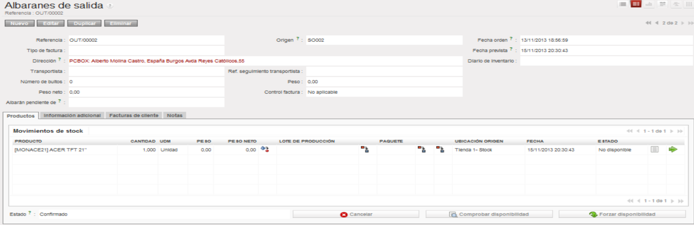
*Figura: albarán de salida OUT/00002 vinculado al pedido SO002. En la pestaña de
movimientos de stock figuran el producto, la cantidad, la ubicación de origen y el estado;
los botones "Comprobar disponibilidad" y "Forzar disponibilidad" gestionan la reserva.
Origen: ApuntesU3SGE, Uso del sistema ERP-CRM (Parte 1).*

Un **producto** se define con nombre, referencia, si puede comprarse, venderse o ambas
cosas, y su **tipo**: *Consumible* (no gestiona stock, cantidad ilimitada), *Almacenable*
(gestiona stock) o *Servicio* (no es un producto físico). Se indica también el método de
abastecimiento (bajo pedido o desde el stock), si se fabrica o se compra, el precio de
coste y el de venta, las existencias iniciales (pestaña Inventario, botón Actualizar) y los
impuestos (pestaña Contabilidad, por norma general el 21 %).

### Devoluciones

Las devoluciones obligan a gestionar bien las dos vertientes (almacén y contabilidad) para
que el sistema no quede inconsistente. Si aún no se ha generado la factura, se cancela el
albarán de salida y luego el pedido. Si la factura ya está pagada, **no se puede cancelar**:
hay que crear una **factura rectificativa** ("Reintegrar factura"), validarla y registrar
el pago. Es habitual distinguir los pedidos devueltos cambiando su
referencia (por ejemplo, de `PO...` a `RT...`).

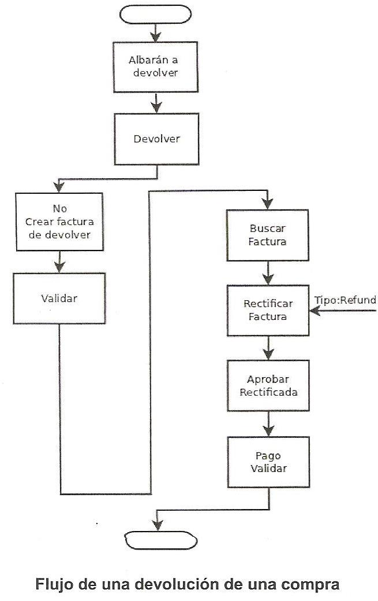
*Figura: flujo de una devolución de compra. Se parte del albarán a devolver; si no había
factura se cancela sin más; si la había, se busca, se crea una rectificativa, se aprueba y
se valida el pago. Origen: ApuntesU3SGE, Uso del sistema ERP-CRM (Parte 1).*

### Almacén, stock y trazabilidad

La gestión de almacén se apoya en dos conceptos: **Ubicación** y **Almacén**. Un almacén es
una localización física dividida en ubicaciones (secciones). Los movimientos de material
entre ubicaciones se documentan con **albaranes**, de tres tipos: **de entrada** (recepción
de mercancías), **de salida** (salida de productos) e **internos** (movimientos entre
almacenes o ubicaciones propias). El almacenaje usa un sistema de **doble entrada**: todo
movimiento es una salida de una ubicación (resta unidades) y una entrada en otra (suma
unidades), de modo que la cuenta total entre todos los almacenes es cero; eso facilita el
control de errores.

Cada producto tiene dos valores de stock:

- **Valor real**: cantidad total existente en este momento. Se usa en las ventas.
- **Valor virtual**: valor real + lo que se espera recibir − lo que se va a distribuir. Se
  usa para lanzar reglas automáticas de almacenaje.

Los tipos de ubicación son: **Vista** (solo organizativa, nunca contiene stock),
**Interno** (stock propio), **Inventario** (correcciones manuales), **Producción**
(material que forma un producto y su fabricación), **Abastecimiento** (ubicación temporal
cuando el sistema no puede determinar origen o destino) y **Tránsito** (movimientos entre
sedes de una multinacional). El sistema permite flujos **pull** y **push** automáticos y
**reglas de stock mínimo y máximo**: cuando el stock virtual baja del mínimo se genera un
presupuesto de compra y una **excepción de abastecimiento** que hay que gestionar. La
**trazabilidad** es, precisamente, el seguimiento del producto desde su entrada hasta su
salida; el análisis detallado de movimientos por producto (Almacén → Trazabilidad →
Movimientos de existencias) muestra cada cambio de stock entre ubicaciones.

Dos ubicaciones se pueden **enlazar** para que el material pase de una a otra de forma
automática, sin generar albaranes: por ejemplo, cuando llega una mercancía se recibe en una
ubicación física y se desplaza a otra para el control de calidad. Para el seguimiento
diario, el sistema ofrece el **tablero principal del almacén** (página inicial por defecto;
si no, en Informes → Tableros → Almacén), que muestra de un vistazo el estado de los
albaranes y las excepciones de abastecimiento pendientes. Junto al tablero hay dos informes
específicos: el **análisis de movimientos** (todos los traspasos de material entre
ubicaciones, con opción de ordenar, filtrar y exportar) y el **análisis de inventario**
(cómo se reparten los productos por las ubicaciones físicas; conviene agruparlo por
Ubicación).

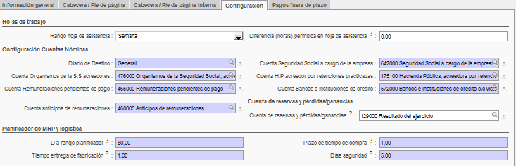
*Figura: secuencia de puesta en marcha del almacén: crear la estructura, las categorías de
productos, los productos, el stock inicial, establecer las reglas de abastecimiento y
comprobar los niveles de stock. Origen: ApuntesU3SGE, Uso del sistema ERP-CRM (Parte 1).*

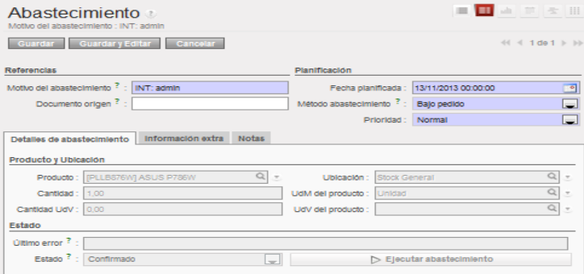
*Figura: orden de abastecimiento con su método (bajo pedido), la fecha planificada, el
producto y la ubicación, y el botón "Ejecutar abastecimiento". Las ubicaciones de tipo
Producción intervienen en la fabricación de un producto a partir de sus materiales. Origen:
ApuntesU3SGE, Uso del sistema ERP-CRM (Parte 1).*

### Contabilidad y asientos predefinidos

La contabilidad está **totalmente integrada** con compras y ventas: cuando se crea un
pedido con su factura, se dan de alta los **asientos contables** de forma automática. El
módulo se alimenta de dos fuentes: la **configuración** (ejercicios y periodos, diarios,
plan contable, impuestos y plazos, tipos de pago) y la **actividad diaria** más los apuntes
manuales del contable.

- **Ejercicio fiscal**: nombre, código y fechas de inicio y fin; estado Abierto o Cerrado.
  Está formado por **periodos**, que suelen coincidir con las liquidaciones de impuestos
  (trimestrales o mensuales; trimestrales para PYMES en España) y que no se solapan salvo
  en la apertura y el cierre.
- **Diario**: libro contable donde se registran los asientos. Se recomienda uno por tipo
  de operación y como mínimo tres (compras, ventas y efectivo). Tipos habituales: General,
  Ventas, Compras, Efectivo/Tarjeta, Abono de…, y Banco y cheques.
- **Impuestos**: nombre, cuándo se aplican, tipo e importe.
- **Mecanismos de pago**: plazos de pago, tipos de pago y modos de pago (un modo relaciona
  un tipo de pago con un banco, un tipo de recibo y el diario donde se anota).
- **Plan contable**: estructura jerárquica de cuentas según una norma. No se crea de cero:
  se parte de una plantilla (plan general o plan para PYMES).
- **Cuentas**: nombre, código, tipo interno (vista, regular, a cobrar, a pagar, liquidez,
  consolidación o cierre), tipo de cuenta contable, método de cierre y si permiten
  conciliar asientos.

Un **apunte** es una entrada registrada en un libro al debe o al haber; un **asiento** es
un conjunto de apuntes que representan un movimiento contable. El sistema los crea
automáticamente en el momento del pago, aunque también admite creación manual. Los
**asientos predefinidos** permiten introducir asientos con rapidez sin necesidad de tener
conocimientos de contabilidad. Con los asientos se puede **asentar** (validar varios de un
diario y periodo para impedir cambios) y **conciliar**.

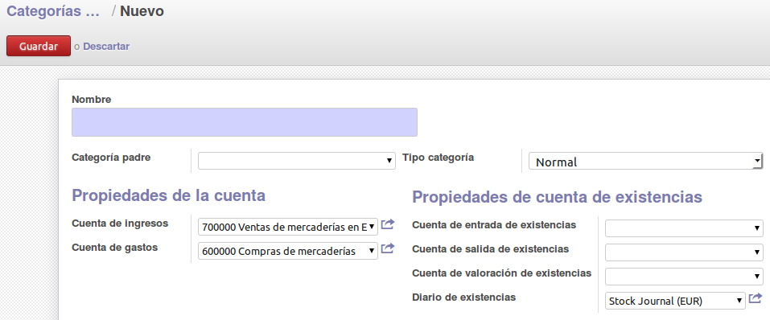
*Figura: en la categoría de producto se fijan las cuentas contables por defecto (cuenta de
ingresos 700000 Ventas de mercaderías, cuenta de gastos 600000 Compras de mercaderías) y el
diario de existencias; de ahí salen los asientos que la aplicación genera al vender o
comprar. Origen: ApuntesU3SGE, Uso del sistema ERP-CRM (Parte 1).*

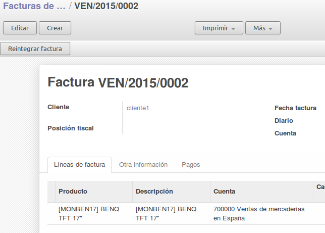
*Figura: factura de venta VEN/2015/0002. Cada línea de factura lleva asociada su cuenta
contable (700000 Ventas de mercaderías en España); "Reintegrar factura" es el punto de
partida de una rectificativa. Origen: ApuntesU3SGE, Uso del sistema ERP-CRM (Parte 1).*

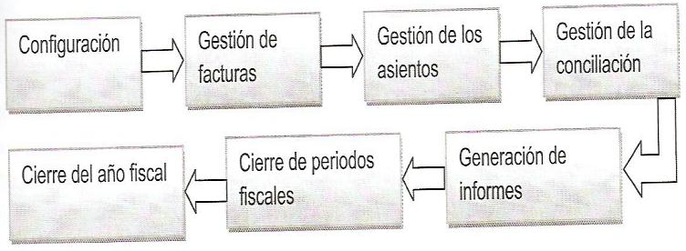
*Figura: secuencia de la gestión contable: configuración, gestión de facturas, gestión de
los asientos, conciliación, generación de informes, cierre de periodos y cierre del año
fiscal. Origen: ApuntesU3SGE, Uso del sistema ERP-CRM (Parte 2).*

El **cierre contable** usa asistentes que hacen buena parte del trabajo. Cerrar un
**periodo** impide nuevos movimientos entre esas fechas y es reversible sin pérdida de
datos. Cerrar el **año fiscal** es más laborioso: revisar que no falte nada por
contabilizar, hacer inventario físico, amortizar activos, ajustar cuentas, calcular el
impuesto de sociedades, renumerar los asientos y comprobar que existen los asientos de
apertura y cierre (`A/`, `C/`, `PG/`). En los materiales se emplea el módulo
`l10n_es_fiscal_year_closing`.

### Recursos humanos y nóminas

El área de personal cubre la ficha de los empleados y sus contratos, el **control de
asistencia**, la organización de las **ausencias** y la **gestión de nóminas**. La
asistencia se justifica normalmente por **fichaje**: el empleado registra su entrada y su
salida y consulta su hoja de asistencia semanal (si el menú no aparece, se instala el
módulo `hr_attendance`). Las **ausencias** se configuran antes como tipos (Recursos
Humanos → Configuración → Tipos de ausencia); el sistema interpreta como vacaciones
cualquier falta no tipificada. A cada tipo se le puede exigir **doble validación** (deben
aprobarla dos personas) o una sola. El circuito distingue dos casos: una falta justificada
se pide mediante una **petición de ausencia** (descripción, tipo, fecha de inicio y número
de días), y las vacaciones mediante una **petición de asignación**; en ambos casos
Recursos Humanos aprueba o rechaza. Para las **nóminas**, una vez cerradas las hojas de
trabajo se crea la nómina de cada empleado (Recursos Humanos → Nómina → Nóminas del
empleado) indicando el diario contable donde anotar el gasto, el diario desde el que se
paga y la fecha; se añaden las líneas de bonificación o rectificación necesarias, se
calcula con **Recalcular plantilla** y se valida con **Comprobar hoja**. El pago genera el
asiento correspondiente en las cuentas configuradas en la compañía y en la ficha del
empleado.

### Módulos de Odoo 17 y su interconexión

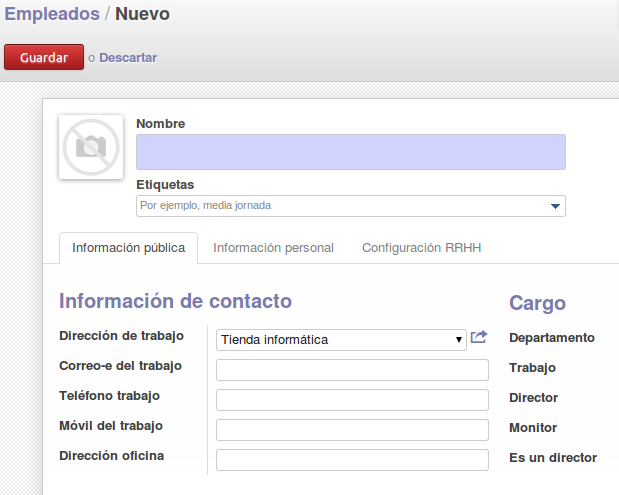
*Figura: formulario de creación de un empleado, con las pestañas Información pública,
Información personal y Configuración RRHH. La gestión de recursos humanos (empleados,
contratos, fichaje de asistencia, ausencias y nóminas) es otro de los procesos del ERP.
Origen: ApuntesU3SGE, Uso del sistema ERP-CRM (Parte 2).*

El material más reciente de la carpeta describe, para Odoo 17, módulos como
**Facturación** (facturas estándar, proforma, rectificativa o recurrente; conciliación
bancaria; gestión de IVA y retenciones; facturación electrónica), **Compra** (solicitudes
de presupuesto o RFQ, comparación de ofertas, pedidos, recepción y **gestión de tres vías**
pedido-recepción-factura), **Ventas** (CRM integrado, presupuestos, listas de precios,
entregas) y **Punto de venta** (POS: interfaz táctil, códigos de barras, sesiones de caja,
gestión de mesas en hostelería). La **interconexión** hace que, al confirmar un pedido de
venta, se genere automáticamente la factura y, si hace falta, el movimiento de inventario;
y que, si no hay stock para cubrir un pedido de cliente, Odoo pueda lanzar por sí mismo una
orden de compra al proveedor.

> **Ejemplo actual — un pedido que se convierte solo en albarán, factura y asiento.** En
> una tienda que use Odoo 18 o Dolibarr 21 (2024-2025), confirmar el pedido de un cliente
> desencadena la reserva de stock, el albarán de salida, la factura con su IVA y el asiento
> en el diario de ventas, todo enlazado. El personal de tienda solo valida; los cálculos
> (subtotales, impuestos, descuentos, contrapartidas contables) los hace el ERP. El mismo
> principio, a mayor escala, es lo que venden SAP S/4HANA o Microsoft Dynamics 365
> Business Central.

### Ideas clave de esta sección
- Compras y ventas encadenan pedido → recepción/entrega (albarán) → factura → pago/cobro;
  hay que procesar siempre el albarán y la factura.
- El almacén funciona por doble entrada; cada producto tiene stock real y stock virtual, y
  las reglas de mínimo disparan compras y excepciones de abastecimiento.
- La trazabilidad es el seguimiento del producto de la entrada a la salida.
- La contabilidad se integra con compras y ventas: el pago genera asientos; los asientos
  predefinidos agilizan la introducción; el cierre de periodo y de ejercicio se hacen con
  asistentes.
- Recursos humanos cubre fichaje de asistencia, ausencias (con posible doble validación:
  petición de ausencia frente a petición de asignación de vacaciones) y nóminas, que se
  calculan con "Recalcular plantilla", se validan con "Comprobar hoja" y generan asiento.

---

## 6. Gráficos

Los **gráficos** son otra forma de ver los datos de un formulario: los mismos datos se
representan en varios formatos y tipos para visualizar mejor la información. En Odoo, el gráfico es un **tipo de vista** más, junto al formulario y al
árbol, y se define igual que los demás en la descripción XML del objeto.

En la práctica, los análisis de la aplicación (Análisis de ventas, de compras, de
recepciones, de facturas) ofrecen un botón de **vista de gráfico** situado en la parte
superior derecha de la ventana: con los mismos filtros y agrupaciones que la lista, se pasa
de la tabla a la gráfica. Esta capacidad enlaza con la inteligencia de negocio, cuya
tercera tarea consiste precisamente en **mostrar la información en distintos formatos
gráficos** y convertirla en indicadores.

El gráfico se trata aquí como una vista alternativa a la lista y al formulario y como paso
final de los procesos de análisis y de inteligencia de negocio, sin entrar en un catálogo
de tipos de gráfico ni en sus opciones de configuración.

> **Ejemplo actual — del gráfico suelto al panel completo.** Odoo 17 permite fijar
> vistas de gráfico y de tabla dinámica y agruparlas en su módulo de paneles; fuera del
> ERP, es muy común volcar los datos de PostgreSQL en herramientas como Metabase, Apache
> Superset, Grafana o Power BI para construir gráficos interactivos que se refrescan solos.
> La diferencia con el gráfico interno del ERP es que estas herramientas cruzan datos de
> varias fuentes y permiten explorarlos sin tocar la aplicación de gestión.

### Ideas clave de esta sección
- El gráfico es un tipo de vista que representa los datos de un formulario en distintos
  formatos.
- Los análisis de la aplicación incluyen un botón para pasar de lista a gráfico con los
  mismos filtros.
- Es el paso final de los procesos de análisis y de inteligencia de negocio.

---

## 7. Herramientas de monitorización y de evaluación del rendimiento

Cuando alguien administra el servidor donde corre el ERP necesita herramientas para
**seguir los datos que arroja el equipo**. El rendimiento del servidor puede degradarse o
caer por muchos motivos; para investigarlo hay que consultar los **ficheros de registro
(logs)** o ejecutar herramientas de análisis y monitorización. Se pueden obtener datos
**instantáneos** (uso de procesador, memoria, dispositivos de entrada y salida…) o
**recoger datos periódicamente** y guardarlos en ficheros históricos para consultarlos
después; esos históricos revelan carencias y **cuellos de botella**. Las utilidades típicas
recopilan la información del sistema, la almacenan durante un tiempo y calculan valores
medios.

### La herramienta `sar` (paquete `sysstat`)

En un servidor Linux, una de las herramientas de referencia es **`sar`**, incluida en el
paquete **`sysstat`**:

```
$ sudo apt-get install sysstat
```

Todos los comandos de `sar` aceptan como parámetros el **número de valores** a obtener y
**cada cuántos segundos** capturarlos. Por ejemplo, tres lecturas del uso de procesador,
una por segundo:

```
$ sar 1 3
```

```
Linux 2.6.35-28-generic (ubuntu)   21/12/11   _x86_64_   (1 CPU)
16:38:02   CPU   %user   %nice %system %iowait  %steal   %idle
16:38:03   all   70,00    0,00   18,00   0,00     0,00   12,00
16:38:04   all   67,00    0,00   26,00   0,00     0,00    7,00
16:38:05   all   52,00    0,00   28,00   0,00     0,00   20,00
Media:     all   63,00    0,00   24,00   0,00     0,00   13,00
```

La última fila es la **media aritmética** de las lecturas. Otras opciones útiles:

| Orden | Qué muestra |
| --- | --- |
| `sar -P ALL` | Uso de cada procesador. |
| `sar -r` | Memoria. |
| `sar -n DEV` | Interfaces de red. |
| `sar -d` | Discos. |

Para que `sar` capture información **periódica** hay que editar `/etc/default/sysstat` y
poner `ENABLED="true"`, y reiniciar el servicio con `/etc/init.d/sysstat start`. A partir
de ahí, el script `/usr/lib/sysstat/sa1` se ejecuta cada 10 minutos y guarda los datos de
rendimiento en `/var/log/sysstat/saXX`, donde `XX` es el día del mes; por defecto se
conserva la última semana. Para consultar esos datos de forma **gráfica** se usa la
herramienta **Isag** (disponible en Synaptic).

### Auditorías de acceso a los datos: logs

La actividad de los programas —sobre todo los que corren en servidores— queda registrada
en **logs**. Examinar esos ficheros sirve para hacer un **control de acceso a los datos**:
quién entra, qué comandos ejecuta, qué errores muestran las aplicaciones. En la mayoría de
distribuciones Linux, los logs están en `/var/log` y hace falta ser `root` (o pertenecer a
un grupo autorizado) para verlos. Ahí está, por ejemplo, `syslog`, con mensajes de
demonios y de programas como `cron`, `init` o `dhclient`, además de mensajes del núcleo. En
el entorno gráfico de GNOME se pueden consultar de forma visual.

> **Ejemplo actual — del `sar` al panel de métricas.** Las ideas de `sar`/`isag` siguen
> vigentes, pero hoy es habitual montar la monitorización con Prometheus recogiendo
> métricas y Grafana dibujándolas, o con Zabbix y Netdata, con alertas por correo o chat
> cuando la CPU, la memoria o el disco de la base de datos superan un umbral. Para el ERP
> en sí, Odoo.sh y los planes gestionados de SAP o Salesforce incluyen sus propios cuadros
> de estado del servicio.

### Ideas clave de esta sección
- El rendimiento se vigila con lecturas instantáneas y con históricos que revelan cuellos
  de botella.
- En Linux, `sar` (paquete `sysstat`) toma medidas de CPU, memoria, red y disco; `sar N M`
  significa M lecturas cada N segundos y la última fila es la media.
- La captura periódica se activa en `/etc/default/sysstat`; los datos van a
  `/var/log/sysstat/saXX` y se visualizan con Isag.
- Los logs de `/var/log` (accesibles como root) permiten auditar accesos y actividad.

---

## 8. Incidencias: identificación y resolución

El registro de trazas del sistema no solo sirve para auditar accesos: su utilidad
principal es **consultar la información después para resolver problemas**. Cuando una
aplicación no funciona o no consigue arrancar, lo normal es que **imprima una traza de
error** que orienta sobre lo que ocurre.

En `/var/log` están las trazas de las aplicaciones. Por ejemplo, para ver la actividad del
servidor de Odoo:

```
$ sudo head /var/log/odoo/odoo-server.log
```

La salida son las diez primeras líneas del log, donde se puede interpretar, por ejemplo,
que el servidor de Odoo está en marcha y esperando conexiones en el **puerto 8069**.
Cualquier incidencia queda reflejada en estos archivos; a partir de ahí hay que
**identificar la causa y proponer una solución**, y **documentar** tanto la incidencia
como la resolución.

### Incidencias funcionales

No todas las incidencias son del servidor. En el uso diario aparecen problemas de
**coherencia entre el almacén y la contabilidad**: si una devolución se gestiona a medias
(se cancela el albarán pero no se rectifica la factura, o al revés), el sistema queda
inestable. Otro caso frecuente son las **excepciones de abastecimiento**, que se generan
cuando el stock virtual baja del mínimo o cuando el sistema no puede determinar el origen o
el destino de un movimiento; se revisan en la planificación del almacén y se resuelven
convirtiendo el presupuesto de compra en pedido y recibiendo el material. La regla general
es: toda operación que toque stock y dinero debe completarse en sus dos vertientes.

> **En las noticias — cuando el ERP para la fábrica.** En los últimos años se han
> documentado varios incidentes en los que un fallo o una migración mal planificada de un
> ERP dejó a empresas sin poder facturar o servir pedidos durante días, con impacto
> directo en las cuentas. Es el motivo por el que las implantaciones separan los entornos
> (desarrollo, pruebas y explotación), guardan copias de seguridad frecuentes y practican
> la vuelta atrás antes de tocar el sistema en producción.

### Ideas clave de esta sección
- Ante un fallo, el primer sitio donde mirar es el log de la aplicación (`/var/log/odoo/…`
  para Odoo).
- La incidencia y su solución se documentan.
- Muchas incidencias son de consistencia funcional (almacén/contabilidad, excepciones de
  abastecimiento) y se resuelven completando el proceso en sus dos vertientes.

---

## 9. Procesos de extracción de datos en sistemas de ERP-CRM y almacenes de datos

La **extracción de datos** es la operación de **sacar datos de una aplicación para
tratarlos en otra**. El uso más sencillo consiste en conectar una **herramienta
ofimática** (procesador de textos, hoja de cálculo) al ERP y volcar en ella información de
la base de datos. Los procesos más potentes son los de **Business Intelligence**, que se
tratan en la sección siguiente.

### Según el origen de los datos

- **Consultas e informes**: cuando **todos los datos están en una sola base de datos** y
  se extraen con una consulta SQL. La aplicación ofrece consultas e informes predefinidos,
  y también permite crear los propios o usar herramientas externas como Jasper Reports.
- **Almacenes de datos** (*data warehouse*): la extracción se hace **desde varios sistemas
  y bases de datos distintas**, creando un almacén de datos cuyo objetivo es
  **homogeneizar e integrar** la información.
- **Cubos multidimensionales**: un cubo n-dimensional es un conjunto de datos organizados
  en **ejes y celdas** que maneja la información de una base de datos relacional. También
  existen bases de datos multidimensionales, como alternativa a guardar los datos en
  bases relacionales y manejarlos luego con cubos.

Cuando el volumen es grande, la extracción y la manipulación **no se hacen en tiempo
real**, para no penalizar la velocidad de respuesta: primero se extraen los datos y
después se manipulan, de modo que puede haber una **ligera diferencia** entre la
información ya procesada y el contenido real de la base de datos en ese instante.

### Importar y exportar

La forma directa de extraer información de la aplicación es **exportar** los datos; y para
cargar información de forma masiva se **importa**. El formato habitual es **CSV**, texto en
el que las columnas se separan por comas (o por punto y coma cuando la coma es el separador
decimal, como en España, Francia o Italia) y las filas por saltos de línea. La herramienta
de importación permite **seleccionar los campos** y volcarlos en el objeto deseado, hacia
una sola tabla o hacia varias (con un separador que indica a qué tabla pertenece cada
dato). Para exportar, desde el objeto se elige la opción **Exportar** del formulario; el
archivo generado se abre en cualquier ofimática o, si es CSV, en un editor de texto. En
Odoo, exportar desde la **vista formulario** ofrece más campos que hacerlo desde la vista
árbol.

### Automatizar la extracción

Automatizar las extracciones de datos mediante **procesos** es otro de los puntos que trabaja esta unidad.
Para ello se usan:

- **Procedimientos almacenados de servidor**: un programa, procedimiento o función
  guardado en la base de datos y listo para usarse. Puede ejecutarlo el usuario o
  dispararse cuando se cumple una condición mediante **disparadores**. En PostgreSQL se
  escriben en varios lenguajes:

  ```sql
  CREATE [ OR REPLACE ] FUNCTION nombre_funcion([ argumentos ])
  RETURNS tipo AS
  $BODY$
   codigo
  $BODY$
  LANGUAGE lenguaje;
  ```

  Se ejecutan con `SELECT nombre_funcion();`. Ejemplo que devuelve las empresas de tipo
  sociedad limitada:

  ```sql
  CREATE OR REPLACE FUNCTION PRUEBA()
   RETURNS setof res_partner AS
  $BODY$
  select * from res_partner where title='Ltd'
  $BODY$
  LANGUAGE sql;
  ```

- **Eventos de servidor**: detectan que ocurre algo en la aplicación y hacen que el
  sistema responda automáticamente (por ejemplo, enviar un correo al cliente cada vez que
  hace un pedido, o registrar ese pedido en su histórico). Se crean **a nivel de objetos**,
  no de base de datos, y se definen desde los menús de la aplicación sin necesidad de
  programar en la base de datos.

- **Copias de seguridad y migración** como forma de extracción global. Los materiales
  detallan, para Odoo, qué hay que copiar: el **sistema base de Odoo**, la **base de datos
  PostgreSQL**, el **fichero de configuración** (`/etc/odoo/odoo.conf`) y las **carpetas**
  de datos (`addons`, `sessions` y `filestore` —escrito «firestore» en el material—,
normalmente bajo `/var/lib/odoo`). La copia
  de la base de datos se puede hacer desde la interfaz de Odoo
  (`http://localhost:8069/web/database/manager`, con la contraseña maestra) o con las
  herramientas clásicas de PostgreSQL (`pg_dump` para copiar, `psql` para restaurar).
  Migrar a otro servidor con la misma versión solo exige restaurar y ajustar el fichero de
  configuración; migrar **entre versiones** es más delicado y no siempre es posible.

> **Ejemplo actual — extracción programada hacia el almacén de datos.** Un patrón muy
> extendido es programar cada noche un proceso ETL (con Talend, Apache NiFi, Airbyte o
> dbt) que lee de la base de datos del ERP, limpia y combina los datos y los deja en un
> almacén (BigQuery, Snowflake, Redshift o un PostgreSQL analítico). Al día siguiente, los
> informes y cuadros de mando consultan el almacén, no el ERP, para no ralentizarlo. Es la
> versión moderna de "primero se extrae y luego se manipula".

### Ideas clave de esta sección
- Extraer datos es llevarlos de una aplicación a otra; lo más simple es exportar a CSV
  hacia una hoja de cálculo.
- Si los datos están en una sola base, se usan consultas e informes; si están repartidos,
  se construye un almacén de datos que los integra; los cubos multidimensionales los
  organizan en ejes y celdas.
- La extracción de gran volumen no se hace en tiempo real.
- Se automatiza con procedimientos almacenados (ejecutados por el usuario o por
  disparadores), eventos de servidor y procesos programados; las copias de seguridad son
  una extracción global del sistema.

---

## 10. Inteligencia de negocio (Business Intelligence)

La **inteligencia de negocio (BI)** agrupa los procesos "más complicados y potentes" de
extraer información. Una solución de BI debe realizar **tres tareas**:

1. **Transformar y combinar** los datos para extraer la información.
2. **Convertirla en indicadores** potentes.
3. **Mostrarla** en distintos formatos gráficos.

Para conseguirlo se apoya en los elementos vistos en la sección anterior: **consultas e
informes** cuando los datos están en una sola base; **almacenes de datos** cuando proceden
de varios sistemas y hay que homogeneizarlos e integrarlos; y **cubos multidimensionales**
(o bases de datos multidimensionales) para analizar la información por ejes y celdas. Como
el volumen suele ser alto, el procesamiento no se hace en tiempo real: se extrae primero y
se manipula después, asumiendo una posible diferencia leve con el dato vivo del ERP.

El objetivo final es que la dirección disponga de una **visión consolidada** —ventas,
compras, facturación, almacén— en un único lugar, con **indicadores** y **gráficos** que
apoyen la toma de decisiones, en vez de tener que mirar cada módulo por separado. Los
materiales de la unidad presentan la BI de forma introductoria: definen sus tres tareas y
sus componentes, pero no desarrollan una herramienta concreta de BI ni un ejemplo paso a
paso.

> **Ejemplo actual — BI encima del ERP.** Sobre Odoo es habitual conectar Metabase o
> Apache Superset a su base PostgreSQL para publicar cuadros de mando de ventas y
> tesorería; Microsoft integra Power BI con Dynamics 365, y Salesforce ofrece Tableau y
> CRM Analytics. La tendencia 2024-2025 añade asistentes de IA generativa (Joule en SAP,
> Einstein/Agentforce en Salesforce, Copilot en Dynamics) que permiten preguntar en
> lenguaje natural "¿cómo van las ventas de este trimestre por región?" y obtener el
> gráfico y el comentario. El concepto de fondo sigue siendo el mismo: transformar datos,
> convertirlos en indicadores y mostrarlos.

### Ideas clave de esta sección
- BI = transformar y combinar datos + convertirlos en indicadores + mostrarlos en
  gráficos.
- Se apoya en consultas e informes, almacenes de datos y cubos multidimensionales.
- No trabaja en tiempo real con grandes volúmenes.
- Su fin es dar a la dirección una visión consolidada del negocio para decidir.

---

## Glosario rápido

| Término | En una frase |
| --- | --- |
| Objeto | Todo elemento de la aplicación (tabla, vista, formulario, informe, menú, asistente) que permite acceder a sus datos. |
| Modelo (Odoo) | La tabla con la que trabaja la aplicación; se consulta en Técnico → Estructura de la base de datos. |
| Campo | Columna de una tabla o dato que se muestra en una vista; se declara con la etiqueta `field` en XML. |
| Vista | Interfaz de un objeto (formulario, árbol o gráfico) descrita en XML; también, tabla virtual que no almacena datos. |
| `one2many` | Tipo de campo que modela una relación de uno a muchos entre dos objetos. |
| Consulta de acceso a datos | Petición que devuelve un subconjunto de registros de una o varias tablas o vistas. |
| SQL | Lenguaje de consulta estructurado con el que se escriben las consultas al gestor de base de datos. |
| pgAdmin 4 | Herramienta gráfica para administrar bases de datos PostgreSQL (puerto 5432). |
| Formulario | Vista que muestra un solo registro con los campos ordenados según el XML. |
| Árbol | Vista que muestra un conjunto de registros en modo lista. |
| Informe | Presentación de datos para visualizar o imprimir; en Odoo, módulos con etiqueta `report`. |
| Albarán | Documento que refleja un movimiento de mercancía: de entrada, de salida o interno. |
| Trazabilidad | Seguimiento del producto desde su entrada hasta su salida. |
| Stock real / virtual | Existencias actuales / existencias actuales más lo esperado menos lo comprometido. |
| Asiento / apunte | Movimiento contable formado por apuntes al debe y al haber / cada una de esas entradas. |
| Asiento predefinido | Plantilla que permite introducir asientos con rapidez sin saber contabilidad. |
| Procedimiento almacenado | Programa guardado en la base de datos, ejecutable por el usuario o por un disparador. |
| Evento de servidor | Automatismo definido a nivel de objeto que responde a algo que ocurre en la aplicación. |
| `sar` / `sysstat` | Herramienta y paquete de Linux para medir CPU, memoria, red y disco del servidor. |
| Log | Fichero de `/var/log` que registra actividad, accesos y errores del sistema o de una aplicación. |
| ETL | Proceso de extraer, transformar y cargar datos de un sistema a otro. |
| Almacén de datos | Depósito que integra y homogeneíza datos procedentes de varios sistemas. |
| Cubo multidimensional | Conjunto de datos organizado en ejes y celdas para analizarlos por dimensiones. |
| Business Intelligence | Conjunto de procesos que transforman datos en indicadores y los muestran en gráficos. |

## Preguntas de repaso

1. ¿Qué diferencia hay entre una tabla y una vista en la base de datos de un ERP?
2. Enumera los cuatro pasos para construir una consulta de acceso a datos.
3. ¿Para qué sirven las etiquetas `notebook` y `separator` en la definición de una vista?
   ¿Y el atributo `readonly`?
4. ¿Qué modela un campo `one2many`? Pon un ejemplo de los materiales.
5. ¿Cuáles son los tres tipos básicos de interfaz según la distribución de los campos?
6. ¿Qué dos acciones se asocian con más frecuencia a los menús y qué hace cada una?
7. Explica el ciclo de documentos de una operación de venta y por qué hay que procesar
   tanto el albarán como la factura.
8. ¿Qué es el stock virtual y para qué se utiliza frente al stock real?
9. ¿Qué es un asiento predefinido y qué ventaja aporta?
10. ¿Cómo se piden a `sar` tres lecturas de CPU separadas un segundo y qué representa la
    última fila del resultado?
11. ¿Dónde se consultan las trazas del servidor de Odoo y qué información se obtiene de sus
    primeras líneas?
12. Diferencia entre extraer datos con "consultas e informes", con un "almacén de datos" y
    con "cubos multidimensionales".
13. ¿Cuáles son las tres tareas que debe realizar una solución de Business Intelligence?
14. ¿Por qué la extracción de grandes volúmenes no se hace en tiempo real?

<details>
<summary>Respuestas</summary>

1. La tabla almacena datos físicamente (filas = registros, columnas = campos); la vista es
   una "tabla virtual" que no guarda datos y se apoya en otras tablas, útil para dar
   visiones parciales (sección 1).
2. Seleccionar tablas o vistas; establecer la relación entre ellas si la aplicación no la
   da; seleccionar los campos a mostrar; ejecutar (sección 2).
3. `notebook` distribuye los campos en pestañas; `separator` inserta una línea de
   separación con etiqueta (`string`) y tamaño (`colspan`). `readonly="1"` hace el campo de
   solo lectura (sección 1).
4. Una relación de uno a muchos entre dos objetos; por ejemplo, el campo `address` de
   `res.partner` enlaza con `res.partner.address`: una empresa con muchas direcciones
   (sección 1).
5. Formularios (un registro), árboles o listas (varios registros) y gráficos (sección 3).
6. `ir.actions.act_window`, que abre una vista en una nueva ventana, e `ir.actions.report`,
   que imprime un informe (sección 3).
7. Pedido de venta → albarán de salida y entrega → factura de venta → cobro. El albarán
   actualiza el almacén y la factura, la contabilidad; si falta uno, el sistema queda
   inconsistente (sección 5).
8. El stock virtual es el real más lo que se espera recibir menos lo que se va a
   distribuir; se usa para disparar reglas automáticas de abastecimiento, mientras que el
   real se usa en las ventas (sección 5).
9. Una plantilla de asiento que permite introducir asientos con rapidez sin necesidad de
   conocimientos de contabilidad (sección 5).
10. Con `sar 1 3`; la última fila (`Media:`) es la media aritmética de las lecturas
    (sección 7).
11. En `/var/log/odoo/odoo-server.log` (por ejemplo con `sudo head`); las primeras líneas
    indican, entre otras cosas, que el servidor está activo y escuchando en el puerto 8069
    (sección 8).
12. "Consultas e informes" cuando todo está en una sola base y se usa SQL; "almacén de
    datos" cuando los datos vienen de varios sistemas y hay que integrarlos y
    homogeneizarlos; "cubos multidimensionales" cuando se organizan en ejes y celdas para
    análisis por dimensiones (sección 9).
13. Transformar y combinar los datos para extraer la información, convertirla en
    indicadores potentes y mostrarla en distintos formatos gráficos (sección 10).
14. Por el gran volumen de información: procesarla en tiempo real penalizaría la velocidad
    de respuesta, así que primero se extrae y luego se manipula, asumiendo una posible
    diferencia leve con el dato vivo (secciones 9 y 10).

</details>

## Bibliografía y fuentes

- *Implantación de Odoo 17 en una empresa. Caso práctico: la taberna de Moe* [Supuesto
  práctico del módulo Sistemas de Gestión Empresarial]. (s. f.).
- Ministerio de Educación y Formación Profesional. (s. f.). *Organización, consulta y
  tratamiento de la información* [Materiales formativos de FP Online].
- *Sistemas de Gestión Empresarial. UD3: Uso del sistema ERP-CRM* (Partes 1-2) [Apuntes del
  módulo Sistemas de Gestión Empresarial]. (2015).
- *Tema 4. Implantación de un ERP en la empresa* [Apuntes del módulo Sistemas de Gestión
  Empresarial]. (s. f.).
