# UT4 — Consulta de la información e Implantación de sistemas ERP-CRM en una empresa

## Índice

1. [Tipos de empresa. Necesidades de la empresa](#1-tipos-de-empresa-necesidades-de-la-empresa)
2. [Selección de los módulos del sistema ERP-CRM](#2-seleccion-de-los-modulos-del-sistema-erp-crm)
3. [Tablas y vistas que es preciso adaptar](#3-tablas-y-vistas-que-es-preciso-adaptar)
4. [Consultas necesarias para obtener información](#4-consultas-necesarias-para-obtener-informacion)
5. [Creación de formularios personalizados](#5-creacion-de-formularios-personalizados)
6. [Creación de informes personalizados](#6-creacion-de-informes-personalizados)
7. [Paneles de control (Dashboards)](#7-paneles-de-control-dashboards)
8. [Integración con otros sistemas de gestión](#8-integracion-con-otros-sistemas-de-gestion)
9. [Glosario rápido](#glosario-rapido)
10. [Preguntas de repaso](#preguntas-de-repaso)

## Panorama de la unidad

Un sistema ERP (del inglés *Enterprise Resource Planning*, planificación de recursos empresariales) es una aplicación única y centralizada que integra los procesos de una organización —compras, ventas, almacén, contabilidad, facturación, recursos humanos, producción— sobre una sola base de datos. Un CRM (*Customer Relationship Management*, gestión de las relaciones con el cliente) es la parte que registra toda la interacción con clientes y clientes potenciales: contactos, oportunidades, presupuestos, campañas. Instalar ese software es solo el principio. La unidad se ocupa de lo que viene después: adaptar un ERP-CRM ya elegido a una empresa concreta, con sus procesos, su vocabulario y sus datos.

La programación describe la unidad como el desarrollo de un caso práctico en el que se implanta un ERP en una organización con características determinadas. Para ello se realiza un análisis previo que ayude a decidir el sistema a implantar y, durante la implantación, se elaboran formularios y se controla el manejo de la información. Es, por tanto, una unidad de proyecto: menos "cómo se instala un paquete" y más "cómo se lleva ese paquete a producción sin que el negocio se pare".

El hilo conductor son las fases de un proceso de selección, implantación y puesta en marcha de un ERP: **selección del ERP** (identificar los procesos clave, las tareas repetitivas automatizables y los módulos que responden a las necesidades), **fase de implantación** (cambios y adaptaciones en la aplicación, con una planificación de todo el proceso), **fase de puesta en marcha** (instalación en el entorno de producción y resolución de problemas) y **cierre y finalización del proyecto** (revisión final que comprueba todo el funcionamiento). La identificación de los procesos clave de la empresa es lo que determina qué aplicación se elige y qué se le pide.

El producto que utilizan los materiales como ejemplo es Odoo (y su antecesor OpenERP), con PostgreSQL como base de datos y pgAdmin como herramienta de administración. Conviene separar el concepto general —lo que pide la programación: analizar la empresa, seleccionar módulos, adaptar tablas y vistas, crear consultas, formularios, informes y paneles, integrar con otros sistemas— de los detalles concretos de esa herramienta, que aquí sirven de ilustración y no de norma. La carpeta de esta unidad combina en su nombre restos del título de la unidad anterior ("Consulta de la información") con el propio de esta ("Implantación de sistemas ERP-CRM en una empresa"); el contenido y la estructura siguen los Contenidos de RA4.

## Resultado de aprendizaje y criterios de evaluación

El resultado de aprendizaje asociado (RA4) consiste en **adaptar sistemas ERP-CRM**: identificar los requerimientos de un supuesto empresarial y cubrirlos con las herramientas que el propio sistema proporciona, sin necesidad (en esta unidad) de programar módulos nuevos desde cero.

Los criterios de evaluación, expresados de forma neutra, se consideran cubiertos cuando:

- Se identifican las posibilidades de adaptación que ofrece el ERP-CRM.
- Se adaptan las definiciones de campos, tablas y vistas de la base de datos del ERP-CRM.
- Se adaptan las consultas de acceso a los datos.
- Se adaptan las interfaces de entrada de datos y de procesos (los formularios).
- Se personalizan los informes.
- Se crean paneles de control.
- Se adaptan procedimientos almacenados de servidor.
- Se realizan pruebas del resultado.
- Se documentan las operaciones realizadas y las incidencias observadas.
- Se realizan integraciones con otro sistema de gestión empresarial.

---

## 1. Tipos de empresa. Necesidades de la empresa

El punto de partida de toda implantación es entender el negocio. Los materiales lo plantean como la construcción de un **modelo del negocio**: una representación de los procesos primordiales que ayuda a visualizar el entorno, ofrecer soluciones con visión integral e incorporarse al vocabulario propio de la organización. El detalle del análisis debe ser, al menos, el mínimo indispensable para dominar ese vocabulario, saber cómo se organiza la empresa y cuáles son sus procesos principales. Para descubrir los casos de uso de los procesos se realizan sesiones de trabajo con las personas usuarias, recabando información sobre el organigrama, los planes estratégicos, los sistemas actuales y las recomendaciones existentes.

Una herramienta que acompaña a todo el proyecto es el **diccionario del negocio**: una tabla con los términos y palabras propias de la empresa, explicados para alguien con conocimiento nulo del sector. Debe iniciarse cuanto antes y actualizarse durante toda la duración del proyecto.

Las empresas se pueden clasificar según varios criterios, y el criterio elegido condiciona qué necesidades aparecen:

- **Según el sector de actividad:** primario, secundario o terciario.
- **Según el tamaño:** grande, mediana, pequeña o microempresa.
- **Según la propiedad del capital:** privada, pública o mixta.
- **Según el ámbito de actividad:** local, provincial, regional, nacional o internacional.
- **Según el destino de los beneficios:** con ánimo de lucro o sin ánimo de lucro.
- **Según la forma jurídica:** empresario individual (unipersonal), sociedad colectiva, cooperativa, comanditaria, de responsabilidad limitada o sociedad anónima.

El diseño modular de las aplicaciones de planificación empresarial permite que un mismo producto sirva a un gran número de empresas: cada tipo activa los módulos que necesita. Los materiales describen varios perfiles típicos susceptibles de implantar un ERP:

- **Pequeña y mediana empresa (PYME):** gestión de clientes, proveedores y productos, y los procesos de compras, ventas y almacén.
- **Sector servicios:** trabaja por proyectos, así que necesita un módulo específico de control y seguimiento de proyectos.
- **Tiendas y restaurantes:** la venta se realiza mediante **terminales de punto de venta (TPV)** con lector de código de barras o pantalla táctil, categorías de productos (bebidas, comidas, aperitivos…), varios pedidos simultáneos y distintos métodos de pago.
- **Ayuntamientos y Administración Pública:** gestión de proyectos y contabilidad de departamentos, control de compras y stocks, gestión de recursos humanos, atención al ciudadano mediante el CRM enlazado con el portal municipal, padrón municipal y gestión de tasas.
- **Venta telefónica:** el módulo CRM es el centro, porque el personal registra en él toda la información resultante de cada contacto con el cliente.

Entre las necesidades a cubrir, una destaca por encima del resto: la **formación**. Para dimensionarla conviene responder, para cada puesto, a preguntas como qué tiene que hacer la persona trabajadora, cómo, dónde y por qué tiene que hacerlo, y qué es lo que hace actualmente. Esa autoevaluación de procesos —el estudio de necesidades y motivos para adquirir un ERP— es lo que determinará el éxito o el fracaso de la implantación. Parece sencillo y en la práctica es una labor complicada; por eso es habitual contratar a una consultora externa que analice las necesidades y emita un informe final con características y recomendaciones, de modo que la empresa pueda decidir con criterio qué aplicación adquirir.

> **Ejemplo actual — Un mismo ERP, tres configuraciones distintas.** Odoo se ofrece como una única plataforma con más de un centenar de aplicaciones. Una asesoría contable activa sobre todo Contabilidad, Facturación y Documentos; una quesería artesana añade Inventario, Fabricación (con listas de materiales y órdenes de producción) y Calidad; un restaurante enciende Punto de Venta, Cocina y Reservas. El núcleo es el mismo software: lo que cambia es la selección de módulos, que se deriva del tipo de empresa y de sus procesos.

> **En las noticias — La factura electrónica obligatoria empuja a las PYMES hacia el ERP.** El desarrollo reglamentario de la Ley 18/2022 ("Crea y Crece") y el sistema Verifactu de la Agencia Tributaria han situado en la agenda de las pequeñas empresas españolas la adopción de software de facturación y gestión que emita facturas en formato estructurado y conserve registros no manipulables. Según se ha informado en medios económicos durante 2024 y 2025, esta exigencia ha acelerado la contratación de soluciones de gestión en la nube orientadas a autónomos y PYMES, precisamente el perfil que los materiales describen como candidato natural a un ERP centrado en clientes, proveedores, productos, compras, ventas y almacén.

### Ideas clave de esta sección
- Antes de tocar el software se construye un **modelo del negocio** y un **diccionario de términos** que se mantiene durante todo el proyecto.
- Las empresas se clasifican por sector, tamaño, propiedad del capital, ámbito, destino de los beneficios y forma jurídica; el perfil condiciona las necesidades.
- Perfiles típicos: PYME, sector servicios (proyectos), tiendas y restaurantes (TPV), Administración Pública, venta telefónica (CRM).
- La **formación** de las personas usuarias es una necesidad de primer orden y se dimensiona con preguntas sobre cada puesto.
- El **estudio de necesidades** decide el éxito o el fracaso; puede encargarse a una consultora externa.

## 2. Selección de los módulos del sistema ERP-CRM

Toda la funcionalidad de un ERP vive en sus **módulos**. Elegir cuáles se instalan depende de la empresa concreta: una organización que no fabrica no necesita el módulo de producción; según el país donde opere, conviene instalar los módulos de **localización** correspondientes (en el caso español, los que permiten ventas, compras, productos, almacén, contabilidad, facturación y plan contable con las particularidades fiscales del país).

La selección exige un **análisis previo de los requerimientos**: detallar los procesos de cada área o departamento e identificar las tareas que sería deseable realizar y que hoy no se hacen, se hacen mal o consumen demasiado tiempo. También hay que identificar qué información viaja de un área a otra y por qué medio (correo electrónico, papel…). Disponer de ese análisis permite obtener presupuestos más ajustados y facilita decidir qué ERP utilizar; su resultado es la elección del ERP y de los módulos que mejor se adaptan a los procesos de la empresa.

El **análisis inicial** —tarea previa a la selección— estudia cómo funciona cada área (compras; ventas; marketing y gestión de las relaciones con el cliente; logística; recursos humanos) y debe cubrir preferiblemente cinco aspectos:

1. **Estructura de la información o datos maestros.** Qué datos necesita la aplicación para poder trabajar.
2. **Procesos de negocio.** Qué tareas realiza cada área y con qué herramientas se comunican entre sí; después se verifica si los procesos que trae el ERP se adaptan a los que requiere la empresa.
3. **Informes necesarios.** Los que ya incorpora el ERP y los nuevos que haya que crear para ajustarse a los requisitos.
4. **Traspaso de información.** La migración de datos desde los sistemas actuales al nuevo ERP, automática o, si no es posible, manual. Es un punto crítico: hay que estudiar la estructura y las características de los datos a traspasar, identificar los campos que el ERP necesita para funcionar y verificar que se introducen todos.
5. **Planificación de la implantación.** Gestionar el proceso como un proyecto, de forma sistemática y organizada de principio a fin.

Técnicamente los módulos pueden ser de tres tipos:

- **Módulo base:** se instala con la aplicación y ofrece las opciones mínimas para funcionar.
- **Módulos precargados:** se cargan automáticamente durante la instalación y quedan disponibles para instalarse en cualquier momento.
- **Módulos no precargados:** no aparecen en la lista; para instalarlos hay que cargarlos primero en la aplicación (descargarlos de Internet y copiarlos).

La aplicación puede funcionar solo con el módulo base, pero casi siempre se necesita algún módulo más. En el ERP que usan los materiales, los módulos que no vienen precargados se buscan en la sección **Apps** del sitio de Odoo, filtrando por categoría, de pago o gratuitos y versión. El proceso de instalación de un módulo consiste en descargarlo, descomprimir los ficheros del ZIP en la carpeta **addons** (en Windows, por defecto `C:\Program Files (x86)\Odoo 12.0\server\odoo\addons`, o donde apunte el parámetro `addons_path` del fichero `odoo.conf`; en Linux, `/usr/lib/python3/dist-packages/odoo/addons`), entrar en **Aplicaciones**, pulsar **Actualizar la lista de aplicaciones**, buscar el módulo y pulsar **Instalar**.

> **Ejemplo actual — La tienda de aplicaciones del ERP.** El Odoo App Store publica decenas de miles de módulos de terceros: conectores con transportistas, pasarelas de pago, integraciones con marketplaces, informes fiscales de cada país. Encender la funcionalidad de "suscripciones recurrentes" o "firma electrónica" se parece más a instalar una extensión del navegador que a un desarrollo: se busca, se instala y se configura. Es la traducción práctica de la distinción entre módulos precargados y no precargados que describen los materiales.

> **En las noticias — Cuenta atrás para dejar los ERP heredados.** SAP ha comunicado que el mantenimiento estándar de su ERP clásico (SAP ERP 6.0 / ECC) finaliza en 2027, con una extensión de pago hasta 2030, lo que obliga a miles de grandes empresas a planificar la migración a S/4HANA, en muchos casos hacia la nube mediante la oferta "RISE with SAP". La consecuencia práctica, recogida por la prensa especializada durante 2023-2025, es que numerosas organizaciones están rehaciendo el análisis inicial de procesos y la selección de módulos que describe esta unidad, esta vez sobre un producto nuevo.

### Ideas clave de esta sección
- Los módulos a instalar dependen del tipo de empresa y del país (módulos de **localización**).
- El **análisis previo** de requerimientos da como resultado la elección del ERP y de sus módulos.
- El **análisis inicial** cubre datos maestros, procesos de negocio, informes necesarios, traspaso de información y planificación.
- Tipos de módulo: **base**, **precargados** y **no precargados** (estos hay que descargarlos y cargarlos en `addons`).
- En el ERP de ejemplo, instalar un módulo nuevo es: descargar → descomprimir en `addons` → actualizar lista → instalar.

## 3. Tablas y vistas que es preciso adaptar

Adaptar el ERP a la empresa se puede hacer en tres ámbitos de creciente complejidad: crear **nuevas vistas sobre datos ya existentes** (que los materiales llaman informes), **modificar o crear informes imprimibles** adaptados a la empresa y **programar módulos completos** con toda la funcionalidad necesaria. Esta unidad se centra en los dos primeros; la creación de módulos propios corresponde a la unidad siguiente.

Lo primero es estudiar la información que se va a introducir. Puede bastar con **añadir campos** a objetos existentes, o hacer falta **crear objetos nuevos**; incluso puede ser necesario llevar **bases de datos diferentes**, ya que cada base de datos constituye una empresa distinta (una base de datos nueva se crea antes de conectarse a ninguna, desde el menú **Base de Datos**).

En el ERP de ejemplo, un **objeto** se crea desde el menú *Ajustes → Técnico → Estructura de la base de datos → Objetos* (Modelos). Al definirlo se indican, entre otros datos:

- **Nombre del objeto:** el nombre que tendrá en la aplicación.
- **Objeto:** el nombre técnico con el que la tabla queda registrada en la base de datos (por ejemplo, el objeto de empresas o el de líneas de pedido de venta).
- **Descripción de los campos:** la lista de campos del objeto.
- **Tipo de los campos:** el tipo de dato de cada campo (texto, fecha, número…).
- **Permisos de acceso:** los derechos sobre ese objeto. Si no se asigna ningún grupo, todas las personas usuarias pueden acceder sin restricción.

La clave conceptual: **crear un objeto equivale a crear una tabla** en la base de datos. Los objetos se pueden modificar desde el propio menú de objetos o directamente en la base de datos con pgAdmin. También existen objetos que en lugar de una tabla son una **vista** de base de datos; los materiales citan como ejemplo el objeto *Estadísticas de Servidor*, que se corresponde con la vista `report_smtp_server`.

*Figura: menú *Ajustes → Técnico*. Bajo *Interfaz de usuario* están *Vistas* y *Vistas personalizadas*; bajo *Estructura de la base de datos*, *Modelos* y *Campos*. Es el punto de acceso para adaptar tablas, campos y vistas sin programar un módulo. Origen: DAM_SGE04_Implantación de sistemas ERP-CRM.pdf.*

Los **tipos de vista** que puede tener un mismo objeto (todas, una o varias a la vez) son:

- **Formulario:** para cumplimentar los campos de un registro.
- **Árbol o lista:** para trabajar con varios registros a la vez y en la pantalla de búsqueda; más simple que el formulario.
- **Gantt:** útil en planificación de recursos humanos y materiales.
- **Calendario:** totalmente dinámica; se puede pinchar en el gráfico y arrastrar y soltar el objeto a otra ubicación.
- **Gráfico.**
- **Búsqueda.**

La personalización de vistas y objetos se ejecuta de dos modos: **mediante código XML** (*Ajustes → Técnico → Interfaz de usuario → Vistas*) o **por medio del cliente web** (Administrador de vistas). En cualquier caso conviene conocer el modelo de objetos del ERP para entender lo que se está haciendo.

La adaptación de campos, tablas y vistas se apoya en un **control de acceso** bien definido. En el ERP de ejemplo se gestiona con **usuarios y grupos**: cada persona pertenece a uno o más grupos, y el grupo determina qué menús ve y a qué tablas de la base de datos accede. Se recomienda definir primero los grupos, que deben ser representativos de las funciones de la empresa (por ejemplo, *Comercial* y *Responsable de Ventas*). Además del acceso a menús existe el **control de acceso por objetos**, que define qué se puede hacer con los datos una vez dentro: para cada objeto se conceden cuatro permisos —**leer, escribir, crear y eliminar**— a un grupo; si no se asigna grupo, acceden todas las personas usuarias. Los menús implicados son *Ajustes → Usuarios y compañías → Usuarios / Grupos* y *Ajustes → Técnico → Seguridad → Permisos de acceso*.

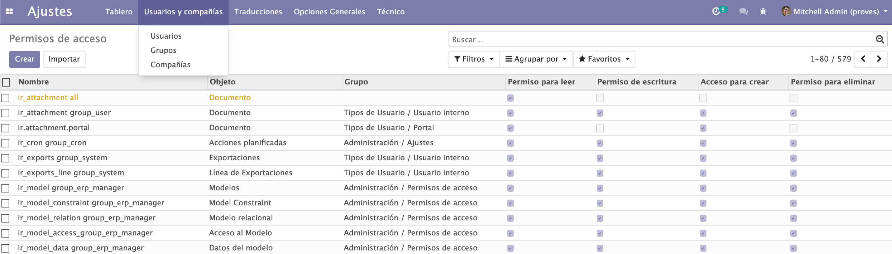
*Figura: lista de permisos de acceso. Cada línea asocia un objeto y un grupo con los cuatro tipos de permiso. El menú *Usuarios y compañías* da acceso a Usuarios, Grupos y Compañías. Origen: DAM_SGE04_Implantación de sistemas ERP-CRM.pdf.*

> **Ejemplo actual — Añadir un campo sin escribir código.** Herramientas como Odoo Studio permiten arrastrar un campo nuevo (por ejemplo "canal de captación" en la ficha de cliente) a un formulario y que el sistema cree por debajo la columna en la tabla y la muestre en la vista. Es la versión visual de lo que los materiales describen como "añadir campos a objetos existentes": el concepto —tocar el modelo de datos y la vista— es el mismo, cambie o no la herramienta.

> **En las noticias — Cuando la personalización se vuelve deuda técnica.** Distintos análisis del sector publicados en 2023-2024 han insistido en el coste de los ERP "sobre-personalizados": cada tabla y cada vista modificada a medida complica después las actualizaciones y la migración a la nube. La recomendación recurrente —mantener el estándar siempre que sea posible y reservar la adaptación para lo que de verdad diferencia al negocio— es coherente con la escala de tres ámbitos (vistas, informes imprimibles, módulos propios) que plantea la unidad.

### Ideas clave de esta sección
- Adaptar el ERP tiene tres niveles: **vistas/informes sobre datos existentes**, **informes imprimibles** y **módulos propios** (este último, en la UT5).
- **Crear un objeto = crear una tabla**; un objeto también puede ser una **vista** de la base de datos.
- Al crear un objeto se define nombre, nombre técnico, campos, tipos y permisos.
- Tipos de vista: formulario, árbol/lista, Gantt, calendario, gráfico y búsqueda; se editan por **XML** o por el **cliente web**.
- El **control de acceso** se basa en usuarios y grupos; por objeto se conceden permisos de **leer, escribir, crear y eliminar**.

## 4. Consultas necesarias para obtener información

En la etapa de implantación, el proveedor del ERP es responsable del diseño y la adaptación del programa, de la puesta en marcha y del soporte en la fase final. Si el análisis inicial fue exhaustivo, gran parte de la información recabada sirve directamente para definir los requerimientos de la implantación.

Aunque cada tipo de empresa tiene su casuística, casi todas necesitan, como mínimo, **consultar** la siguiente información:

- Datos de la empresa.
- Clientes.
- Proveedores.
- Productos.
- Almacén.
- Información de compra y venta: tarifas, formas de pago, etc.
- Información financiera: definición del plan contable, impuestos, etc.

En el ERP de ejemplo, una consulta que se reutiliza se materializa como un **informe personalizado**: una vista nueva que recoge información de la base de datos sin crear estructuras de datos nuevas —usa las existentes— y, en una analogía con bases de datos, "crea nuevas vistas sobre los datos". El proceso empieza eligiendo uno o varios **objetos base** (equivalentes a tablas) en la pestaña *Configuración general*.

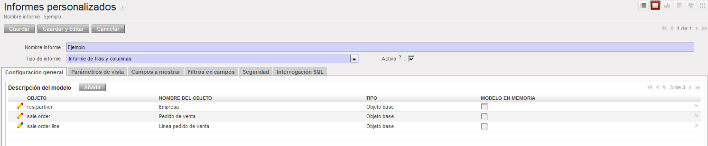
*Figura: definición de un informe/consulta a partir de varios objetos base. Las pestañas superiores (*Parámetros de vista*, *Campos a mostrar*, *Filtros en campos*, *Seguridad*, *Interrogación SQL*) recorren todo el diseño. Origen: ApuntesU4SGE.pdf.*

Los pasos siguientes son: fijar los **campos a mostrar** dando a cada uno un valor numérico de **secuencia** (indica el orden de visualización; los valores menores se muestran antes y no tienen por qué ser consecutivos) y un mecanismo de **agrupado** —*Grouped* (agrupar valores iguales), *Sum* (sumar el campo), *Minimun* / *Maximun* y *Count* (contar elementos)—; establecer **filtros** sobre los campos en la pestaña *Filtros en campos*; y **guardar**. La pestaña **Interrogación SQL** muestra la sentencia SQL que el sistema lanzará para construir la consulta, lo que permite comprobar que es correcta.

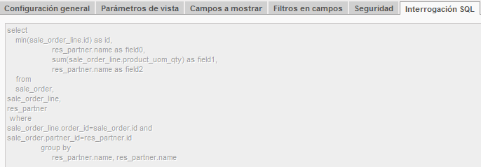
*Figura: SQL generado automáticamente a partir de los objetos, campos, agrupaciones y filtros elegidos. Une `sale_order`, `sale_order_line` y `res_partner` y agrupa por nombre de empresa. Origen: ApuntesU4SGE.pdf.*

La consulta se lanza desde la pestaña *Configuración general* con el botón **Abrir informe**. Si ese mecanismo resulta incómodo, se puede asignar un **menú** a la vista con el asistente del botón **Crear menú**, indicando el nombre y el menú padre.

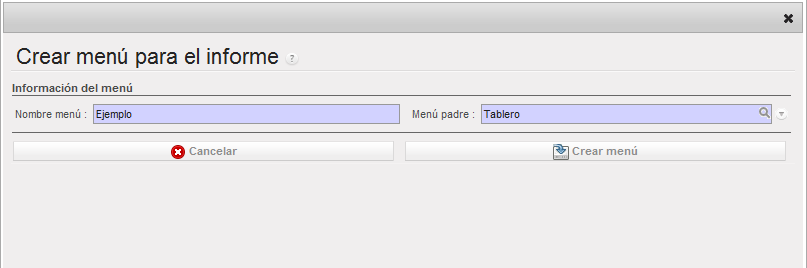
*Figura: asistente que crea una entrada de menú para lanzar la consulta directamente, sin tener que abrir antes la definición del informe. Origen: ApuntesU4SGE.pdf.*

Junto a las consultas guardadas, el ERP ofrece **consulta interactiva** en cualquier listado: cuadro de búsqueda, **Filtros** predefinidos y personalizados, **Agrupar por** varios criterios y **Búsqueda avanzada**. Es la forma más rápida de obtener información puntual sin diseñar nada.

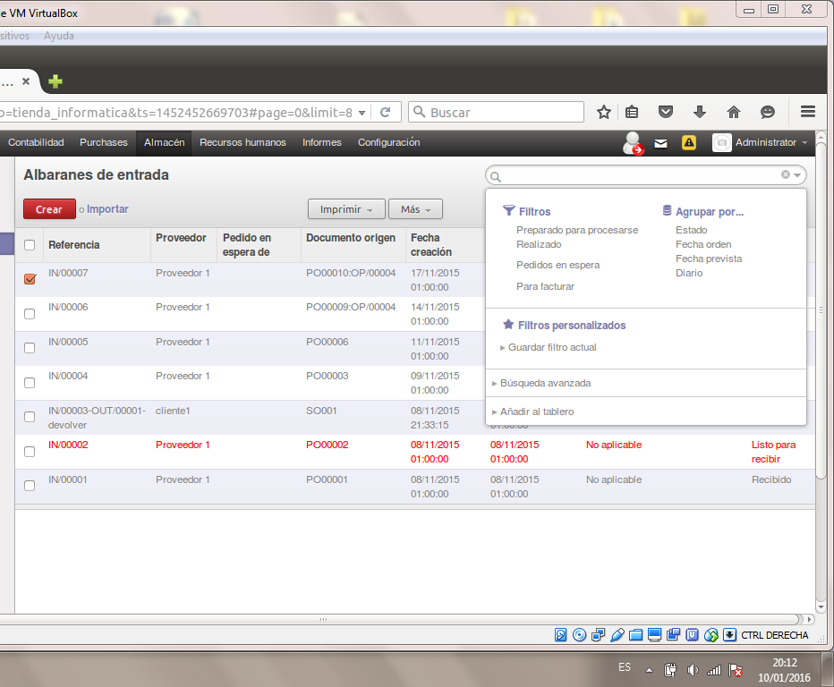
*Figura: consulta interactiva sobre un listado. Los filtros y agrupaciones se pueden guardar y también "Añadir al tablero" para reutilizarlos. Origen: ApuntesU4SGE.pdf.*

> **Ejemplo actual — Del clic al SQL.** En Odoo, la vista dinámica de tablas ("pivot") deja cruzar, por ejemplo, ventas por comercial y por mes, y exportar el resultado a hoja de cálculo. Herramientas como Metabase permiten construir una consulta arrastrando campos y ver, si se quiere, el SQL equivalente. Es exactamente la idea de la pestaña *Interrogación SQL*: la persona diseña con clics y el sistema traduce a una `SELECT ... GROUP BY`.

> **En las noticias — Consultas en lenguaje natural.** Durante 2024 y 2025, los principales fabricantes de software de gestión han incorporado asistentes que responden preguntas del tipo "¿qué clientes han bajado su facturación este trimestre?" generando la consulta por detrás: Microsoft con Copilot en Dynamics 365, Salesforce con Einstein/Agentforce y SAP con Joule. La capa que traduce la pregunta a una consulta sobre las tablas del ERP es nueva; la información que casi toda empresa necesita consultar —clientes, proveedores, productos, almacén, compras, ventas, finanzas— es la misma que enumeran los materiales.

### Ideas clave de esta sección
- Casi toda empresa necesita consultar: datos de la empresa, clientes, proveedores, productos, almacén, compra/venta y finanzas.
- Un **informe personalizado** es una consulta guardada que reutiliza las tablas existentes; no crea estructuras nuevas.
- Se define con **objetos base**, **campos a mostrar** (con **secuencia** y **agrupado**: Grouped, Sum, Minimun, Maximun, Count) y **filtros**.
- La pestaña **Interrogación SQL** muestra el `SELECT` generado; el botón **Crear menú** da acceso directo a la consulta.
- Los listados permiten **consulta interactiva** con filtros, "agrupar por" y búsqueda avanzada, que se pueden guardar.

## 5. Creación de formularios personalizados

Un **formulario** es una interfaz de entrada y visualización de datos. En el ERP de ejemplo, los formularios se implementan mediante **vistas**, que pueden ser de tipo formulario, de tipo árbol o de tipo gráfico. Adaptar un formulario es, por tanto, adaptar una vista, y se hace de las dos formas ya conocidas:

- **Cambiando el código XML** de la vista desde *Ajustes → Técnico → Interfaz de usuario → Vistas*. El XML describe qué campos aparecen y en qué posición.
- **Con el Administrador de vistas:** desde el objeto del que depende la vista, mediante el menú contextual *Personalizar → Gestionar Vistas*.

Según el manual de desarrollo del producto, las vistas "son una forma de representar los objetos en el lado del cliente": en ellas se visualizan los tipos de campo y la posición en la que se ubican. Un mismo objeto puede tener asociadas varias vistas (formulario para el alta de un registro, árbol para verlo en lista, gráfico para analizarlo), y el sistema muestra una u otra según el contexto. Las vistas disponibles se consultan en *Configuración → Técnico → Interfaz de usuario → Vistas*.

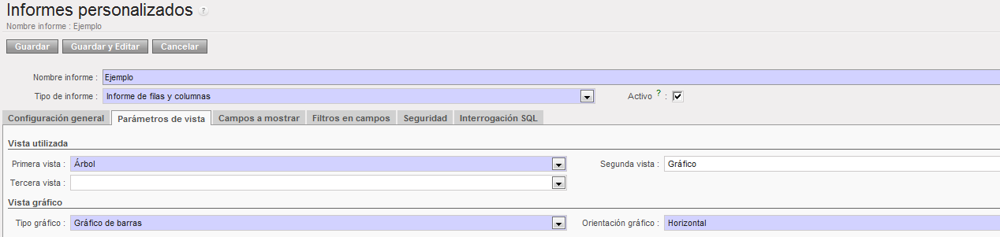
*Figura: selección de las vistas con que se presentará un objeto (hasta tres) y, para la vista gráfico, el tipo y la orientación. Ilustra que un mismo conjunto de datos se muestra con distintas vistas según convenga. Origen: ApuntesU4SGE.pdf.*

Antes de modificar un formulario conviene valorar la necesidad real del cambio: alterar la organización de menús y componentes puede obligar a volver a formar a las personas usuarias y a actualizar la documentación. Como medida de seguridad, al modificar un menú o una vista es recomendable **duplicarlo** primero, de modo que siempre quede un enlace al original al que volver si algo falla.

Adaptar los formularios es también adaptar **interfaces de procesos**: además de los campos visibles, un formulario es la interfaz de entrada y de visualización de datos que se implementa como vista y se edita por XML o desde el administrador de vistas.

> **Ejemplo actual — Editar el formulario con el navegador.** En las versiones recientes de Odoo, el modo desarrollador permite abrir "Editar vista: Formulario" desde cualquier pantalla y modificar el XML en caliente; Odoo Studio ofrece la misma operación en modo visual, arrastrando campos, pestañas y botones. En ambos casos el resultado es un registro de vista que se puede exportar, versionar y, si hace falta, revertir volviendo a la vista base.

> **En las noticias — Menos pantallas, más asistentes.** La tendencia que muestran los lanzamientos de 2024-2025 de Dynamics 365, SAP y Odoo es reducir el número de campos que la persona rellena a mano: formularios que se autocompletan a partir de un documento escaneado, propuestas de datos generadas por IA y validaciones en el momento. El formulario deja de ser solo una rejilla de campos y se acerca a un proceso guiado, aunque por debajo siga siendo una vista sobre un objeto.

### Ideas clave de esta sección
- Un **formulario** es una interfaz de entrada y visualización de datos; en el ERP de ejemplo se implementa como una **vista**.
- Las vistas se adaptan por **XML** (*Interfaz de usuario → Vistas*) o con el **Administrador de vistas** (*Personalizar → Gestionar Vistas*).
- Un objeto tiene varias vistas (formulario, árbol, gráfico…); el sistema muestra la adecuada según el contexto.
- Conviene **duplicar** la vista o el menú antes de modificarlo para poder volver atrás.
- Adaptar formularios incluye adaptar **interfaces de procesos**: botones y estados de los documentos.

## 6. Creación de informes personalizados

Los materiales distinguen dos grandes tipos de informe:

- **Informes estadísticos:** informes y gráficos **dinámicos**, que cambian según las opciones seleccionadas y cuya finalidad es mostrarse por pantalla. Son los que se crean con el módulo `base_report_creator`.
- **Documentos imprimibles:** informes cuya finalidad es **imprimirse**; el resultado suele ser un **PDF** generado a partir de los datos seleccionados en pantalla, y se pueden abrir con una suite ofimática para retocarlos antes de enviarlos.

El ERP de ejemplo trae muchos informes por defecto en todos sus módulos y permite instalar otros como módulos independientes; los módulos que contienen exclusivamente informes llevan en su nombre la etiqueta `report_`.

Para crear **documentos imprimibles** hay tres vías:

1. Utilizar el **lenguaje de programación** de la aplicación.
2. Usar **herramientas ofimáticas**: descargar el archivo asociado al informe, modificarlo y volver a subirlo al servidor.
3. Usar un **motor de informes** con entorno gráfico (por ejemplo **JasperReports**, o el motor **Aeroo**), exportando el objeto desde la aplicación y construyendo el informe a partir de él. JasperReports y Aeroo no vienen por defecto en el servidor.

La opción más habitual es la ofimática con **OpenOffice.org**: el procesador de textos genera una **plantilla RML** que, a su vez, produce el informe en **PDF**. Programar RML directamente da acceso completo al sistema pero es ineficiente. Los pasos de preparación son instalar el módulo **`base_report_designer`** en el servidor y la **extensión de OpenOffice.org** (el fichero suele llamarse `openerp_report_designer.zip`, añadido desde *Herramientas → Administrador de extensiones*; hay que reiniciar la aplicación para que aparezca el menú **OpenERP Report Designer**). Solo la persona administradora tiene permiso para subir informes por este mecanismo.

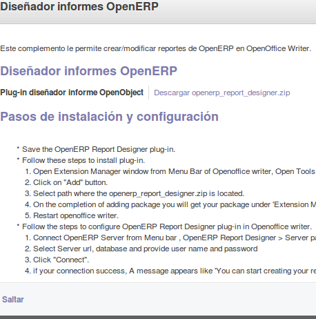
*Figura: descripción del complemento que permite crear y modificar informes de OpenERP dentro de OpenOffice Writer, con los pasos para instalar la extensión y conectar con el servidor. Origen: ApuntesU4SGE.pdf.*

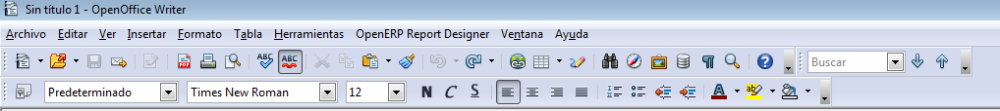
*Figura: una vez instalada la extensión, Writer muestra el menú *OpenERP Report Designer*, desde el que se conecta con el servidor, se abren informes existentes y se crean nuevos. Origen: ApuntesU4SGE.pdf.*

El flujo de trabajo para un informe imprimible nuevo es:

1. **Configurar la conexión** con el servidor (todos los datos son obligatorios) y conectarse a la base de datos deseada como un cliente más.
2. Crear el informe **desde cero** (*Open a new report*) o **modificar uno existente** (*Modify Existing Report*; solo se pueden modificar los que tienen fichero `SWX` o `RML`).
3. Al crear desde cero, elegir el **módulo base** de datos (por ejemplo *Country* para un listado de países).
4. Añadir un **bucle** que recorra los registros (*Add a loop* / RepeatIn Builder): se fija el objeto sobre el que iterar, el nombre de la variable y cómo se visualiza.
5. Construir la estructura del documento: escribir textos, insertar imágenes y colocar **campos** de la base de datos en su sitio (*Add a field* / Field Builder), repitiendo el proceso cuantas veces haga falta.
6. **Guardar** en disco con nombre en letras inglesas y en formato **`swx`** (OpenOffice 1.0), que es obligatorio.
7. **Subirlo al servidor** (*Send to the server*), indicando el nombre del informe y el tipo a generar (PDF).
8. **Dar acceso** al informe creando una entrada de menú; se puede revisar y ajustar en *Configuración → Técnico → Acciones → Informes*.

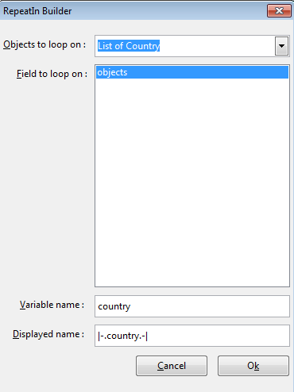
*Figura: definición del bucle que recorre los registros del informe (aquí, la lista de países). Sin bucle, el informe no tendría datos que repetir. Origen: ApuntesU4SGE.pdf.*

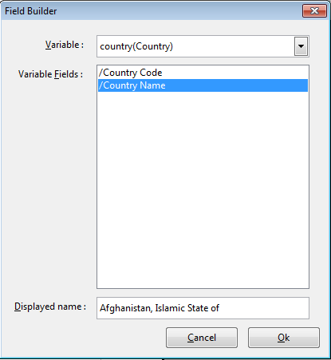
*Figura: inserción de un campo concreto del registro (por ejemplo, el nombre del país) en la posición del documento donde debe aparecer. Origen: ApuntesU4SGE.pdf.*

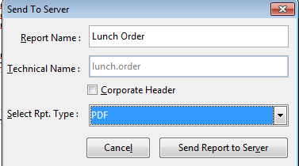
*Figura: envío del informe terminado al servidor. Al subirlo se traduce de OpenOffice.org a **RML**; al generarlo, los campos se sustituyen por sus valores. Origen: ApuntesU4SGE.pdf.*

Sobre **RML** (*Report Markup Language*): es un formato descriptor para generar documentación impresa; un documento RML es un documento **XML**, similar a HTML, con etiquetas que describen cómo serán las páginas. Se divide en **zona de plantilla** (`<pageTemplate>`, formato de página y contenidos comunes), **zona de estilos** (`<style>`, colores y tipografías) y **zona de documento** (`<story>`, el contenido). Generar un informe en RML permite **incluirlo dentro del propio código del módulo**, guardándolo en el directorio `report` del módulo del que extrae los datos, de forma que se instale con él. Los informes antiguos muestran las expresiones de datos entre **corchetes dobles** en lugar de como campos; existen conversiones *Brackets → Fields* y *Fields → Brackets*.

Los informes personalizados **de tipo estadístico** se definen con el mismo asistente descrito en la sección de consultas: objetos base, campos a mostrar con su secuencia y agrupado, filtros, y hasta tres vistas (árbol, gráfico y, para el gráfico, tipo —por ejemplo de barras— y orientación).

Por último, la creación de informes va acompañada de la **creación de documentación y manuales** para las personas usuarias. La formación se plantea en dos niveles: una **formación integral** durante la implantación, con contenidos planificados, y un **soporte posterior** durante el funcionamiento, más imprevisible. Los mecanismos incluyen cursos presenciales u online, documentación (manuales, videotutoriales, presentaciones, base de datos de conocimiento con preguntas frecuentes) y soporte por correo, teléfono, chat o videoconferencia.

> **Ejemplo actual — Del RML a QWeb y a la hoja de cálculo.** Las versiones modernas de Odoo generan los PDF con plantillas **QWeb** (HTML + CSS convertido a PDF con wkhtmltopdf), que sustituyen al antiguo RML, y ofrecen además informes dinámicos en un motor de hoja de cálculo integrado. El planteamiento de los materiales —diseñar la plantilla con una herramienta visual y dejar que el servidor sustituya los campos por sus valores— sigue siendo válido; cambian el lenguaje de plantilla y el editor.

> **En las noticias — Informes que se redactan solos.** Los lanzamientos de 2024-2025 de las suites de gestión incluyen la generación automática de resúmenes narrativos a partir de los datos: comentarios de cierre mensual, fichas de cliente o descripciones de producto redactadas por IA generativa. El informe deja de ser solo una tabla con formato y añade una capa de texto explicativo, aunque la fuente sigue siendo una consulta sobre las tablas del ERP.

### Ideas clave de esta sección
- Dos tipos de informe: **estadísticos** (dinámicos, para pantalla, con `base_report_creator`) y **documentos imprimibles** (PDF, con `base_report_designer`).
- Los módulos que solo contienen informes llevan el prefijo **`report_`**.
- Vías para imprimibles: lenguaje de la aplicación, ofimática (OpenOffice.org) o motor de informes (**JasperReports**, **Aeroo**).
- Flujo con OpenOffice.org: conectar → crear/abrir → **bucle** (RepeatIn) → **campos** (Field) → guardar en **`swx`** → **Send to the server** → crear menú.
- **RML** es XML con zonas `<pageTemplate>`, `<style>` y `<story>`; permite empaquetar el informe dentro del módulo.
- La documentación y los **manuales** de usuario acompañan a la implantación; la formación tiene un nivel integral y un soporte posterior.

## 7. Paneles de control (Dashboards)

Un **panel de control** o **tablero** (*dashboard*) organiza varios informes en una sola pantalla para aumentar la productividad: mientras un informe presenta un conjunto de datos de forma ordenada, el tablero reúne varios de esos informes juntos. El ERP de ejemplo ya trae tableros estándar en sus módulos; además se pueden definir tableros propios.

Hay dos formas de construir un tablero:

- **Desde el asistente de tableros:** *Informes → Configuración → Crear tablero*. Cada entrada del tablero se asocia con una **acción** distinta (un informe) y se ajustan sus características de presentación; se añaden tantos componentes como se necesiten. Una vez definido el tablero, se insertan en él los distintos informes.
- **Desde cualquier listado:** al tener un informe abierto en vista de lista o de gráfico, en las opciones de búsqueda extendidas se pulsa **"Añadir al tablero"**. Antes de insertarlo se pueden aplicar **filtros** y **agrupaciones**, de modo que el componente que queda en el tablero muestra ya los datos filtrados y agrupados que interesan.

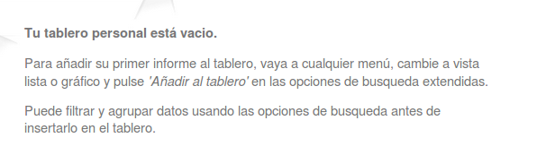
*Figura: el tablero personal parte vacío; se rellena añadiendo informes desde los listados, tras filtrar y agrupar los datos. Origen: ApuntesU4SGE.pdf.*

El tablero personalizado, igual que las consultas, puede tener asignada su propia **entrada de menú** para acceder a él directamente.

> **Ejemplo actual — Cuadros de mando dentro y fuera del ERP.** Odoo incorpora una app de *Tableros* con indicadores por área (ventas, tesorería, proyectos) y un editor de hoja de cálculo para componerlos. Cuando la dirección quiere cruzar datos de varias fuentes, es habitual llevar la información del ERP a herramientas específicas de *business intelligence* como Power BI, Looker Studio o Metabase, que se conectan a la base de datos o a una API y presentan los KPI en un panel único.

> **En las noticias — El cuadro de mando en tiempo real.** Durante 2024 y 2025, los fabricantes de ERP han reforzado los paneles con datos que se actualizan al instante y con alertas automáticas cuando un indicador se sale de rango (roturas de stock, desviaciones de margen, retrasos de cobro). La idea que describen los materiales —agrupar varios informes en una pantalla para decidir mejor— se mantiene; lo que cambia es la frecuencia de actualización y la capa de avisos.

### Ideas clave de esta sección
- Un **tablero** agrupa varios informes en una pantalla; el ERP trae tableros estándar y permite crear los propios.
- Dos vías: el asistente *Informes → Configuración → Crear tablero* (asociando **acciones**/informes) o **"Añadir al tablero"** desde un listado en vista lista o gráfico.
- Antes de añadir un informe al tablero se le aplican **filtros** y **agrupaciones**.
- El tablero personalizado puede tener su propia **entrada de menú**.

## 8. Integración con otros sistemas de gestión

Los materiales de la unidad tratan la integración con otros sistemas sobre todo desde la **migración y el intercambio de datos**, no desde el consumo de APIs (eso corresponde a la unidad siguiente). La forma estándar de trasportar datos entre sistemas en el ERP de ejemplo es el fichero de texto **CSV**.

El **traspaso de datos** desde los sistemas antiguos al nuevo ERP es uno de los puntos más críticos de la implantación: la información de una empresa es muy valiosa y una mala gestión de los datos puede paralizar toda la organización. Exige estudiar el **formato de almacenamiento** del software origen y del destino para poder **emparejar** ambos. Las tareas típicas son:

- **Unificar el formato y el contenido** de los datos, reuniendo en un único archivo la información relacionada que estaba repartida entre varias aplicaciones.
- **Eliminar la duplicidad**: determinar la información clave de cada conjunto y borrar los registros repetidos.
- **Mejorar la codificación** de la información antes de importarla (por ejemplo, corregir códigos postales mal guardados) para ganar calidad de datos en el ERP.
- **Guardar los datos** en un archivo con el formato de exportación elegido.
- **Introducir antes los datos de las tablas secundarias** que vayan a hacer falta.
- **Ejecutar la importación.**

Para **exportar** desde el ERP de ejemplo se selecciona la vista y los registros y se usa el enlace **Exportar** (menú *Más* en el cliente web), que abre un diálogo de selección de campos y su orden. Es importante elegir el tipo **"compatible con importación"** si los datos van a volver a un sistema del mismo tipo. El resultado se guarda como fichero **CSV**.

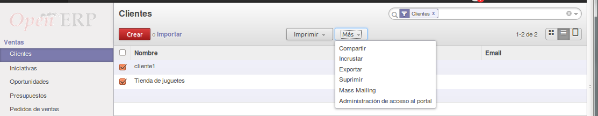
*Figura: punto de partida de la exportación de datos, sobre el listado de Clientes. Origen: ApuntesU4SGE.pdf.*

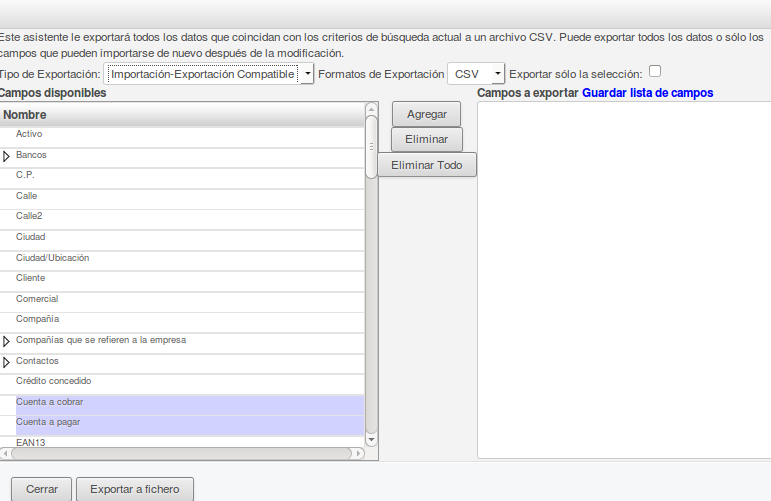
*Figura: selección de campos y de tipo de exportación. Marcar "compatible con importación" es lo que permite volver a cargar el fichero en un sistema del mismo tipo. Origen: ApuntesU4SGE.pdf.*

Para que el fichero CSV se importe sin errores en el ERP de ejemplo hay que respetar varias reglas:

- Los campos se separan con **punto y coma** (`;`).
- El separador de texto es la **comilla doble** (`"`).
- La **primera fila** contiene los nombres de los campos en el **mismo idioma** configurado por defecto en las preferencias de la aplicación.
- Las **tablas secundarias** deben contener ya los valores referenciados: la importación falla si se intenta introducir un registro cuyo valor no existe en la tabla relacionada (por ejemplo, importar empresas con la categoría *Cliente* exige que esa categoría exista en `res.partner.category`).

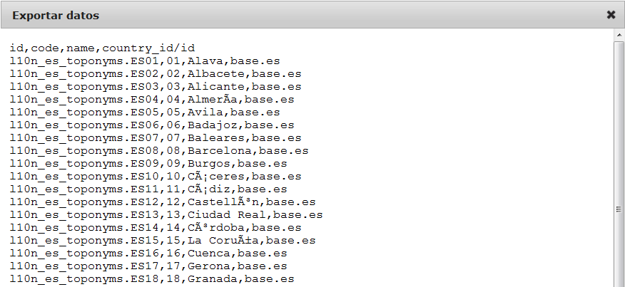
*Figura: fichero CSV "compatible con importación". La cabecera nombra los campos (incluida la referencia externa `country_id/id`) y cada línea es un registro. Origen: ApuntesU4SGE.pdf.*

El proceso de **importación** es simétrico: se elige la vista a cargar, se pulsa importar, se selecciona el archivo y el sistema **mapea automáticamente** los campos del fichero con los de la vista.

Además del intercambio de ficheros, la integración se apoya en decisiones de **puesta en marcha**: mantener el sistema antiguo funcionando **en paralelo** con el nuevo durante la fase de pruebas (entradas de datos duplicadas y coste en tiempo, pero permite comparar resultados) frente al **bloqueo del sistema antiguo** y arranque directo del nuevo (más rápido, pero arriesgado si el sistema nuevo no se ha probado lo suficiente). La elección depende de lo exhaustivas que hayan sido las pruebas.

Este Contenido está tratado en los materiales de forma más limitada que los anteriores: se cubre bien la integración por **exportación/importación de datos** y la convivencia temporal de sistemas, pero no se desarrollan mecanismos de integración en tiempo real (servicios web, APIs, conectores permanentes), que se abordan en la unidad de desarrollo de componentes.

> **Ejemplo actual — La tienda online y el ERP hablando entre sí.** Un comercio que vende con WooCommerce, PrestaShop o Shopify y factura con Odoo, Holded o Dolibarr suele usar un conector que sincroniza catálogo, stock y pedidos entre ambos. En su forma más básica es un intercambio de ficheros CSV programado; en su forma avanzada, una integración por API que actualiza el stock en segundos. El problema de fondo —emparejar los campos del sistema origen con los del destino y evitar duplicados— es el mismo que describe la unidad para la migración inicial.

> **En las noticias — Cuando la integración de datos hace descarrilar el proyecto.** El caso del Ayuntamiento de Birmingham (Reino Unido) se citó a lo largo de 2023 y 2024 como ejemplo de implantación de ERP fallida: la puesta en marcha de un sistema Oracle para finanzas y recursos humanos se saldó con costes que, según se informó, se multiplicaron desde una cifra inicial de unos 19 millones de libras hasta superar los 100 millones, con graves problemas para conciliar y migrar los datos contables, y contribuyó a que el consistorio declarara en la práctica su insolvencia. Ilustra tres riesgos de implantación que enumeran los materiales: finalización fuera de plazo, presupuesto sobrepasado y funcionamiento no esperado de la aplicación.

### Ideas clave de esta sección
- El **traspaso de datos** es crítico: exige estudiar y **emparejar** los formatos de origen y destino.
- Tareas: unificar formato, eliminar duplicados, mejorar codificación, guardar el archivo, preparar tablas secundarias e importar.
- El intercambio estándar es **CSV**: separador `;`, texto entre `"`, primera fila con los nombres de campo, y valores de tablas secundarias creados de antemano.
- Exportación con la opción **"compatible con importación"**; en la importación el sistema **mapea** los campos automáticamente.
- La puesta en marcha admite **pruebas en paralelo** o **bloqueo del sistema antiguo**; la decisión depende de la calidad de las pruebas.
- Los materiales cubren la integración vía datos, no vía APIs en tiempo real.

---

## Glosario rápido

| Término | En una frase |
| --- | --- |
| ERP | Aplicación integrada que centraliza compras, ventas, almacén, contabilidad y demás procesos sobre una sola base de datos. |
| CRM | Parte del sistema que registra la relación con clientes y clientes potenciales: contactos, oportunidades, presupuestos, campañas. |
| Modelo del negocio | Representación de los procesos primordiales de una empresa para entender su entorno y su vocabulario. |
| Diccionario del negocio | Tabla de términos propios de la empresa con su descripción, mantenida durante todo el proyecto. |
| Análisis inicial | Estudio previo a la selección que cubre datos maestros, procesos, informes, traspaso de información y planificación. |
| Módulo base | Módulo que se instala con la aplicación y ofrece las opciones mínimas para funcionar. |
| Módulo precargado | Módulo disponible en el sistema, listo para instalarse en cualquier momento. |
| Módulo no precargado | Módulo que hay que descargar y copiar en `addons` antes de poder instalarlo. |
| Localización | Conjunto de módulos que adaptan el ERP a la legislación y las prácticas de un país. |
| Objeto / Modelo | Definición de una entidad del ERP; crear un objeto equivale a crear una tabla en la base de datos. |
| Vista | Forma de representar un objeto en el cliente: formulario, árbol/lista, Gantt, calendario, gráfico o búsqueda. |
| Formulario | Interfaz de entrada y visualización de datos de un registro; se implementa como una vista. |
| Informe personalizado | Consulta guardada que reutiliza las tablas existentes y las presenta como una vista nueva. |
| Secuencia | Valor numérico que ordena la visualización de los campos de un informe (los menores, antes). |
| Interrogación SQL | Pestaña que muestra la sentencia `SELECT` que el sistema genera para una consulta o informe. |
| Informe estadístico | Informe o gráfico dinámico pensado para verse por pantalla (`base_report_creator`). |
| Documento imprimible | Informe pensado para imprimirse, normalmente un PDF (`base_report_designer`). |
| RML | Lenguaje de marcado en XML que describe páginas impresas, con zonas `<pageTemplate>`, `<style>` y `<story>`. |
| Tablero / Dashboard | Pantalla que agrupa varios informes para facilitar la toma de decisiones. |
| Traspaso / migración de datos | Volcado de la información del sistema antiguo al nuevo ERP; punto crítico de la implantación. |
| CSV | Fichero de texto para intercambiar datos; en el ERP de ejemplo, campos separados por `;` y texto entre `"`. |
| Tabla secundaria | Tabla relacionada cuyos valores deben existir antes de importar registros que la referencian. |
| Permisos de acceso | Derechos por objeto y grupo: leer, escribir, crear y eliminar. |
| Pruebas en paralelo | Uso simultáneo del sistema antiguo y el nuevo hasta comprobar que los resultados coinciden. |

## Preguntas de repaso

1. ¿Qué cuatro fases componen el proceso de selección, implantación y puesta en marcha de un ERP?
2. Enumera tres perfiles de empresa y el módulo o enfoque que cada uno prioriza.
3. ¿Qué cinco aspectos debe cubrir el análisis inicial previo a la selección del ERP?
4. Diferencia módulo base, módulo precargado y módulo no precargado.
5. ¿Por qué se dice que "crear un objeto equivale a crear una tabla"? ¿Qué es entonces un objeto que se corresponde con una vista?
6. ¿Qué cuatro permisos se conceden por objeto y grupo en el control de acceso? ¿Qué ocurre si a un objeto no se le asigna ningún grupo?
7. ¿Qué información muestra la pestaña *Interrogación SQL* de un informe personalizado y para qué sirve?
8. Distingue informe estadístico y documento imprimible, e indica el módulo asociado a cada uno.
9. Resume el flujo para crear un informe imprimible con OpenOffice.org, desde la conexión hasta el acceso por menú.
10. ¿Qué es RML y qué ventaja tiene generar un informe en ese formato?
11. ¿De qué dos maneras se puede construir un tablero personalizado?
12. Enumera las reglas que debe cumplir un fichero CSV para importarse sin errores en el ERP de ejemplo.
13. Compara las pruebas de funcionamiento "en paralelo" con el "bloqueo del sistema antiguo" en la puesta en marcha.
14. Cita tres riesgos de implantación y tres causas frecuentes de fracaso de un proyecto ERP.

Respuestas

1. Selección del ERP, fase de implantación, fase de puesta en marcha, y cierre y finalización del proyecto (sección 1 / Panorama).
2. PYME → clientes/proveedores/productos y compras-ventas-almacén; sector servicios → módulo de proyectos; tiendas y restaurantes → TPV; Administración Pública → proyectos, compras, RR. HH., CRM de atención al ciudadano, padrón, tasas; venta telefónica → CRM (sección 1).
3. Estructura de la información o datos maestros, procesos de negocio, informes necesarios, traspaso de información y planificación de la implantación (sección 2).
4. Base: se instala con la aplicación, funciones mínimas. Precargado: ya disponible en el sistema para instalar cuando se quiera. No precargado: hay que descargarlo de Internet y copiarlo en `addons` antes de instalarlo (sección 2).
5. Porque al definir un objeto el ERP crea físicamente una tabla en la base de datos. Un objeto-vista no crea tabla: se apoya en una vista SQL ya existente (ejemplo: *Estadísticas de Servidor* = `report_smtp_server`) (sección 3).
6. Leer, escribir, crear y eliminar. Si no se asigna grupo, todas las personas usuarias pueden acceder al objeto sin restricción (sección 3).
7. La sentencia SQL que el sistema lanzará para construir la consulta; sirve para comprobar que el informe es correcto antes de usarlo (sección 4).
8. Estadístico: dinámico, para pantalla, con `base_report_creator`. Imprimible: para imprimir, normalmente PDF, con `base_report_designer` (sección 6).
9. Configurar y abrir la conexión con el servidor; crear desde cero o modificar uno existente; elegir el módulo base; añadir un bucle (RepeatIn); insertar los campos (Field); guardar en formato `swx`; enviarlo al servidor (*Send to the server*) indicando nombre y tipo; crear una entrada de menú para acceder a él (sección 6).
10. Es un lenguaje de marcado en XML que describe páginas impresas (zonas `<pageTemplate>`, `<style>`, `<story>`). Su ventaja es que el informe se puede incluir dentro del propio código del módulo, en el directorio `report`, y se instala con él (sección 6).
11. Con el asistente *Informes → Configuración → Crear tablero*, asociando cada entrada a una acción/informe; o pulsando "Añadir al tablero" desde un listado en vista lista o gráfico, tras filtrar y agrupar (sección 7).
12. Campos separados por `;`; texto entre comillas dobles `"`; primera fila con los nombres de los campos en el idioma configurado por defecto; y los valores de las tablas secundarias deben existir previamente (sección 8).
13. En paralelo: se trabaja con los dos sistemas a la vez y se comparan resultados; seguro pero costoso en tiempo por la doble introducción de datos. Bloqueo: se apaga el antiguo y se arranca el nuevo; rápido, pero arriesgado si el sistema nuevo no se ha probado bien (sección 8).
14. Riesgos: finalización fuera de plazo, sobrepasar el presupuesto, funcionamiento no esperado de la aplicación, imprevistos que impidan el desarrollo normal. Causas de fracaso: falta de liderazgo del equipo directivo, resistencia al cambio, consultores inexpertos, software poco flexible o con interfaz poco amigable, funcionalidad atribuida al ERP que no existe, y falta de capacidad o recursos (sección 8 / Panorama).

## Bibliografía y fuentes

- *Implementación de sistemas ERP-CRM* [Apuntes del módulo Sistemas de Gestión Empresarial]. (2016).
- Ministerio de Educación y Formación Profesional. (s. f.). *Implantación de sistemas ERP-CRM* [Materiales formativos de FP Online].
