# UT5 — Desarrollo de componentes para un sistema ERP-CRM

## Índice

1. [Arquitectura del ERP-CRM](#1-arquitectura-del-erp-crm)
2. [Lenguaje proporcionado por el sistema ERP-CRM: características, sintaxis, declaración de datos, estructuras y sentencias](#2-lenguaje-proporcionado-por-el-sistema-erp-crm-caracteristicas-sintaxis-declaracion-de-datos-estructuras-y-sentencias)
3. [Entornos y herramientas de desarrollo en sistemas ERP y CRM](#3-entornos-y-herramientas-de-desarrollo-en-sistemas-erp-y-crm)
4. [Inserción, modificación y eliminación de datos en los objetos](#4-insercion-modificacion-y-eliminacion-de-datos-en-los-objetos)
5. [Operaciones de consulta. Herramientas](#5-operaciones-de-consulta-herramientas)
6. [Formularios e informes en sistemas ERP-CRM](#6-formularios-e-informes-en-sistemas-erp-crm)
7. [Procesamiento de datos y obtención de la información](#7-procesamiento-de-datos-y-obtencion-de-la-informacion)
8. [Llamadas a funciones y librerías de funciones (APIs)](#8-llamadas-a-funciones-y-librerias-de-funciones-apis)
9. [Depuración de un programa](#9-depuracion-de-un-programa)
10. [Glosario rápido](#glosario-rapido)
11. [Preguntas de repaso](#preguntas-de-repaso)

## Panorama de la unidad

Un sistema ERP-CRM instalado y configurado casi nunca cubre el cien por cien de las
necesidades de una empresa. Llega un momento en que hace falta un cálculo que el sistema
no trae, un documento con un formato concreto, una pantalla adaptada a un procedimiento
interno o una conexión con otra aplicación. Esta unidad se ocupa de esa última fase: crear
componentes nuevos usando el lenguaje de programación que el propio ERP-CRM pone a
disposición de quien desarrolla, integrarlos en el sistema y comprobar que funcionan.

El trabajo se apoya en un producto concreto de ejemplo, **Odoo**, que además de ser un
ERP-CRM de código abierto es un *framework* de desarrollo. Odoo se programa en **Python**
para la lógica (modelo y controlador) y en **XML** para la interfaz (vistas, menús,
acciones, informes). La base de datos es **PostgreSQL**, pero rara vez se escriben consultas
SQL directamente: entre las clases de Python y las tablas se interpone una capa **ORM**
(mapeo objeto-relacional) que genera y mantiene el esquema. Todo lo que se añade a Odoo se
empaqueta en **módulos**, unidades de software que se pueden instalar y desinstalar sin
tocar el código original.

La materia mezcla dos generaciones de material. Una parte describe versiones antiguas
(OpenERP, Python 2.7, ficheros `__openerp__.py`, clases que heredan de `osv.osv`); otra
describe Odoo moderno (versión 17, Python 3, `__manifest__.py`, `models.Model`,
decoradores `@api`). Los conceptos de fondo —MVC, ORM, módulos, herencia, vistas árbol y
formulario— se mantienen; cambian los nombres y algunos detalles de sintaxis. El resumen
distingue ambas cuando es relevante.

La idea que vertebra la unidad es que **un producto concreto sirve de ejemplo, no de
norma**. Otros ERP ofrecen lenguajes propietarios, no estándar, que obligan a
formarse en ellos solo para ese sistema. Lo que se pide aprender es el patrón general:
reconocer las sentencias del lenguaje del ERP, escribir componentes que manipulen datos y
extraigan información, modificar lo que ya existe, integrarlo, probarlo y documentarlo.

## ¿Qué vamos a aprender?

Esta unidad trabaja desarrollar componentes para un sistema ERP-CRM analizando y utilizando el lenguaje de
programación incorporado.

En términos llanos, esto supone ser capaz de leer y escribir código en el
lenguaje que el ERP-CRM incorpora, y usarlo para ampliar el sistema. En concreto:

- Se reconocen las sentencias del lenguaje propio del sistema ERP-CRM (en el caso de
  ejemplo, Python y XML sobre el *framework* de Odoo).
- Se utilizan los elementos de programación del lenguaje (variables, estructuras de control,
  funciones, clases) para crear componentes que insertan, modifican y eliminan datos y que
  extraen información.
- Se modifican componentes de software ya existentes para añadirles funcionalidades nuevas,
  normalmente mediante herencia.
- Los nuevos componentes quedan integrados en el sistema ERP-CRM: se detectan, se instalan y
  aparecen en la aplicación como cualquier otro módulo.
- Se verifica el funcionamiento correcto de lo creado, con pruebas y con herramientas de
  depuración.
- Se documentan todos los componentes creados o modificados.
- Se analiza la arquitectura del ERP-CRM para saber dónde encaja cada pieza.

---

## 1. Arquitectura del ERP-CRM

Para desarrollar sobre un ERP-CRM hay que entender primero cómo está organizado por dentro.
El material parte del patrón **Modelo-Vista-Controlador (MVC)**, muy conocido en aplicaciones
web. El MVC divide una aplicación en tres componentes:

- **Modelo**: los datos de la aplicación.
- **Vista**: la interfaz de usuario.
- **Controlador**: define la forma en que la interfaz reacciona a la entrada del usuario;
  recibe las peticiones a través de la vista, consulta datos del modelo, hace los cálculos
  necesarios y solicita nuevas vistas.

La ventaja de esta separación es que los cambios en la interfaz no afectan a los datos y
viceversa. En el esquema clásico del patrón, el modelo notifica a la vista cuando sus datos
cambian para que esta se actualice, sin conocer el funcionamiento interno de la vista; y la
vista tiene un acceso deliberadamente limitado al controlador, porque el controlador puede
sustituirse en cualquier momento.

**En Odoo, el MVC se concreta así:**

| Parte del MVC | En Odoo |
| --- | --- |
| Modelo | Las tablas de la base de datos (PostgreSQL) |
| Vista | Archivos **XML** que definen la interfaz de usuario del módulo |
| Controlador | Objetos y métodos escritos en **Python** |


*Figura: el modelo se apoya en el ORM, el controlador se escribe en Python y la vista se
describe en XML. Origen: diapositivas «Unidad 5: desarrollo de módulos para un sistema
ERP-CRM».*

### Arquitectura cliente-servidor

Odoo tiene una **arquitectura cliente-servidor**. La comunicación entre cliente y servidor
usa los protocolos **XML-RPC** o **Net-RPC**, que permiten al cliente hacer llamadas a
procedimientos remotos (ejecutar código en otra máquina). En XML-RPC la función llamada, sus
argumentos y el resultado viajan por HTTP codificados en XML. Net-RPC es más reciente, está
basado en funciones de Python y es más rápido.

El material más antiguo describe Odoo funcionando sobre un *framework* llamado **OpenObject**,
orientado al **desarrollo rápido de aplicaciones (RAD)**, cuyos elementos principales son:

- **ORM**: mapeo de bases de datos relacionales a objetos Python.
- Arquitectura **MVC**.
- **Diseñador de informes**.
- Herramientas de **Business Intelligence** y cubos multidimensionales.
- **Cliente web**.

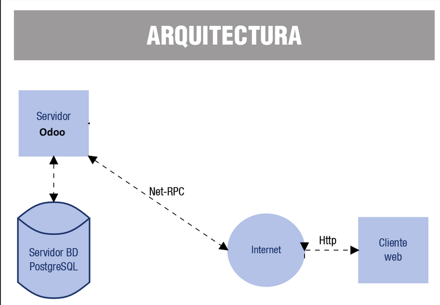
*Figura: el servidor Odoo se conecta por un lado con la base de datos PostgreSQL y por otro,
a través de Internet, con el cliente web. Origen: «Desarrollo de componentes» (Ministerio de
Educación y Formación Profesional).*

### La arquitectura de tres capas (Odoo moderno)

El material actualizado precisa esa arquitectura como **cliente-servidor de tres capas**:

- **Capa de datos**: la base de datos en un servidor **PostgreSQL**.
- **Capa lógica**: el **servidor Odoo**, que engloba la lógica de negocio y el servidor web.
- **Capa de presentación**: el **cliente**, que es una **SPA** (*Single Page Application*)
  en JavaScript. Esta capa está subdividida en al menos tres interfaces:
  - **Backend**: donde administradores y empleados gestionan la base de datos.
  - **Frontend** o página web: donde acceden clientes y empleados; puede incluir una tienda.
  - **TPV**: para los terminales punto de venta, que pueden ser táctiles.

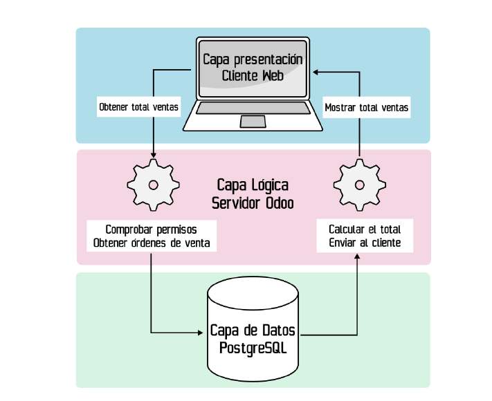
*Figura: recorrido de una operación («obtener total de ventas») a través de las tres capas.
Origen: «Desarrollo de módulos de Odoo: modelo y vista».*

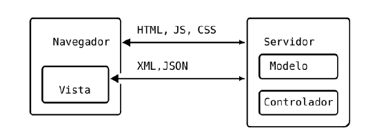
*Figura: la vista es un programa cliente en JavaScript que se comunica con el servidor
mediante mensajes breves (XML y JSON). Origen: «Desarrollo de módulos de Odoo: modelo y
vista».*

Odoo es un **ERP-CRM de código abierto**. Se distribuye en dos modalidades de despliegue:
**On-premise** (en GNU/Linux o Windows, con dos ediciones: *Community*, gratuita, y
*Enterprise*, de pago) y **SaaS** (*Software as a Service*, en la nube de la empresa que
desarrolla Odoo o de terceros). La licencia ha ido cambiando con el tiempo; la de la versión
17 *Community* es **LGPLv3**.

### Sistema modular

Odoo es **modular**: tanto el servidor como el cliente se componen de módulos que extienden
a un módulo **`base`**, que contiene el funcionamiento básico. Sobre él se apoyan los
módulos **funcionales**, que aportan la lógica de negocio: `account` (gestión contable y
financiera), `purchase` (compras), `sale` (ventas), `mrp` (fabricación y planificación de
recursos) y `crm` (relaciones con clientes y proveedores), entre otros. Para ampliar o
adaptar Odoo **no se modifica su código fuente**: se crea un módulo. Un módulo puede cambiar el
comportamiento del programa, la estructura de la base de datos o la interfaz, y en principio
se puede instalar y desinstalar revirtiendo por completo sus cambios.

Este *framework* de tipo RAD se apoya en varios principios:

- La capa **ORM** entre los objetos y la base de datos. La combinación **clase Python ↔ ORM
  ↔ tabla PostgreSQL** se llama **Modelo**. Quien programa no diseña la base de datos, solo
  las clases y sus relaciones; tampoco necesita escribir consultas SQL, porque casi todo se
  hace con los métodos del ORM.
- La arquitectura **MVC**.
- **Tenencia múltiple**: un único servidor puede dar servicio a muchas bases de datos de
  clientes distintos.
- Un **diseñador de informes**.
- Facilidad para **traducir** la aplicación a muchos idiomas (buena práctica: programar en
  inglés y añadir después las traducciones).

### Composición de un módulo

Cada módulo es una carpeta, con el nombre del módulo, situada en un directorio `addons` del
servidor. Los archivos habituales son:

- **`__init__.py`**: necesario para que la carpeta se trate como paquete de Python; contiene
  los `import` de los ficheros Python del módulo.
- **`__manifest__.py`**: un diccionario de Python con la descripción del módulo y la
  ubicación de los demás ficheros. En versiones antiguas se llamaba `__terp__.py` o
  `__openerp__.py`.
- **`nombre_modulo.py`**: define las clases con sus campos. Al crear la clase se está
  creando a la vez el **modelo** (una tabla en la base de datos) y el **controlador** (el
  comportamiento asociado).
- **`nombre_modulo_view.xml`** (o `views/views.xml`): define la vista o vistas del objeto.

Puede haber subcarpetas como `models`, `views`, `controllers`, `demo`, `security`, `report`,
`wizard` o `test`. Los valores típicos del `__manifest__.py` son: `name`, `version`,
`description`, `summary`, `author`, `website`, `license` (por defecto GPL), `category`,
`application`, `depends` (lista de módulos necesarios; `base` casi siempre), `data` (lista
de ficheros XML y CSV que se cargan al instalar o actualizar) e `installable`.

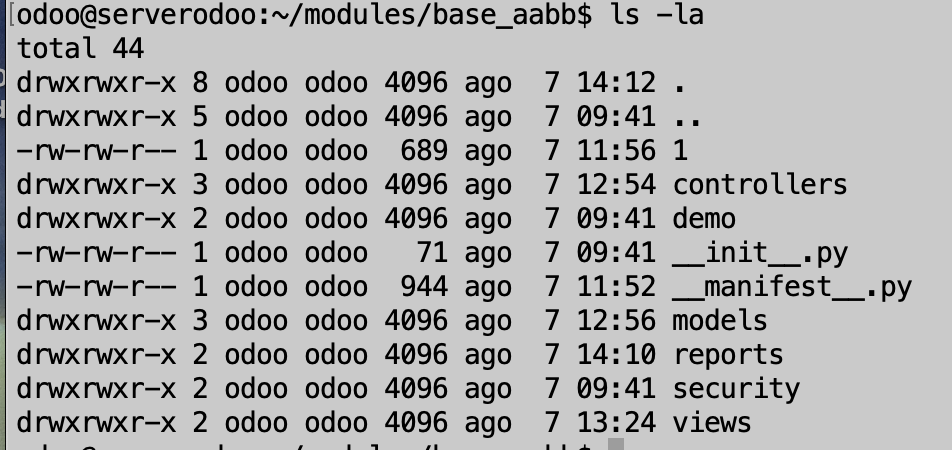
*Figura: estructura de directorios de un módulo generado con `odoo scaffold`. Origen:
«Tutorial: entorno de desarrollo y primer módulo Odoo».*

> **Ejemplo actual — El «núcleo más módulos» como norma del sector.** La misma idea de un
> núcleo estable que se amplía con módulos, sin tocar el estándar, es hoy la recomendación
> general en los grandes ERP. SAP la ha formalizado en su estrategia de *clean core* para
> S/4HANA: las adaptaciones se hacen mediante extensiones y APIs, no modificando el sistema
> base, para que las actualizaciones no rompan lo personalizado. Microsoft Dynamics 365
> sigue el mismo criterio con sus extensiones en AL. El motivo es siempre el mismo que
> señala el material para Odoo: si se modifica el código oficial, la siguiente
> actualización borra los cambios y aparecen problemas de seguridad.

### Ideas clave de esta sección

- El ERP-CRM del ejemplo sigue el patrón MVC: modelo = tablas, vista = XML, controlador =
  Python.
- Arquitectura cliente-servidor; comunicación por XML-RPC o Net-RPC; tres capas
  (datos/PostgreSQL, lógica/servidor Odoo, presentación/SPA con backend, web y TPV).
- El ORM evita diseñar la base de datos y escribir SQL.
- Todo lo que se añade se empaqueta en módulos instalables y desinstalables, sin tocar el
  código original.
- Un módulo es una carpeta en `addons` con `__init__.py`, `__manifest__.py`, ficheros
  Python (modelo y controlador) y ficheros XML (vistas).

## 2. Lenguaje proporcionado por el sistema ERP-CRM: características, sintaxis, declaración de datos, estructuras y sentencias

La mayoría de aplicaciones de planificación empresarial modernas están construidas con
lenguajes orientados a objetos. Algunos ERP ofrecen **lenguajes propietarios**, no estándar,
que obligan a formarse en ese lenguaje solo para manejar ese ERP. En el caso de Odoo el
lenguaje es **Python**, un lenguaje de propósito general.

Python fue creado por **Guido van Rossum** a principios de los años 90 en el CWI (*Centrum
Wiskunde & Informatica*), en los Países Bajos; el nombre proviene de la afición de su autor
por el grupo de cómicos **Monty Python**. En 2001 se creó la **Python Software Foundation
(PSF)**, sin ánimo de lucro, que posee la propiedad intelectual de la licencia; entre sus
patrocinadores están Google, Canonical y Microsoft. Su licencia (**PSFL**) es de código
abierto y compatible con GPL.

### Características del lenguaje

- **Sintaxis muy sencilla**, cercana al lenguaje natural.
- **Interpretado**: los programas se ejecutan mediante un intérprete; el código fuente se
  traduce a un *bytecode* con extensión `.pyc` o `.pyo` que se ejecuta en sucesivas
  ocasiones.
- **Tipado dinámico**: las variables no se declaran; el tipo se determina en tiempo de
  ejecución según el valor asignado (aunque es obligatorio inicializar la variable antes de
  usarla).
- **Fuertemente tipado**: no se puede usar una variable de un tipo como si fuera de otro sin
  una conversión explícita.
- **Multiplataforma**: el intérprete está disponible para Linux, Windows, macOS, etc.
- **Orientado a objetos**: los programas se forman con clases y objetos.

El primer programa es `print('Hola mundo')`. El intérprete interactivo se abre escribiendo
`python` en un terminal (prompt `>>>`); se sale con `exit()` o `Ctrl+D`. Un archivo se
ejecuta con `python programa.py`. Los comentarios se escriben con `#` (o con triples
comillas para varias líneas); la asignación, con `=`. No hay delimitador de sentencia (como
el `;` de Java o C) ni delimitador de bloques (como las llaves): **la sangría** indica qué
instrucciones pertenecen a un bloque, y un bloque empieza siempre tras dos puntos (`:`).

### Declaración de datos: tipos básicos

| Tipo | Descripción | Ejemplo |
| --- | --- | --- |
| `int` / `long` | Enteros (32/64 bits, o precisión arbitraria) | `a = 2` |
| `float` | Reales con decimales | `b = 2.0` |
| complejo | Parte real e imaginaria | `c = 2.0 + 7.5j` |
| cadena | Texto entre comillas simples o dobles | `m = "Hola"` |
| booleano | Solo `True` o `False` | `activo = True` |

Operadores: **aritméticos** `+ - * / // ** %`; **booleanos** `and`, `or`, `not`;
**relacionales** `== != < > <= >=`.

### Estructuras de programación: colecciones

- **Listas**: colecciones ordenadas y **mutables** (equivalen a *arrays* o vectores),
  entre corchetes; se accede por índice empezando en 0: `l = [3, True, "texto", [1, 2]]`.
  Admiten índices negativos (desde el final) y rebanadas (`l[1:3]`), y métodos como
  `append`, `insert`, `extend`, `pop`, `remove`, `index`.
- **Tuplas**: parecidas a las listas pero **inmutables** y más ligeras, entre paréntesis:
  `t = ("hola", 2, False)`.
- **Diccionarios**: relacionan una **clave** con un **valor**, entre llaves; se accede con
  `[clave]`: `d = {"Nombre": "Alberto", "Victorias": [2007, 2008]}`.

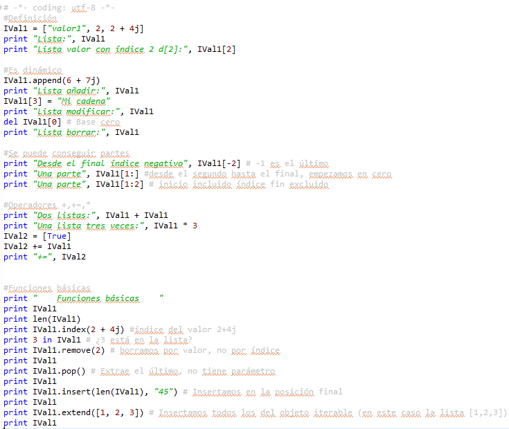
*Figura: manejo de listas en Python (colección ordenada y mutable). Origen: diapositivas
«Unidad 5: desarrollo de módulos para un sistema ERP-CRM».*

### Sentencias del lenguaje

- **Condicional**: `if` con la condición y dos puntos, el bloque sangrado, y opcionalmente
  `else` (y `elif` para más casos).
- **Bucle `while`**: repite el bloque mientras la condición sea cierta.
- **Bucle `for ... in`**: recorre secuencias de elementos (listas, tuplas, cadenas,
  rangos con `range()`). Con `break` se sale del bucle y con `continue` se pasa a la
  siguiente iteración.

### Clases y objetos

Un programa orientado a objetos se forma con **clases** (plantillas) y **objetos**
(instancias de una clase). Las clases tienen **atributos** (campos) y **métodos**. En Python
se definen con `class`, dos puntos y el cuerpo sangrado. El método **`__init__`** inicializa
el objeto y se ejecuta al instanciarlo; el primer argumento de todo método es **`self`**,
que referencia al objeto actual.

```python
class persona:
    def __init__(self, nombre, edad):
        self.nombre = nombre
        self.edad = edad
    def mayordeedad(self):
        return self.edad >= 18

empleado = persona("Javier", 32)
print(empleado.nombre, empleado.edad)
```

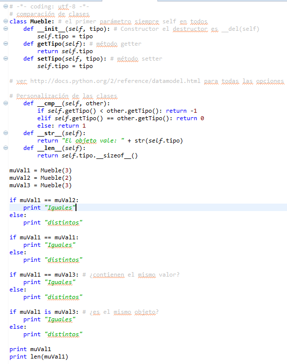
*Figura: clase con constructor, métodos de acceso y métodos especiales. Origen: diapositivas
«Unidad 5: desarrollo de módulos para un sistema ERP-CRM».*

### Módulos y paquetes de Python

Un **módulo** de Python es un archivo `.py` con definiciones y declaraciones; se reutiliza
con `import nombre_modulo`. Un **paquete** es un directorio con varios módulos relacionados;
para que Python trate un directorio como paquete debe contener un archivo `__init__.py`.
Este mismo mecanismo es el que usa Odoo para sus módulos.

### El lenguaje del modelo en Odoo

Sobre Python, Odoo añade su propio vocabulario para declarar datos. En el material antiguo
(OpenERP), una clase hereda de `osv.osv` y define `_name` (nombre de la tabla) y `_columns`
(un diccionario con `fields.char`, `fields.integer`, `fields.float`, `fields.boolean`,
`fields.date`, `fields.datetime`, `fields.text`, `fields.binary`, `fields.selection`, más
opciones como `size`, `required=True`, `digits=(4,2)`, `select=True`, `translate=True`,
`readonly=True`). Otras propiedades del objeto: `_defaults`, `_constraints`,
`_sql_constraints`, `_order`, `_rec_name`, `_inherit`, `_inherits`, `_table`, `_sequence`,
`_auto`, `_log_access`. (`_rec_name` indica de qué campo se toma el nombre con el que se
muestra un registro; por defecto, el campo `name`.)

En el material moderno, un **modelo** es una clase Python que hereda de **`models.Model`**;
`_name` es obligatorio y `_description` es opcional. Los atributos que se guardan en la base
de datos se declaran como **`fields`**: `fields.Char`, `Integer`, `Text`, `Date`,
`Datetime`, `Float`, `Boolean`, `Html`, `Binary`, `Image`, `Selection`. Sus constructores
admiten argumentos como `string`, `default`, `required`, `readonly`, `translate`, `help`,
`index`, `compute`, `store`, `copy`. El ORM analiza el modelo, localiza los `fields` y
mapea todo en la base de datos.

**Campos relacionales** (evitan tener que crear las claves ajenas a mano):

- **`Many2one`**: relación muchos-a-uno; se traduce en una clave ajena a la otra tabla
  (`pais_id = fields.Many2one('modulo.pais')`).
- **`One2many`**: la inversa del `Many2one`; necesita que exista un `Many2one` en el otro
  modelo; no cambia la base de datos, se comporta como un campo calculado.
- **`Many2many`**: relación muchos-a-muchos; se mapea como una tabla intermedia con claves
  ajenas a las dos tablas.
- **`related`**: no es un tipo, sino una propiedad para mostrar un dato que está en un
  registro de otro modelo con el que hay un `Many2one`.

**Campos calculados**: se definen con `compute='_nombre_funcion'` y la función lleva el
decorador **`@api.depends('campo1', 'campo2')`**, que hace que se recalcule cuando cambian
esos campos. Con `store=True` se guardan en la base de datos (necesario para poder buscar u
ordenar por ellos).

**Restricciones**: con el decorador **`@api.constrains('campo')`** una función revisa el
valor y lanza `ValidationError` si no es válido, lo que impide guardar. Alternativamente,
`_sql_constraints` es una lista de tuplas (nombre, restricción SQL, mensaje).

**Herencia** (tres tipos en el ORM):

| Tipo | Cómo se indica | Efecto |
| --- | --- | --- |
| **De clase** | `_inherit = obj` y `_name = obj` (el mismo) | Amplía la clase original con nuevos campos o métodos; sigue mapeada en la **misma tabla**; las vistas existentes siguen funcionando; permite sobrescribir métodos |
| **Por prototipo** | `_inherit = obj` y `_name = nuevo` | Crea un objeto nuevo que aprovecha la definición del original; la clase original sigue existiendo; se mapea en una **tabla nueva**; hay que rediseñar las vistas |
| **Por delegación** | `_inherits = {'obj': 'campo_id'}` | Herencia simple o múltiple; la nueva clase «delega» funcionamiento en otras que incorpora; cada recurso contiene un recurso de cada clase de la que deriva; se mapea en **tablas diferentes** |

Como Odoo ya existe y normalmente solo se quieren ampliar funcionalidades, la más usada es
la **herencia de clase**.

> **En las noticias — Python, lenguaje más popular.** En los últimos años Python encabeza de
> forma sostenida los índices de popularidad de lenguajes de programación (índice TIOBE,
> encuestas de Stack Overflow, «Octoverse» de GitHub), impulsado por la ciencia de datos y
> la inteligencia artificial. Que el ERP del ejemplo use precisamente Python, y no un
> lenguaje propietario, facilita encontrar documentación, bibliotecas y personas con
> experiencia previa.

### Ideas clave de esta sección

- Odoo se programa en Python: interpretado, tipado dinámico y fuerte, orientado a objetos,
  la sangría delimita los bloques.
- Tipos básicos (`int`, `float`, complejo, cadena, booleano) y colecciones (listas
  mutables, tuplas inmutables, diccionarios clave-valor).
- Sentencias: `if/elif/else`, `while`, `for ... in`.
- El modelo se declara con clases que heredan de `models.Model` y atributos `fields.*`;
  campos relacionales `Many2one`, `One2many`, `Many2many`.
- Campos calculados (`compute` + `@api.depends`), restricciones (`@api.constrains`,
  `_sql_constraints`) y tres tipos de herencia (de clase, por prototipo, por delegación).

## 3. Entornos y herramientas de desarrollo en sistemas ERP y CRM

Un **entorno de desarrollo integrado (IDE)** es un programa que incluye todo lo necesario
para programar en uno o varios lenguajes: además de un editor de texto especializado,
navegadores de archivos, asistentes de compilación, **depuradores**, etc. Para programas
pequeños puede bastar el intérprete interactivo; cuando el código crece, un IDE ahorra
mucho tiempo.

**Entornos citados para trabajar con Python y Odoo:**

- **IDLE**: uno de los más sencillos, disponible en casi todas las plataformas. Permite
  revisar la sintaxis del módulo (`Run / Check module`), ejecutarlo (`Run / Run module`) e
  incluye opciones de depuración.
- **Extensión de Odoo para el editor Gedit**: convierte el editor en un entorno para Odoo;
  su principal ventaja es que añade fragmentos de código típico.
- **Eclipse** con el complemento **PyDev**: entorno más completo; incorpora plantillas con
  código que facilitan crear los módulos. El material antiguo usa además **Dia** para
  dibujar diagramas de clases y generar código.
- **Visual Studio Code** y **PyCharm**: los más usados en el material moderno (se opta por
  VS Code), con extensiones **Python**, **Odoo**, **Odoo-snippets** y **Container-Tools**.

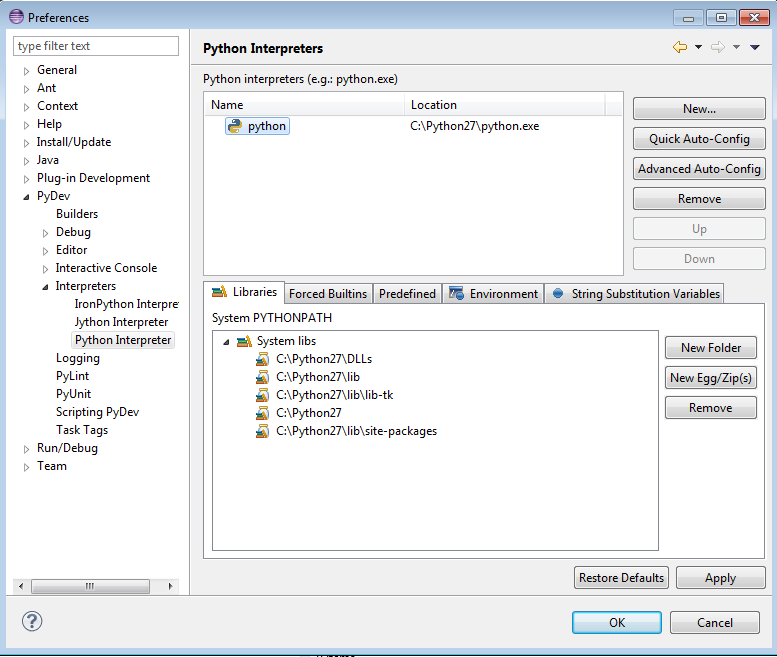
*Figura: configuración del intérprete de Python en Eclipse con PyDev. Origen: diapositivas
«Unidad 5: desarrollo de módulos para un sistema ERP-CRM».*

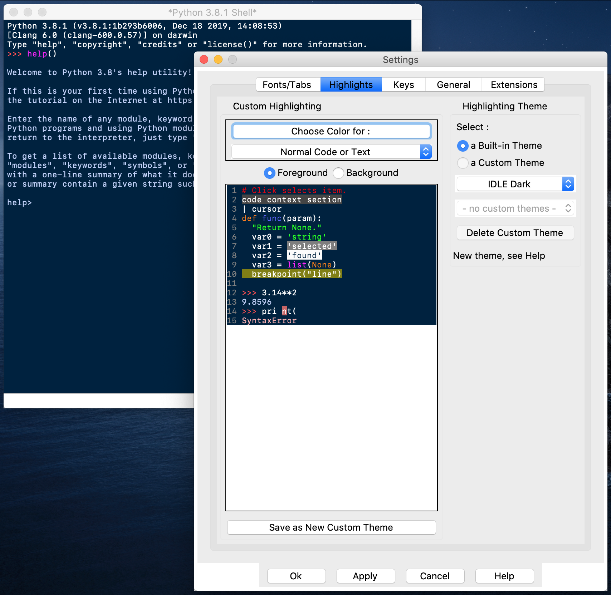
*Figura: el IDE IDLE, incluido con Python, con su shell interactivo y su ventana de ajustes.
Origen: «Desarrollo de componentes» (Ministerio de Educación y Formación Profesional).*

### Herramientas específicas de Odoo

- **`odoo scaffold nombremodulo /ruta`**: genera la estructura básica de directorios y
  ficheros de un módulo, con algo de código de ejemplo.
- **Modo desarrollador** (Odoo 17): se activa desde *Ajustes*; requiere tener instalado al
  menos un módulo. Permite ver el nombre del modelo y del campo al pasar el ratón por
  encima, explorar los identificadores externos y depurar gráficamente.
- **`odoo shell`**: acceso por terminal al servidor para probar instrucciones del ORM sin
  editar archivos ni reiniciar.
- **Despliegue con Docker y Docker Compose**: el directorio de módulos queda mapeado en la
  máquina anfitriona; `docker-compose exec web bash` entra en el contenedor y
  `docker-compose restart web` reinicia el servicio.

### Entornos de desarrollo, pruebas y explotación

El material distingue cómo se comporta Odoo según el entorno:

- **Desarrollo** (`--dev=all`): el servidor lee cada vez las vistas, los datos y el código
  Python directamente de los ficheros; los cambios se ven sin reiniciar ni actualizar el
  módulo.
- **Producción**: Odoo funciona *data-driven* (dirigido por datos). Al instalar o
  actualizar un módulo, las vistas y los datos de los `.xml` se guardan en la base de
  datos; un cambio en un XML **no** se refleja hasta actualizar el módulo. Los ficheros
  Python sí se recargan al reiniciar el servicio.

### Ideas clave de esta sección

- Un IDE reúne editor especializado, navegación de archivos y depurador.
- Entornos para Python/Odoo: IDLE, Gedit con la extensión de Odoo, Eclipse+PyDev, VS Code,
  PyCharm.
- `odoo scaffold` crea el esqueleto del módulo; el modo desarrollador y `odoo shell` ayudan
  a inspeccionar y probar.
- En desarrollo los cambios se leen al vuelo; en producción hay que actualizar el módulo
  para que los XML surtan efecto.

## 4. Inserción, modificación y eliminación de datos en los objetos

Crear un componente que manipule datos consiste, básicamente, en definir un **objeto** (una
clase) que el ORM convierte en una tabla, y darle una vista para poder insertar, modificar y
eliminar registros. Los ficheros implicados son los ya vistos: `__init__.py`,
`__manifest__.py`, `nombre_modulo.py` (la clase con sus campos: modelo + controlador) y
`nombre_modulo_view.xml` (la vista). Al reiniciar el servidor o actualizar el módulo, el ORM
interpreta los ficheros Python y mapea las novedades en la base de datos, y carga los datos
de los ficheros XML.

Existe también una vía sin desarrollo: el módulo **`base_module_record`**, que graba todas
las acciones que se realizan en la aplicación (como las macros de una hoja de cálculo) y
produce un archivo comprimido que en realidad es un módulo instalable.

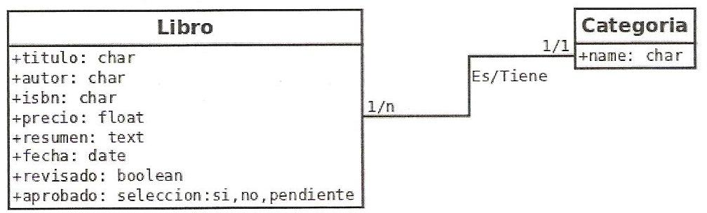
*Figura: modelo de dos objetos relacionados con `Many2one` (un libro tiene una categoría;
una categoría tiene muchos libros). La relación se declara en la parte «muchos». Origen:
diapositivas «Unidad 5: desarrollo de módulos para un sistema ERP-CRM».*

### Métodos del ORM para manipular datos

En lugar de sentencias SQL, se usan los métodos que el ORM aplica sobre **recordsets**
(conjuntos de registros) y **singletons** (un solo registro):

| Método | Qué hace |
| --- | --- |
| `create({...})` | Crea y devuelve un registro nuevo a partir de un diccionario de campos |
| `write({...})` | Escribe valores en el *recordset* desde el que se invoca |
| `search([dominio])` | Devuelve un *recordset* con los registros que cumplen el dominio (admite `offset`, `limit`, `order`, `count`) |
| `browse([ids])` | Devuelve un *recordset* a partir de una lista de identificadores |
| `unlink()` | Borra de la base de datos los registros del *recordset* |
| `exists()` | Indica si un registro sigue existiendo |
| `copy()` | Devuelve una copia del *recordset* |
| `ref('External ID')` | Devuelve el *recordset* correspondiente a un identificador externo |
| `ensure_one()` | Garantiza que un *recordset* es en realidad un *singleton* |

Para acceder a los datos hay que iterar el *recordset* (`for record in self:`) y trabajar
con cada *singleton*. Los *recordsets* admiten operaciones de conjuntos (`in`, `|`, `&`,
`-`) y funciones de programación funcional: `filtered()`, `sorted()` y `mapped()`.

### Escribir en relaciones muchos-a-muchos

Al escribir en un `Many2many` (o en un `One2many`) se usan **tripletas** con un código
numérico:

- `(0, _, {campos})`: crea un registro nuevo y lo vincula.
- `(1, id, {campos})`: actualiza un registro ya vinculado.
- `(2, id, _)`: desvincula y elimina el registro.
- `(3, id, _)`: desvincula sin eliminar.
- `(4, id, _)`: vincula un registro existente.
- `(5, _, _)`: desvincula todos.
- `(6, _, [ids])`: reemplaza la lista de registros vinculados.

### Ficheros de datos e identificadores externos

Los datos que deben ir a la base de datos se describen en XML:
`<odoo><data><record model="..." id="..."><field name="...">valor</field></record></data></odoo>`.
El `id` es un **External ID** (identificador externo), escrito en lenguaje humano, con la
forma `nombre_modulo.identificador`, que no depende del `id` autonumérico de la tabla. Para
rellenar un `Many2one` en XML se usa `ref('modulo.registro')`; para calcular un valor con
Python durante la instalación, `eval(...)`. Para borrar registros: `<delete model="..."
id="..."/>`.

### Onchange

El decorador **`@api.onchange('campo')`** hace que un método se ejecute cuando el usuario
cambia el valor de un campo en el formulario, normalmente para modificar otros campos o
avisar con un `warning`. Trabaja sobre un **registro virtual** (copia de los datos
originales); para acceder al registro real se usa `self._origin`.

### Seguridad: control de acceso

Para que los usuarios puedan operar sobre un modelo nuevo hay que declarar sus permisos en
`security/ir.model.access.csv`, una lista de **ACL** (*Access Control List*) con las
columnas `perm_read`, `perm_write`, `perm_create` y `perm_unlink` (`1` concede, `0`
deniega) y el grupo al que se aplica (por ejemplo `base.group_user` para todos los
usuarios). Se pueden definir grupos propios en un XML con `res.groups`.

### Ejemplo del material: módulo «Lista de tareas»

El módulo de ejemplo define un modelo `lista_tareas.lista_tareas` con los campos `tarea`
(`Char`), `prioridad` (`Integer`), `realizada` (`Boolean`) y `urgente` (`Boolean` calculado,
`store=True`), este último con un método `_value_urgente` decorado con
`@api.depends('prioridad')` que marca la tarea como urgente si la prioridad es mayor que 10.
El `__manifest__.py` declara `depends: ['base']` y carga `security/ir.model.access.csv` y
`views/views.xml`.

### Ideas clave de esta sección

- Un componente de datos = una clase (modelo + controlador) + su vista; el ORM crea la
  tabla.
- Manipulación sin SQL: `create`, `write`, `search`, `browse`, `unlink`, más `filtered`,
  `sorted`, `mapped`.
- En relaciones `x2many` se usan tripletas con códigos `0`–`6`.
- Los datos iniciales y las vistas se cargan desde XML con `<record>` e identificadores
  externos.
- `@api.onchange` reacciona a cambios en el formulario; los permisos se declaran en
  `ir.model.access.csv`.

## 5. Operaciones de consulta. Herramientas

Los objetos nuevos se basan en **consultas** a los datos existentes. Si se manejan grandes
volúmenes, una consulta puede tardar bastante, así que conviene que las consultas sean lo
más **optimizadas** posible. Optimizar es «modificar un sistema para mejorar su eficiencia o
el uso de los recursos disponibles».

**Técnicas de optimización de consultas y acceso a grandes volúmenes:**

- **Diseño de tablas**: evitar duplicidad de datos y aprovechar el almacenamiento.
- **Campos**: ajustar el tamaño de los campos para no desperdiciar espacio.
- **Índices**: permiten búsquedas mucho más rápidas, pero ocupan espacio y ralentizan las
  actualizaciones, así que no conviene indexar todos los campos. Razones para poner un
  índice: que el campo se use como criterio de búsqueda o que sea una **clave ajena** en
  otra tabla.
- **Optimizar sentencias SQL**: seguir las reglas de escritura de consultas, tanto de
  selección como de inserción y modificación.
- **Optimizar la base de datos**: conectarse en modo comando y usar sentencias de
  mantenimiento.

### Herramienta: el monitor interactivo de PostgreSQL (`psql`)

Para operar directamente sobre PostgreSQL, los pasos son:

1. Cambiar al usuario `postgres`: `sudo su postgres`.
2. Entrar en el monitor interactivo: `psql` (aparece el *prompt* `postgres=#`).
3. Ejecutar comandos.
4. Salir con `\q`.

| Comando | Función |
| --- | --- |
| `\h` | Ayuda |
| `\l` | Lista las bases de datos |
| `\c [nombre_bd]` | Se conecta a una base de datos |
| `\d` | Muestra las tablas de la base de datos |
| `\d [tabla]` | Muestra los campos de una tabla y sus tipos |
| `VACUUM VERBOSE ANALYZE [tabla];` | Limpia y analiza la base de datos |
| `\q` | Sale del monitor |

### Herramienta: el ORM y la vista de búsqueda

Dentro de Odoo, la consulta habitual se hace con **`search([dominio])`** (y `search_count()`
para contar), donde el **dominio** es una lista de condiciones del estilo
`[('is_company', '=', True), ('customer', '=', True)]`. Sobre el *recordset* obtenido se
aplican `filtered`, `sorted` y `mapped`. En la interfaz, la **vista `search`** (guardada en
`ir.ui.view`) define por qué campos se busca (`<field>`), qué **filtros** predefinidos hay
(`<filter domain="...">`) y cómo se **agrupan** los registros (`<filter>` con
`context="{'group_by': 'campo'}"`).

> **Ejemplo actual — El coste de una consulta mal planteada.** En tiendas y ERP en la nube,
> un listado sin índice sobre un campo de fecha o sin límite de resultados puede tumbar el
> rendimiento en campañas de mucho tráfico (rebajas, «Black Friday»). Es la traducción
> práctica de lo que dice el material: indexar los campos por los que se busca y por los que
> se relaciona, y no traer más filas de las necesarias.

### Ideas clave de esta sección

- Los objetos nuevos consultan datos existentes; conviene que las consultas estén
  optimizadas.
- Técnicas: buen diseño de tablas, campos ajustados, índices selectivos, SQL cuidado,
  mantenimiento de la base de datos.
- `psql` es el monitor interactivo de PostgreSQL: `\l`, `\c`, `\d`, `VACUUM ... ANALYZE`.
- En Odoo se consulta con `search()` y dominios; la vista `search` define búsquedas,
  filtros y agrupaciones para el usuario.

## 6. Formularios e informes en sistemas ERP-CRM

Los **formularios** constituyen la interfaz de un módulo. Una vez creado el objeto
(`nombre_modulo.py`), hay que definir menús, acciones y vistas para poder interactuar con
él; todo eso se describe en `nombre_modulo_view.xml`, fichero que debe estar listado en el
`data` del `__manifest__.py`.

### Arquitectura de las vistas: XML, records, acciones y menús

Las vistas se construyen de forma dinámica a partir de una descripción en **XML**, un
metalenguaje que usa etiquetas para expresar información estructurada. Cada elemento se
guarda con un `<record model="...">`, donde el atributo `model` indica de qué se trata:

- **`ir.ui.view`**: una vista. Campos mínimos: `name`, `model` (el objeto que muestra) y
  `arch` (el XML de la disposición). Dentro de `arch` van etiquetas como `<tree>` (lista) o
  `<form>` (formulario) con los `<field name="...">` que se muestran.
- **`ir.actions.act_window`**: una acción que abre una o varias vistas de un modelo
  (`res_model`, `view_mode` como `tree,form`).
- **`<menuitem>`**: un elemento de menú, con `id`, `name`, `parent` (menú padre; el raíz no
  lo tiene) y `action` (la acción que ejecuta al pulsarlo).

Al crear un módulo son necesarias, como mínimo, la definición de los menús, la acción de
apertura y las vistas de tipo **árbol** (para listar) y **formulario** (para insertar y
modificar).

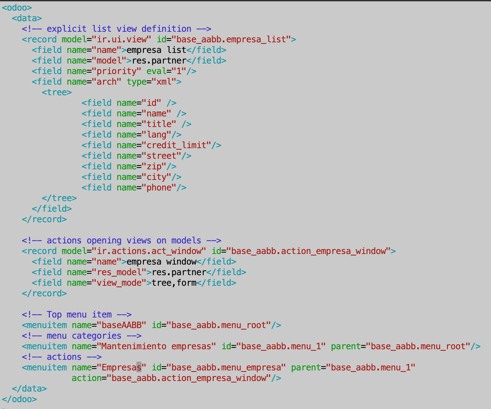
*Figura: estructura de un `views.xml` con vista lista, acción de ventana y menús anidados.
Origen: «Desarrollo de componentes» (Ministerio de Educación y Formación Profesional).*

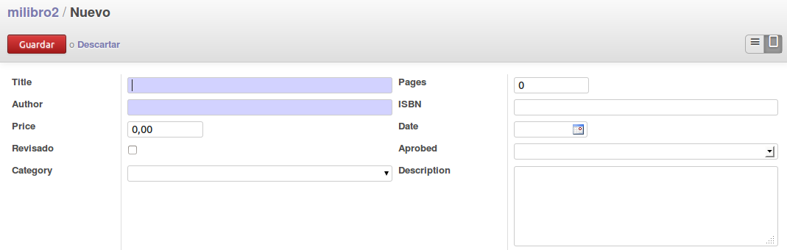
*Figura: vista de tipo formulario generada por un módulo. Origen: diapositivas «Unidad 5:
desarrollo de módulos para un sistema ERP-CRM».*

### Elementos de organización y de datos en las vistas

El material antiguo describe elementos **grupales** (no muestran datos, los organizan):
`<separator string="...">` (línea divisoria con texto), `<notebook>` con `<page
string="...">` (pestañas), `<group>` (con `colspan`, `rowspan`, `col`, `expand`); y
elementos de **datos**: `<newline/>`, `<label string="...">` y `<field>` con atributos como
`name`, `select` (crea índice para búsquedas), `colspan`, `readonly`, `required`, `nolabel`,
`invisible`, `string`, `onchange` y `widget`.

### Tipos de vista y widgets (Odoo moderno)

Además de **`tree`** y **`form`**, Odoo ofrece vistas **`kanban`** (tarjetas, con lenguaje
QWeb), **`calendar`** (necesita un campo de fecha y otro de fecha final o duración),
**`graph`** (gráfica de tipo `pie`, `bar` o `line`, con campos `row`, `col` y `measure`) y
**`search`**. La vista `tree` admite `decoration-*` para colorear líneas según una
condición, `editable` para editar en la propia lista, `invisible="1"` para campos ocultos y
`sum` para totales. La vista `form` se estructura con `<sheet>`, `<group>`, `<separator>`,
`<notebook>`/`<page>` y `<label>`, y afina la presentación con **widgets** (`integer`,
`float`, `monetary`, `percentpie`, `progressbar`, `many2many_tags`, `statusbar`,
`web_ribbon`, `image`…), con `attrs` (mostrar/ocultar/forzar según condiciones) y con
`states` para formularios que se comportan como asistentes.

Un caso particular de formulario es el **wizard** o asistente: una ventana emergente que
guía paso a paso una gestión (por ejemplo, un envío masivo de correos). No usa ninguna
tecnología especial, salvo que sus datos **no se guardan de forma permanente**: para ello
la clase hereda de **`TransientModel`** en lugar de `models.Model`. Los registros de un
modelo transitorio se almacenan de forma temporal, solo son accesibles durante la ejecución
del asistente y después se eliminan.

### Informes

Los **informes** pueden ser:

- **Estadísticos**: con el módulo `base_report_creator` se crean listados, informes y
  gráficos por pantalla.
- **Impresos**: con distintas herramientas. Se cita la extensión de OpenOffice.org y la
  librería **Jasper Reports**, que genera un XML con la descripción del informe y produce un
  documento de salida en PDF o HTML.

En Odoo moderno, un informe es una acción **`ir.actions.report`** que usa una **plantilla
QWeb**; el *framework* la transforma en HTML e invoca **`wkhtmltopdf`** (motor WebKit) para
convertirlo en PDF. Se usan los atajos `<report>` (para la acción) y `<template>` (para la
plantilla); la variable `docs` contiene los registros a mostrar.

### Herencia de vistas

Para añadir campos a una vista existente (herencia de clase en el modelo) no se redefine la
vista entera: se crea un `<record>` con `<field name="inherit_id" ref="modulo.vista_padre"/>`
y, dentro del `arch`, se referencia una etiqueta de la vista padre indicando qué hacer con
ella mediante `position`: `inside` (por defecto), `after`, `before`, `replace` o
`attributes`. Cuando una etiqueta es difícil de localizar o está repetida, se usa `<xpath
expr="..." position="...">`.

### Internacionalización

Terminado el módulo, se generan los ficheros de traducción **`.pot`** (sin idioma) y
**`.po`** (por idioma, por ejemplo `es.po`), se guardan en una carpeta **`i18n`** dentro del
módulo y se traducen los textos (`msgid` → `msgstr`).

> **En las noticias — El fin de `wkhtmltopdf`.** El proyecto `wkhtmltopdf`, la herramienta
> que Odoo y otros sistemas han usado durante años para convertir HTML en PDF, quedó
> archivado por sus responsables (según se informó, a comienzos de 2023) y dejó de recibir
> mantenimiento. Es un recordatorio de que los componentes de generación de informes
> dependen de piezas externas que pueden quedar obsoletas y hay que vigilar.

### Ideas clave de esta sección

- El formulario es la interfaz del módulo; se describe en XML con `<record>` de tipo
  `ir.ui.view`, `ir.actions.act_window` y `<menuitem>`.
- Vistas mínimas: árbol (listar) y formulario (insertar/modificar); Odoo añade kanban,
  calendar, graph y search.
- Elementos de organización (`group`, `notebook`, `page`, `separator`) y de datos (`field`
  con sus atributos y `widget`).
- Informes estadísticos (`base_report_creator`) e impresos (Jasper Reports; QWeb +
  `wkhtmltopdf` en Odoo moderno).
- Las vistas se heredan con `inherit_id` y `position`; la traducción va en ficheros
  `.pot`/`.po` en `i18n`.

## 7. Procesamiento de datos y obtención de la información

Además de las pantallas interactivas, un ERP necesita procesos que traten datos en bloque:
cargar grandes cantidades de registros, recalcular, exportar. El material aborda este tema
con los **sistemas *batch-input***.

El término ***batch-input*** procede de los sistemas **SAP**: es un método para **transferir
grandes cantidades de datos** a un ERP. Hay dos formas de hacerlo:

- **Método clásico**: **asíncrono** (los datos se procesan pero se actualizan más tarde);
  genera un archivo de mensajes o **log** para tratar los errores a posteriori.
- **Método «call transaction»**: **on-line** y **síncrono**, para dar de alta rápidamente
  pocos registros; no genera log, es más rápido, pero poco útil para grandes volúmenes.

Un proceso *batch-input* tiene **dos fases**:

1. **Generación**: se crea el archivo *batch-input* con los datos a introducir o modificar.
2. **Procesamiento**: el archivo se ejecuta y las modificaciones se hacen efectivas en la
   base de datos.

Requiere, por tanto, **programas tanto para generar el archivo como para procesarlo**
después.

### Procesamiento dentro de Odoo

En Odoo el procesamiento se apoya en el controlador y el ORM. Los **campos calculados**
(`compute` + `@api.depends`) recalculan información derivada cuando cambian sus
dependencias. Los métodos del ORM permiten recorrer y transformar conjuntos de registros con
`filtered()`, `sorted()` y `mapped()`. El método **`read()`** devuelve el *recordset*
convertido en una lista de diccionarios de Python, formato útil para **exportar** los datos
a aplicaciones que no son Odoo (por ejemplo, para servir una API REST) o para tratarlos en
crudo dentro de un algoritmo. Las plantillas **QWeb** y los **web controllers** (sección 8)
generan HTML o JSON a partir de los datos para páginas web o aplicaciones externas.

> **Ejemplo actual — Cargas masivas del día a día.** Migrar el maestro de artículos de un
> proveedor, importar miles de líneas de un inventario o volcar los movimientos de un banco
> son tareas *batch* típicas. Las herramientas de importación de CSV/Excel de Odoo, Holded o
> Dynamics siguen el mismo esquema del material: primero se prepara el fichero (fase de
> generación) y después el sistema lo procesa y valida (fase de procesamiento), dejando
> constancia de los errores.

### Ideas clave de esta sección

- Los *batch-input* (origen SAP) transfieren grandes volúmenes de datos en dos fases:
  generación del archivo y procesamiento.
- Método clásico: asíncrono, con log de errores. Método «call transaction»: síncrono,
  rápido, sin log, para pocos registros.
- En Odoo, el procesamiento se hace con campos calculados, `filtered/sorted/mapped` y
  `read()` para exportar; QWeb y web controllers producen la información para el exterior.

## 8. Llamadas a funciones y librerías de funciones (APIs)

### Funciones en Python

Una **función** es un conjunto de instrucciones que realiza una tarea concreta y devuelve un
valor. Sirven para reutilizar código y para dividir el programa en partes más pequeñas,
legibles y fáciles de depurar. Se definen con `def`, un nombre y los **parámetros** entre
paréntesis; se **llaman** usando el nombre y los argumentos. El valor de retorno se indica
con `return`; si no se especifica, la función devuelve `None`.

```python
def cuadrado(numero):
    return numero ** 2

print(cuadrado(4))   # 16
```

Python admite **parámetros con valor por defecto** (`def calcular_impuesto(cantidad, iva=0.21)`),
llamada con el nombre del parámetro (`calcular_impuesto(iva=0.18, cantidad=122.99)`),
número variable de argumentos posicionales con `*args` (llega una tupla) y con nombre
mediante `**kwargs` (llega un diccionario). Las **funciones `lambda`** son funciones
anónimas de una sola línea, definidas allí donde se usan. En Python los valores mutables se
comportan como paso por referencia y los inmutables como paso por valor. Con
`map(función, lista)`, `filter(función, lista)` y `reduce(función, lista)` se recorren y
transforman listas.

### APIs: librerías de funciones

Una **API** (o **biblioteca de clases**) es un conjunto de clases útiles a disposición de
quien programa. Python trae una **biblioteca estándar**; entre sus módulos destacan:

| Módulo | Para qué |
| --- | --- |
| `os` | Funciones del sistema operativo: crear archivos y directorios, leer y escribir, manipular rutas (`chdir()` está aquí) |
| `sys` | Información del intérprete: *prompt*, datos de licencia, parámetros |
| `datetime` | Manipulación de fechas y horas |
| `math` | Funciones matemáticas |

### Llamadas al ORM y al *environment* de Odoo

Dentro de Odoo, las «llamadas a funciones» más frecuentes son a los métodos del **ORM**
(`search`, `create`, `write`, `unlink`, `browse`, `ref`…). Todo *recordset* tiene un
atributo **`env`** (*environment*), que guarda el cursor de la base de datos, el usuario
actual y el **`context`** (un diccionario con, al menos, el identificador de usuario, el
idioma y la zona horaria). Con `self.env['res.partner']` se accede a otro modelo.

### Web controllers y APIs REST

Los **web controllers** son funciones que responden a **rutas** (URIs) concretas. Se
escriben en una clase que hereda de **`http.Controller`**, con métodos decorados con
**`@http.route`**, que permite indicar:

- la **ruta** que atiende;
- la **autenticación** (`auth='user'`, `auth='public'` o `auth='none'`);
- el **tipo** de datos (`type='http'` para GET/POST tradicional, `type='json'` para un
  cuerpo en formato JSON);
- los **métodos HTTP** aceptados (`methods=[...]`);
- el tratamiento de peticiones de otro dominio (`cors=`) y la protección `csrf=`.

Los parámetros llegan por POST/GET (`parametro=valor&...`), al estilo **REST**
(`/school/<model>/<obj>`) o en **JSON**. Cuando la ruta es pública pero necesita leer datos
protegidos, se puede anteponer **`sudo()`** a la llamada del ORM para que ignore los
permisos del usuario; el material advierte de que conviene usarlo con mucho cuidado y, en
general, es mejor apoyarse en el control de acceso normal. Para construir una **API REST** que consuma una
aplicación externa (móvil, SPA en Vue/React/Angular) hay que poner `cors="*"`, desactivar
`csrf`, implementar un mecanismo de sesión propio (**tokens JWT**) y actuar según el verbo
HTTP. La autenticación de Odoo se solicita con una petición JSON a
`/web/session/authenticate`. Para generar HTML se usa `http.request.render()` con una
plantilla **QWeb**; también se puede generar el HTML o el JSON desde Python. Odoo ofrece
además una **API externa por XML-RPC**, con ejemplos oficiales para PHP, Python y Java.

Las **dependencias externas** (bibliotecas de Python o ejecutables del sistema, como
`wkhtmltopdf` o `python-barcode`) se declaran en `__manifest__.py` con
`'external_dependencies': {"python": [...], "bin": [...]}` y hay que instalarlas a mano en
el servidor (o dentro del contenedor Docker).

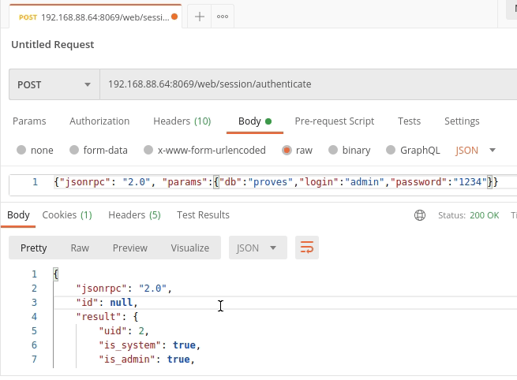
*Figura: prueba de la llamada de autenticación de Odoo con Postman. Herramientas como
Postman o Thunder Client se usan para probar los web controllers y las APIs. Origen:
«Desarrollo de módulos de Odoo: controlador, herencia y web controllers».*

> **Ejemplo actual — APIs e IA generativa sobre el ERP.** Los grandes fabricantes han
> añadido asistentes de IA que se apoyan en las APIs de su ERP-CRM: Salesforce con
> *Agentforce* y Einstein, Microsoft con *Copilot* en Dynamics 365 y SAP con *Joule*. Todos
> funcionan llamando a servicios (equivalentes a los web controllers y a la API externa que
> describe el material) para leer y escribir datos del sistema. Saber exponer y consumir
> APIs es hoy la puerta de entrada a estas integraciones.

### Ideas clave de esta sección

- Función: bloque reutilizable que devuelve un valor (`None` si no hay `return`); admite
  parámetros por defecto, `*args`, `**kwargs` y `lambda`.
- API = biblioteca de clases; la estándar de Python incluye `os`, `sys`, `datetime`,
  `math`.
- En Odoo se «llama» sobre todo al ORM; `self.env` da acceso al cursor, al usuario y al
  `context`.
- Los web controllers (`http.Controller` + `@http.route`) crean rutas y APIs REST;
  autenticación por token, `cors`, verbo HTTP; también hay API externa por XML-RPC.
- Las dependencias externas se declaran en el `__manifest__.py` y se instalan aparte.

## 9. Depuración de un programa

Las **herramientas de depuración** ayudan a detectar errores en el código, mostrando de qué
tipo de error se trata o por qué se produce. Suelen formar parte de los entornos de
desarrollo, aunque también hay depuradores independientes.

Python incorpora un depurador en su biblioteca estándar llamado **`pdb`**, que admite
**puntos de ruptura**, **ejecución paso a paso**, inspección del valor de las variables y
otras opciones. Aun así, una herramienta gráfica ahorra tiempo. En **IDLE**, la depuración
se activa con `Debug / Debugger`; con el botón derecho se pone una parada en la sentencia a
evaluar, de modo que la ejecución se detiene ahí y se puede analizar el valor de las
variables. Las acciones típicas del depurador son:

| Acción | Efecto |
| --- | --- |
| **Go** | Continúa la ejecución hasta el siguiente punto de ruptura |
| **Step** | Ejecuta el programa línea a línea |
| **Over** | Ejecuta la sentencia actual sin detenerse en las funciones anidadas |
| **Out** | Ejecuta hasta el final de la función actual |
| **Quit** | Finaliza la ejecución |

### Manejo de errores: excepciones

Cuando un programa falla, se genera un error en forma de **excepción**: un error detectado
por el intérprete durante la ejecución (por ejemplo, dividir por cero o abrir un archivo que
no existe). Si el programa no las contempla, se detiene con un mensaje. En Python se usa la
construcción **`try` / `except`** (y opcionalmente `else` y `finally`): en el bloque `try`
se pone el código que podría fallar y en `except` el código que se ejecuta si se produce la
excepción. Se puede lanzar una excepción manualmente con **`raise`**.

Excepciones habituales: `BaseException` (clase base de todas), `Exception` (base de las que
no son de entrada/salida), `ArithmeticError` (con `ZeroDivisionError`, `OverflowError`,
`FloatingPointError`), `IOError`, `ImportError` (útil para comprobar si una funcionalidad
está instalada), `IndexError`, `KeyError`, `EOFError`.

```python
def dividir(a, b):
    return a / b

try:
    dividir(1, 0)
except ZeroDivisionError:
    print("No se puede dividir entre cero")
```

En Odoo, el ORM añade excepciones propias como `ValidationError` (usada en las
restricciones). Para depurar el servidor se emplean el **modo desarrollador**, la terminal
**`odoo shell`** (probar instrucciones del ORM, `print(self)`) y clientes como **Postman** o
**Thunder Client** para las peticiones web. El material advierte de que en un *framework*
como Odoo los errores son más difíciles de interpretar, porque no se ve todo lo que ocurre
por debajo.

### Verificación y documentación

Antes de dar por terminado un componente hay que **verificar** que funciona (probar la
inserción, la modificación, el borrado, los cálculos, los informes) y **documentarlo**.
Python permite documentar cada función, clase o módulo con una cadena (*docstring*) escrita
en la línea siguiente a la definición, entre triples comillas; se recomienda el formato tipo
Javadoc (`@param`, `@return`, `@author`, `@version`).

> **Ejemplo actual — Depurar con ayuda de la IA.** Los editores más usados para Odoo (VS
> Code, PyCharm) integran asistentes que explican trazas de error y proponen correcciones
> (GitHub Copilot, Codeium y similares). No sustituyen al depurador ni a las pruebas, pero
> encajan en lo que dice el material: cuanto más ayuda dé la herramienta a interpretar el
> error, menos tiempo se pierde.

### Ideas clave de esta sección

- La depuración detecta y explica errores; suele venir en el IDE. Python trae `pdb`.
- Acciones del depurador: Go, Step, Over, Out, Quit; puntos de ruptura e inspección de
  variables.
- Las excepciones se capturan con `try`/`except`/`else`/`finally` y se lanzan con `raise`;
  Odoo añade `ValidationError`.
- Para depurar Odoo: modo desarrollador, `odoo shell`, Postman/Thunder Client.
- Todo componente debe verificarse con pruebas y documentarse (docstrings).

---

## Glosario rápido

| Término | En una frase |
| --- | --- |
| ERP-CRM | Sistema que integra la gestión de recursos de la empresa y la relación con los clientes |
| MVC | Patrón que separa datos (modelo), interfaz (vista) y lógica de reacción (controlador) |
| ORM | Capa que traduce clases y objetos a tablas y registros de la base de datos sin escribir SQL |
| Módulo (Odoo) | Carpeta con Python y XML que amplía Odoo y se puede instalar y desinstalar |
| `__manifest__.py` | Diccionario de Python que describe un módulo y lista sus ficheros |
| `models.Model` | Clase de la que hereda un modelo de Odoo para que actúe el ORM |
| `field` | Atributo de un modelo que el ORM mapea en una columna de la base de datos |
| `Many2one` / `One2many` / `Many2many` | Campos que representan relaciones entre modelos |
| Campo calculado | `field` cuyo valor produce una función (`compute` + `@api.depends`) |
| Recordset / Singleton | Conjunto de registros de un modelo / conjunto con un solo registro |
| External ID | Identificador en lenguaje humano (`modulo.nombre`) independiente del `id` numérico |
| Vista árbol / formulario | Vista de lista para consultar / vista de una ficha para insertar y modificar |
| QWeb | Motor de plantillas de Odoo para generar HTML (informes, kanban, web) |
| Wizard | Asistente en ventana emergente que usa un `TransientModel` no persistente |
| Web controller | Función que atiende una ruta (URI) del servidor Odoo; base de las APIs REST |
| XML-RPC / Net-RPC | Protocolos de llamada a procedimientos remotos entre cliente y servidor |
| *batch-input* | Proceso en dos fases (generación y procesamiento) para cargar grandes volúmenes de datos |
| `psql` | Monitor interactivo por línea de comandos de PostgreSQL |
| `pdb` | Depurador incluido en la biblioteca estándar de Python |
| Excepción | Objeto que informa de un error en ejecución; se trata con `try`/`except` |
| SaaS / On-premise | ERP en la nube de un proveedor / ERP instalado en servidores propios |

## Preguntas de repaso

1. ¿Qué representa cada parte del MVC en Odoo?
2. ¿Qué diferencia hay entre XML-RPC y Net-RPC?
3. Enumera las tres capas de la arquitectura de Odoo y las tres interfaces del cliente.
4. ¿Qué ficheros mínimos componen un módulo y para qué sirve cada uno?
5. ¿Por qué no se debe modificar el código fuente de Odoo para adaptarlo a una empresa?
6. Cita tres características del lenguaje Python y explica qué significa «tipado dinámico».
7. ¿Qué diferencia una lista de una tupla? ¿Y de un diccionario?
8. ¿Qué hace el decorador `@api.depends` en un campo calculado?
9. Describe los tres tipos de herencia del ORM y su efecto sobre las tablas de PostgreSQL.
10. Nombra cuatro métodos del ORM para manipular datos y di qué hace cada uno.
11. ¿Para qué sirven las tripletas `(0,…)`, `(4,…)` y `(6,…)` al escribir en un `Many2many`?
12. ¿Qué es un External ID y por qué es necesario en los ficheros de datos XML?
13. Enumera tres técnicas de optimización de consultas y explica cuándo conviene un índice.
14. ¿Qué comandos de `psql` muestran las bases de datos, las tablas y la descripción de una
    tabla?
15. ¿Qué elementos mínimos hay que definir en el XML para que un módulo sea usable?
16. ¿En qué se diferencian un informe estadístico y uno impreso en el material? ¿Qué papel
    juegan QWeb y `wkhtmltopdf`?
17. Explica las dos fases de un proceso *batch-input* y la diferencia entre el método
    clásico y «call transaction».
18. ¿Qué es una API? Cita dos módulos de la biblioteca estándar de Python y su función.
19. ¿Qué permite indicar el decorador `@http.route` de un web controller?
20. ¿Qué acciones ofrece un depurador y cómo se capturan las excepciones en Python?

<details>
<summary>Respuestas (referencia a la sección)</summary>

1. Modelo = tablas de la base de datos; vista = archivos XML; controlador = objetos y
   métodos en Python (sección 1).
2. XML-RPC envía función, argumentos y resultado por HTTP codificados en XML; Net-RPC es más
   reciente, se basa en funciones de Python y es más rápido (sección 1).
3. Capas: datos (PostgreSQL), lógica (servidor Odoo), presentación (SPA en JavaScript).
   Interfaces del cliente: backend, frontend/web y TPV (sección 1).
4. `__init__.py` (paquete e imports), `__manifest__.py` (descripción y ficheros),
   `nombre_modulo.py` (clases: modelo y controlador), `nombre_modulo_view.xml` (vistas)
   (secciones 1 y 4).
5. Porque cualquier actualización borraría los cambios, se perdería acceso a nuevas
   funciones y a parches de seguridad, y revertir sería difícil; en su lugar se crea un
   módulo (sección 1).
6. Sintaxis sencilla, interpretado, tipado dinámico, fuertemente tipado, multiplataforma,
   orientado a objetos. «Tipado dinámico»: las variables no se declaran y su tipo se fija en
   ejecución según el valor asignado (sección 2).
7. La lista es ordenada y mutable; la tupla es inmutable y más ligera; el diccionario
   asocia claves con valores (sección 2).
8. Indica de qué campos depende el cálculo, de modo que la función se vuelve a ejecutar
   cuando cambia alguno de ellos (secciones 2 y 4).
9. De clase (`_name` igual, misma tabla, vistas siguen valiendo), por prototipo (`_name`
   nuevo, tabla nueva, vistas de cero), por delegación (`_inherits`, tablas separadas,
   herencia simple o múltiple) (sección 2).
10. `create` (crea a partir de un diccionario), `write` (modifica), `search` (consulta por
    dominio), `unlink` (borra); también `browse`, `ref`, `copy`, `exists` (sección 4).
11. `(0,…)` crea y vincula un registro nuevo; `(4,…)` vincula uno existente; `(6,…)`
    reemplaza toda la lista de vinculados (sección 4).
12. Un identificador en lenguaje humano (`modulo.nombre`) que no depende del `id`
    autonumérico, imprescindible para referenciar registros en XML antes de instalar
    (sección 4).
13. Buen diseño de tablas, campos ajustados, índices, SQL optimizado, mantenimiento de la
    base de datos. Un índice conviene cuando el campo se usa como criterio de búsqueda o es
    clave ajena en otra tabla (sección 5).
14. `\l` (bases de datos), `\d` (tablas), `\d [tabla]` (descripción de una tabla)
    (sección 5).
15. Los menús, la acción de apertura de una vista y las vistas de tipo árbol y formulario
    (sección 6).
16. El estadístico se genera por pantalla (`base_report_creator`); el impreso produce un
    documento (PDF/HTML) con herramientas como Jasper Reports o, en Odoo moderno, una
    plantilla QWeb que se convierte a HTML y luego a PDF con `wkhtmltopdf` (sección 6).
17. Generación (se crea el archivo con los datos) y procesamiento (se ejecuta y se aplican
    los cambios). El método clásico es asíncrono y genera log; «call transaction» es
    síncrono, rápido, sin log y para pocos registros (sección 7).
18. Un conjunto de clases útiles a disposición de quien programa. `os` (sistema operativo),
    `sys` (intérprete), `datetime` (fechas), `math` (matemáticas) (sección 8).
19. La ruta que atiende, el tipo de autenticación (`user`/`public`/`none`), el tipo de datos
    (`http`/`json`), los métodos HTTP aceptados y la política `cors`/`csrf` (sección 8).
20. Go, Step, Over, Out, Quit, más puntos de ruptura e inspección de variables. Las
    excepciones se capturan con `try`/`except` (y `else`/`finally`) y se lanzan con `raise`
    (sección 9).

</details>

## Bibliografía y fuentes

- *Código de ejemplo: lista de tareas* [Material de ejemplo del módulo Sistemas de Gestión
  Empresarial]. (2026).
- *Desarrollo de módulos de Odoo: controlador, herencia y web controllers* [Apuntes del
  módulo Sistemas de Gestión Empresarial]. (s. f.).
- *Desarrollo de módulos de Odoo: modelo y vista* [Apuntes del módulo Sistemas de Gestión
  Empresarial]. (s. f.).
- Ministerio de Educación y Formación Profesional. (s. f.). *Desarrollo de componentes*
  [Materiales formativos de FP Online].
- *Resumen de Python 3* [Apuntes del módulo Sistemas de Gestión Empresarial, basados en
  Learn X in Y Minutes]. (s. f.).
- *Tutorial: entorno de desarrollo y primer módulo Odoo* [Apuntes del módulo Sistemas de
  Gestión Empresarial]. (s. f.).
- *Unidad 5: desarrollo de módulos para un sistema ERP-CRM* [Diapositivas del módulo
  Sistemas de Gestión Empresarial] (Partes 1-4). (s. f.).
