# UT6 — Utilización de herramientas para la creación y mantenimientos de una tienda online

## Índice

1. [Introducción](#1-introduccion)
2. [La arquitectura conceptual: front-office frente a back-office](#2-la-arquitectura-conceptual-front-office-frente-a-back-office)
3. [La pila tecnológica del front-office: WordPress y WooCommerce](#3-la-pila-tecnologica-del-front-office-wordpress-y-woocommerce)
4. [El entorno de desarrollo profesional: Docker](#4-el-entorno-de-desarrollo-profesional-docker)
5. [Taller práctico: infraestructura como código con ayuda de IA](#5-taller-practico-infraestructura-como-codigo-con-ayuda-de-ia)
6. [Visión de sistema y rol profesional](#6-vision-de-sistema-y-rol-profesional)
7. [Glosario rápido](#glosario-rapido)
8. [Preguntas de repaso](#preguntas-de-repaso)

## Panorama de la unidad

Esta unidad rompe con la idea de que una tienda online es "una página web bonita". En una
empresa moderna, una plataforma de comercio electrónico es un componente crítico de un
**Sistema de Gestión Empresarial (SGE)** más amplio: captura pedidos, cobra, calcula
impuestos y portes, y alimenta con esos datos al **ERP** que gobierna el inventario real,
la facturación y la contabilidad. El material presenta ese ecosistema completo, desde la
interfaz con la que interactúa quien compra (el *front-office*) hasta el motor interno que
dirige el negocio (el *back-office*, normalmente un ERP).

El recorrido tiene cuatro bloques encadenados. Primero se fija una visión de sistema:
separar con claridad las operaciones de cara a la clientela de las operaciones internas.
Después se analiza la pila tecnológica concreta que se usa como ejemplo para el canal de
ventas: **WordPress** como gestor de contenidos y **WooCommerce** como extensión que lo
convierte en tienda. A continuación se introduce **Docker** como forma profesional de
montar un entorno de desarrollo aislado y reproducible. Por último, un taller práctico
guiado utiliza una herramienta de **inteligencia artificial** como asistente para generar,
desplegar y auditar esa infraestructura.

La programación provisional del módulo solo desarrolla las unidades 1 a 5 (RA1–RA5) y no
detalla contenidos, resultado de aprendizaje ni criterios de evaluación para esta unidad.
Por tanto, este resumen no sigue una lista de Contenidos de la programación, sino el
**índice del propio material de la carpeta**: la guía *Utilización de herramientas para la
creación y mantenimientos de una tienda online* y su presentación de diapositivas
asociada. Las secciones numeradas reproducen ese índice.

Los productos citados (WordPress, WooCommerce, Odoo, MariaDB, Docker) aparecen en el
material como **ejemplo concreto** de cada categoría. El concepto general —canal de venta,
CMS, plugin, ERP maestro, contenedor, orquestador— es lo que importa; cualquier otra
plataforma equivalente (PrestaShop, Shopify, Adobe Commerce; PostgreSQL; Podman) encajaría
en el mismo esquema.

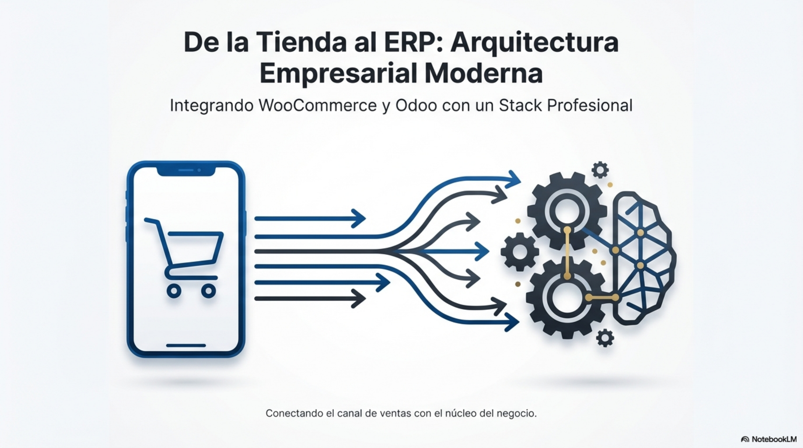
*Figura: idea rectora de la unidad — el canal de ventas (tienda online) se conecta con el núcleo del negocio (ERP). Origen: presentación de diapositivas de la carpeta (diapositiva de título).*

---

## 1. Introducción

El punto de partida es un cambio de perspectiva: una tienda online **no es diseño web, es
una aplicación transaccional** que gestiona procesos de negocio. Sus responsabilidades van
mucho más allá de mostrar un catálogo. Según el material, un sistema de comercio
electrónico gestiona de forma activa:

- **Productos:** catálogos, precios, descripciones y variantes.
- **Clientes:** cuentas de usuario, historiales de compra y datos de contacto.
- **Pedidos:** captura, seguimiento y estado de las órdenes de compra.
- **Pagos:** integración con pasarelas para procesar transacciones.
- **Envíos:** cálculo de costes y gestión de direcciones.
- **Impuestos:** aplicación de las tasas correspondientes según la región.

El mensaje clave se enuncia así: *una tienda online es un sistema de gestión empresarial,
no solo una web bonita*. A partir de ahí, el material construye una arquitectura
conceptual que distingue la "simple tienda" de un verdadero sistema empresarial, y luego
baja al detalle de las herramientas: WordPress y WooCommerce para el canal, Docker para el
entorno de trabajo, e IA como acelerador durante el desarrollo.

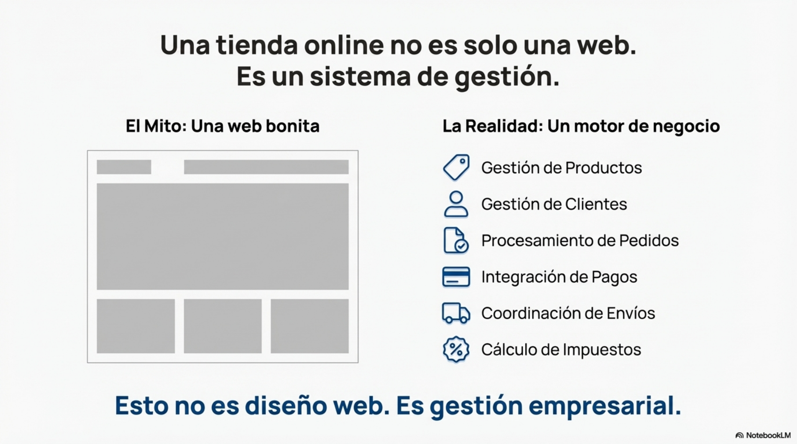
*Figura: contraposición entre la percepción de "web bonita" y la realidad de "motor de gestión". Origen: presentación de diapositivas de la carpeta.*

> **Ejemplo actual — Plataformas más usadas.** En el comercio electrónico actual,
> **WooCommerce** y **Shopify** concentran una parte enorme de las tiendas del mundo. En
> España siguen siendo muy habituales **PrestaShop** (proyecto de origen francés) y, para
> catálogos grandes, **Adobe Commerce** (antes Magento). WooCommerce destaca por ser
> gratuito y muy extensible; Shopify, por ser un servicio en la nube "todo incluido" en el
> que no hay servidor que mantener. Todas resuelven las mismas seis responsabilidades de
> la lista anterior.

> **En las noticias — El comercio electrónico sigue creciendo.** Según los informes
> trimestrales de comercio electrónico que publica la CNMC en España, la facturación ha
> mantenido en los últimos años una tendencia de crecimiento sostenido, moviéndose según
> se ha informado entre los 20.000 y los 25.000 millones de euros por trimestre. El dato
> refuerza la idea de que la tienda online es un canal de negocio serio y no un adorno.

### Ideas clave de esta sección
- Una tienda online es una aplicación transaccional que gestiona procesos de negocio.
- Sus seis áreas de responsabilidad: productos, clientes, pedidos, pagos, envíos e impuestos.
- El resto de la unidad desarrolla las herramientas concretas para construirla y mantenerla.

---

## 2. La arquitectura conceptual: front-office frente a back-office

Para construir sistemas de comercio electrónico robustos, escalables y mantenibles, el
material insiste en una separación estratégica: las operaciones **de cara a la clientela**
y las operaciones **internas del negocio** pertenecen a dominios distintos, cada uno con
su sistema especializado. Esta distinción no es un detalle técnico menor, sino el pilar
sobre el que se asienta toda la arquitectura.

### 2.1. El e-commerce como sistema de gestión empresarial

Retomando la idea de la introducción: la tienda es una aplicación que gestiona procesos
críticos (catálogo, cuentas de cliente, pedidos, cobros, envíos, impuestos). Verla así
cambia las decisiones de diseño: importan la integridad de los datos, la trazabilidad de
cada pedido, la seguridad de los pagos y la capacidad de comunicarse con otros sistemas,
no solo el aspecto visual.

### 2.2. Los dominios: front-office y back-office

La arquitectura profesional separa las funciones en dos dominios claros:

| Dominio | Qué es | Objetivo principal | Tecnología usada como ejemplo |
| --- | --- | --- | --- |
| **Front-office** | Punto de interacción directa con quien compra; el canal por el que se generan las ventas. | Facilitar la compra. | WooCommerce |
| **Back-office** | Sistema maestro que gobierna la operación interna. Gestiona el inventario real, la facturación, la contabilidad y la relación con la clientela (CRM). | Gobernar la operación interna. | Odoo |

El **principio rector** es que debe existir **un único sistema maestro** —el ERP— que sea
la *fuente de verdad* para los datos críticos: stock, clientes y finanzas. La tienda
online es solo uno de los canales que se apoyan en ese maestro; junto a ella pueden
convivir un punto de venta físico, una aplicación móvil o la presencia en *marketplaces*.
Todos escriben contra el mismo núcleo. Enunciado de forma directa: **WooCommerce no
sustituye a Odoo; se integra con Odoo.**

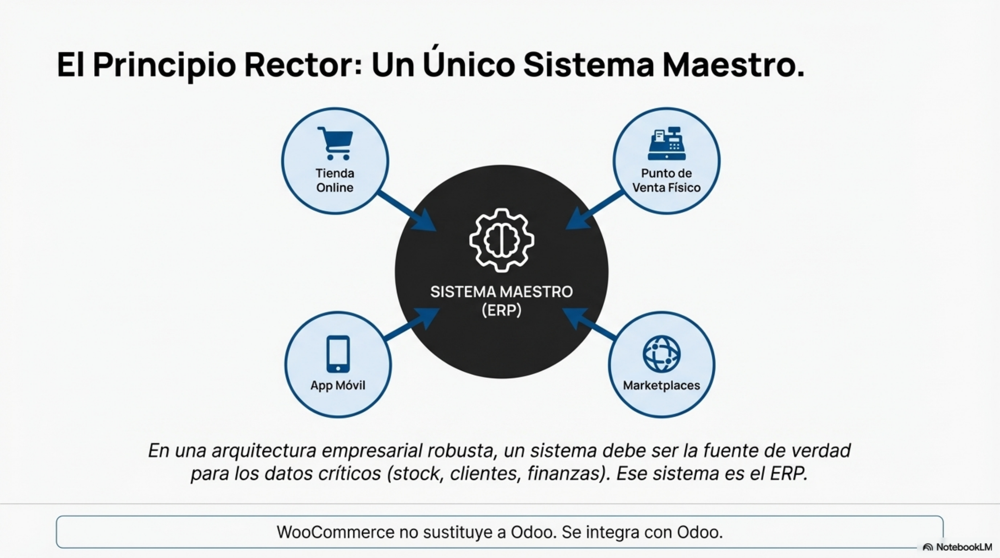
*Figura: el ERP como fuente única de verdad para stock, clientes y finanzas; los canales de venta orbitan a su alrededor. Origen: presentación de diapositivas de la carpeta.*

### 2.3. El flujo de datos: de la venta a la gestión

El valor de esta arquitectura está en la **integración** y el flujo de datos entre ambos
sistemas. Cuando alguien compra, se desencadena un proceso que atraviesa toda la empresa:

1. **Compra de la clientela.** La persona interactúa exclusivamente con el front-office
   (la tienda con WooCommerce): elige productos y finaliza la compra.
2. **Creación del pedido.** Confirmado el pago, la tienda genera un pedido. El material
   subraya una distinción: **pedido ≠ factura**; el pedido es una *intención de compra
   confirmada*, no un documento contable.
3. **Integración con el ERP.** El pedido viaja desde la tienda hasta el sistema central
   (Odoo). Este es el punto neurálgico de la integración entre sistemas: la información
   generada en el canal se transfiere al núcleo del negocio.
4. **Gestión en el ERP.** Odoo recibe el pedido y gobierna el resto: descuenta stock del
   inventario real, gestiona la logística del envío, genera la factura oficial y actualiza
   el CRM.

Para que la comunicación funcione, cada entidad de un sistema debe tener su
**correspondencia** en el otro. La guía lo resume en esta tabla:

| Entidad en WooCommerce | Entidad en Odoo |
| --- | --- |
| Pedido | Sales Order |
| Cliente | Partner |
| Stock (referencial) | Inventory (maestro) |
| Factura (generada) | Accounting |

La distinción importante: WooCommerce maneja un **stock referencial** para el canal de
ventas, pero **Odoo es el maestro** y la única fuente de verdad sobre el inventario real.
Principio arquitectónico: *la tienda dispara el proceso; Odoo lo gobierna*.

La presentación de diapositivas incluye su propia tabla de correspondencia, que no coincide
punto por punto con la de la guía: rotula "Pedido" → "Sales Order", "Cliente Web" →
"Partner", "Producto (Vista)" → "Product / Inventory" y "Stock (Vista)" → "Accounting", y
no recoge la fila de "Factura". Conviene tomar ambas como aproximaciones al mismo mapeo
más que como una lista cerrada.

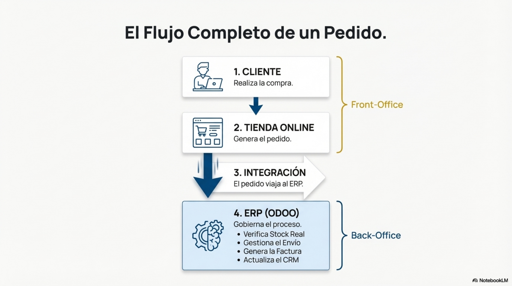
*Figura: recorrido completo de un pedido, con la frontera entre front-office y back-office. Origen: presentación de diapositivas de la carpeta.*

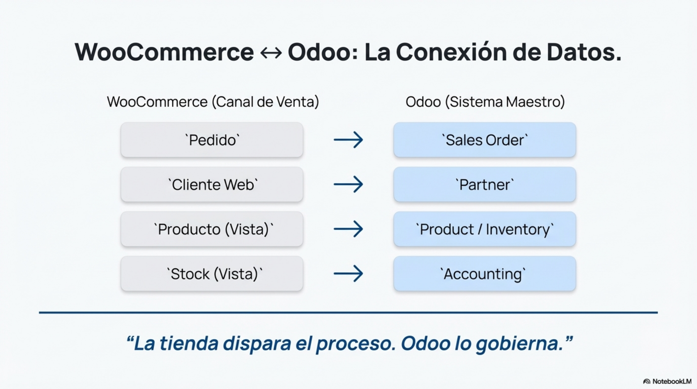
*Figura: mapeo de entidades entre el canal de venta y el sistema maestro. Origen: presentación de diapositivas de la carpeta.*

> **Ejemplo actual — Conectores tienda–ERP.** Las marcas que venden con WooCommerce y
> gestionan el negocio en Odoo, Holded o SAP suelen usar **conectores**: módulos oficiales
> de Odoo, extensiones tipo "WooCommerce Odoo Connector" o plataformas de integración como
> Make o Zapier. Su función es que cada pedido web cree automáticamente el pedido de venta,
> el contacto de cliente y el movimiento de stock en el ERP, sin volver a teclear nada.
> Es la materialización de "la tienda dispara, el ERP gobierna".

> **En las noticias — Ventas concentradas y picos de carga.** Campañas como el Black
> Friday o las rebajas concentran en pocas horas un volumen de pedidos muy superior al
> normal. Cada año se informa de tiendas que se ralentizan o caen durante esos picos. El
> problema casi nunca está en el "diseño" de la web, sino en la capacidad del sistema de
> gestión que hay detrás: base de datos, servidor e integraciones con el ERP y la pasarela
> de pago.

### Ideas clave de esta sección
- Front-office (canal de venta) y back-office (gestión interna) son dominios separados.
- Debe existir un único sistema maestro —el ERP— como fuente de verdad de stock, clientes y finanzas.
- Un pedido es una intención de compra confirmada; la factura la emite el ERP.
- La integración exige una correspondencia explícita entre las entidades de cada sistema.

---

## 3. La pila tecnológica del front-office: WordPress y WooCommerce

Las empresas rara vez construyen su plataforma de comercio electrónico desde cero: el
coste y el tiempo serían prohibitivos. En su lugar se apoyan en **gestores de contenidos
(CMS)** probados y extensibles. El material usa como ejemplo **WordPress**, el más
extendido a nivel mundial, como base sobre la que se levanta la tienda.

### 3.1. Análisis técnico de WordPress

**WordPress es un CMS**: una aplicación web escrita en **PHP** que usa una base de datos
**MySQL o MariaDB** para almacenar toda su información. Su arquitectura interna se entiende
en tres capas:

1. **Core (motor principal).** Gestiona las funcionalidades esenciales: usuarios, roles,
   panel de administración, publicación de contenidos y las **APIs internas** que permiten
   a otros componentes interactuar con el sistema.
2. **Temas (*themes*).** Son la **capa de presentación**: definen la estructura visual, los
   estilos y la apariencia. Principio profesional: **el tema no debe contener lógica de
   negocio**; cambiar de tema no debería romper la tienda.
3. **Plugins.** Son extensiones que añaden funcionalidades concretas **sin alterar el
   código del core**. Un plugin puede modificar o ampliar el comportamiento del sistema
   sin tocarlo. WooCommerce es el ejemplo más relevante aquí.

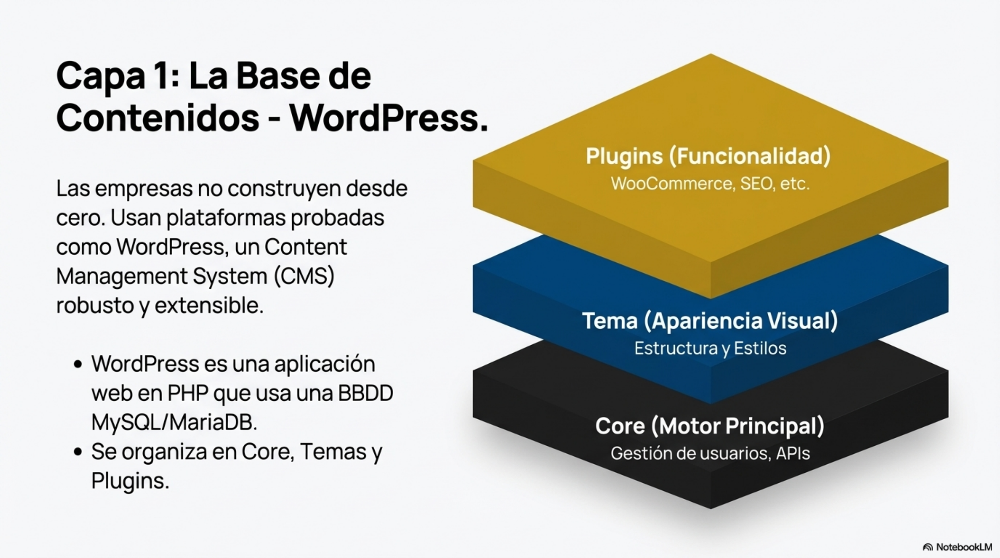
*Figura: las tres capas de WordPress. La lógica de negocio vive en el core y en los plugins, no en el tema. Origen: presentación de diapositivas de la carpeta.*

**Implicación crítica: el modelo de datos.** Una de las decisiones arquitectónicas más
importantes de WordPress es cómo guarda la información. Prácticamente **todo** —entradas de
blog, páginas, productos, pedidos— se almacena en la misma tabla como un tipo genérico
llamado **`post`**. Los detalles específicos de cada elemento se guardan aparte, en una
tabla **`post_meta`**, con un sistema **clave-valor**. Este patrón, conocido como **EAV
(Entity–Attribute–Value)**, es extremadamente flexible, pero puede generar **cuellos de
botella de rendimiento a gran escala**: recuperar información completa exige consultas muy
complejas a la base de datos.

> **En las noticias — WooCommerce y el almacenamiento de pedidos de alto rendimiento.**
> Para mitigar justamente ese problema del modelo `post`/`post_meta`, WooCommerce
> introdujo el **HPOS** (*High-Performance Order Storage*, antes "Custom Order Tables"),
> que guarda los pedidos en **tablas propias** en lugar de la tabla genérica de posts. Se
> fue activando por defecto en las versiones publicadas hacia finales de 2023. Es un caso
> real de cómo una limitación arquitectónica acaba forzando un rediseño del sistema.

### 3.2. WooCommerce: de CMS a plataforma de comercio electrónico

La afirmación central del material es rotunda: **WooCommerce no es una aplicación aparte;
es un plugin que amplía WordPress.** Esta relación tiene consecuencias técnicas profundas.
Al ser un plugin, WooCommerce **hereda todo el entorno de WordPress**, lo bueno y lo malo:

- **Su base de datos.** Productos y pedidos se guardan con el modelo de posts y
  `post_meta`, con sus implicaciones de rendimiento.
- **Su rendimiento.** La velocidad de la tienda está ligada a la de WordPress y a la del
  servidor que lo aloja.
- **Sus vulnerabilidades de seguridad.** Cualquier brecha en el core o en otro plugin
  puede afectar a la tienda.
- **Su ecosistema de plugins.** La tienda puede ampliarse con más plugins, pero eso
  introduce dependencias y posibles conflictos.

De ahí un principio de mantenimiento: **el abuso de plugins es un riesgo empresarial**.
Cada plugin adicional es código de terceros ejecutándose en el sistema, con posibles
problemas de rendimiento, vulnerabilidades, incompatibilidades al actualizar y más
complejidad de mantenimiento. Regla práctica: *pocos plugins bien elegidos suele ser mejor
que muchos*. Corolario: **la salud de la tienda depende de la salud de WordPress**.

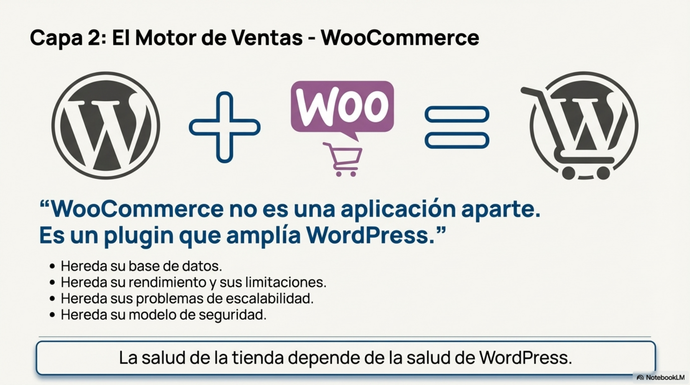
*Figura: WooCommerce como plugin que hereda el entorno completo de WordPress. Origen: presentación de diapositivas de la carpeta.*

> **Ejemplo actual — WooCommerce frente a Shopify.** WooCommerce da control total
> (código, servidor, base de datos, plugins) a cambio de que alguien tenga que
> administrarlo y mantenerlo al día. Shopify ofrece una tienda gestionada por cuota
> mensual: menos control, pero sin servidor ni actualizaciones que vigilar. La elección
> entre "plugin sobre CMS propio" y "SaaS" es una de las primeras decisiones de
> arquitectura de un proyecto de comercio electrónico.

> **En las noticias — Vulnerabilidades en plugins de WordPress.** Empresas de seguridad
> como Wordfence y Patchstack publican periódicamente informes con miles de
> vulnerabilidades detectadas cada año en plugins y temas de WordPress, y alertan de
> campañas de explotación masiva que afectan a tiendas WooCommerce con extensiones sin
> actualizar. Es la confirmación práctica del principio "menos plugins, bien mantenidos".

### Ideas clave de esta sección
- WordPress es un CMS en PHP con base de datos MySQL/MariaDB, organizado en core, temas y plugins.
- El tema es solo presentación; la lógica va en el core y en los plugins.
- WordPress guarda casi todo como `post` + `post_meta` (modelo EAV): flexible, pero pesado a gran escala.
- WooCommerce es un plugin: hereda base de datos, rendimiento, seguridad y ecosistema de WordPress.
- Cada plugin extra es superficie de riesgo; conviene minimizarlos.

---

## 4. El entorno de desarrollo profesional: Docker

Antes de instalar WordPress, el material se detiene en **cómo** se instala. Si cada
persona del equipo monta el software a su manera —distintas versiones de PHP, distintas
configuraciones de base de datos— se llega al clásico *"en mi máquina funciona"*, un
problema inaceptable en empresa. Para que una aplicación se comporte igual en
**desarrollo, pruebas y producción**, la industria utiliza **Docker**.

### 4.1. Fundamentos de Docker

Es habitual confundir Docker con una **máquina virtual (VM)**, pero funcionan de forma
distinta. Analogía del material: una VM es como **alquilar una casa entera**; un contenedor
es como **alquilar una habitación ya amueblada**.

| Característica | Máquina virtual (VM) | Contenedor Docker |
| --- | --- | --- |
| Arquitectura | Emula un hardware completo e instala un sistema operativo invitado completo. | Comparte el kernel del sistema operativo anfitrión y empaqueta solo la aplicación y sus dependencias. |
| Peso | Pesada (varios gigabytes). | Ligero (varios megabytes). |
| Velocidad | Arranque lento (minutos). | Arranque casi instantáneo (segundos). |
| Recursos | Consume una cantidad fija y alta de RAM y CPU. | Consume solo los recursos que la aplicación necesita en cada momento. |

Un **contenedor** es un **entorno de ejecución aislado y portable** que empaqueta una
aplicación junto con todas sus librerías y dependencias, garantizando que funcione igual
donde se ejecute.

Ahora bien, los contenedores son **efímeros por diseño**: se crean y se destruyen con
facilidad. Para no perder datos críticos (la base de datos, los archivos subidos) se usan
**volúmenes**. Un volumen es un mecanismo que **mapea un directorio del anfitrión a un
directorio dentro del contenedor**, dando persistencia a los datos más allá del ciclo de
vida del contenedor. Principio: **el contenedor se puede destruir; los datos no**.

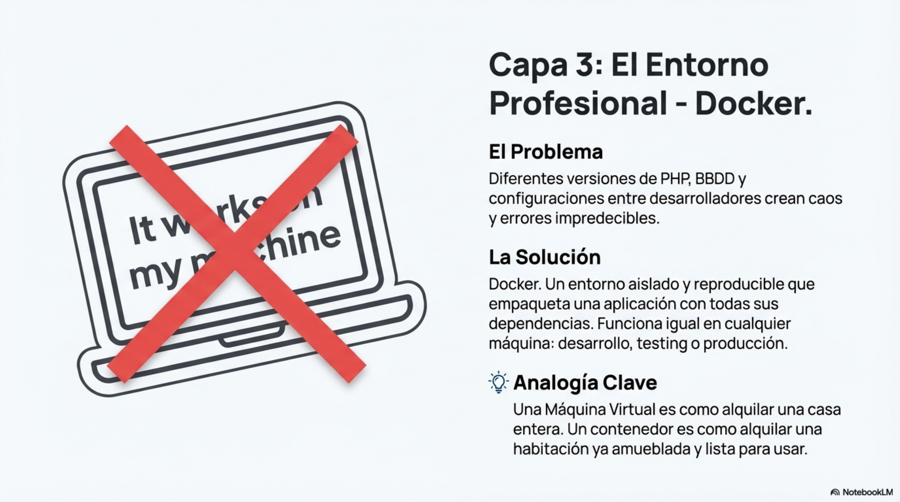
*Figura: por qué Docker sustituye al montaje manual de entornos y en qué se diferencia de una máquina virtual. Origen: presentación de diapositivas de la carpeta.*

### 4.2. Orquestación con docker-compose

Una aplicación real como WordPress **no es un solo componente**: necesita al menos la
aplicación web y una base de datos. Para gestionar aplicaciones formadas por **varios
contenedores** se usa **docker-compose**.

`docker-compose` permite describir y ejecutar aplicaciones multicontenedor con **un único
archivo de configuración en formato YAML**, normalmente llamado **`docker-compose.yml`**.
Ese archivo actúa como el **plano** de la aplicación y define:

- **Servicios:** cada uno de los contenedores que componen la aplicación (por ejemplo, un
  servicio para WordPress y otro para la base de datos MariaDB).
- **Redes:** redes virtuales privadas para que los servicios se comuniquen entre sí de
  forma segura.
- **Volúmenes:** los puntos de montaje que garantizan la persistencia de los datos.

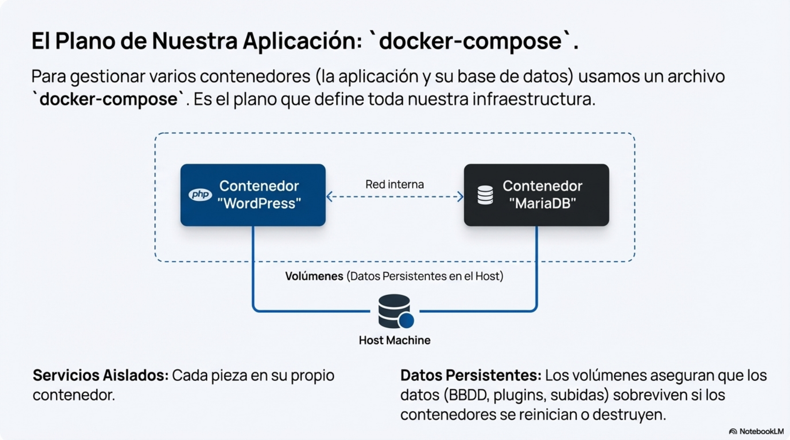
*Figura: estructura típica de un docker-compose para una tienda — dos servicios, una red interna y volúmenes para persistir base de datos y contenidos. Origen: presentación de diapositivas de la carpeta.*

> **Ejemplo actual — Un entorno local en un comando.** Un equipo que mantiene una tienda
> WooCommerce guarda en el repositorio un `docker-compose.yml` con los servicios
> `wordpress` y `db` (MariaDB o MySQL), y a veces `phpmyadmin` o `redis`. Cualquier
> persona nueva clona el repositorio, ejecuta un único comando y tiene la tienda
> funcionando en minutos, con **la misma versión de PHP que producción**. Eso elimina el
> "en mi máquina funciona".

> **En las noticias — Cambios en Docker Hub.** Docker ha ido ajustando los límites de
> descarga de imágenes para cuentas anónimas y gratuitas. Según se ha informado, esto ha
> empujado a las empresas a usar registros propios o de pago y, sobre todo, a **fijar
> versiones concretas** de las imágenes en lugar de depender de la etiqueta `latest`.

### Ideas clave de esta sección
- Docker estandariza el entorno para que sea idéntico en desarrollo, pruebas y producción.
- Un contenedor comparte el kernel del anfitrión; es ligero y arranca en segundos, a diferencia de una VM.
- Los contenedores son efímeros; los volúmenes dan persistencia a los datos.
- `docker-compose.yml` (YAML) es el plano: define servicios, redes y volúmenes de una aplicación multicontenedor.

---

## 5. Taller práctico: infraestructura como código con ayuda de IA

Este bloque pasa de la teoría a la práctica: construir desde cero el entorno de desarrollo
descrito, pero **generando la configuración con una herramienta de inteligencia
artificial** usada como "copiloto de infraestructura". El material lo plantea como reflejo
de una práctica cada vez más común en equipos de desarrollo, donde la IA acelera tareas
repetitivas para que las personas se centren en problemas de mayor nivel.

### 5.1. Planteamiento del taller

En lugar de proporcionar el código final, el material enseña a **generarlo, entenderlo,
desplegarlo y auditarlo**. El objetivo concreto: un entorno con **WordPress conectado a
MariaDB**, con **persistencia de datos** y accesible en el navegador en
**`http://localhost:8080`**.

### 5.2. Normas para el uso profesional de la IA

El material fija tres principios de obligado cumplimiento, no sugerencias:

1. **La IA es una herramienta, no piensa por quien la usa.** Genera código a partir de
   patrones; la estrategia, la arquitectura y la lógica son responsabilidad de la persona.
2. **Hay que entender cada línea de código generado.** Si no se puede explicar qué hace
   una línea de configuración o por qué está ahí, esa línea no es válida.
3. **La responsabilidad final es de quien desarrolla.** Si el sistema falla, se despliega
   con una vulnerabilidad o no cumple los requisitos, responde la persona, no la
   herramienta.

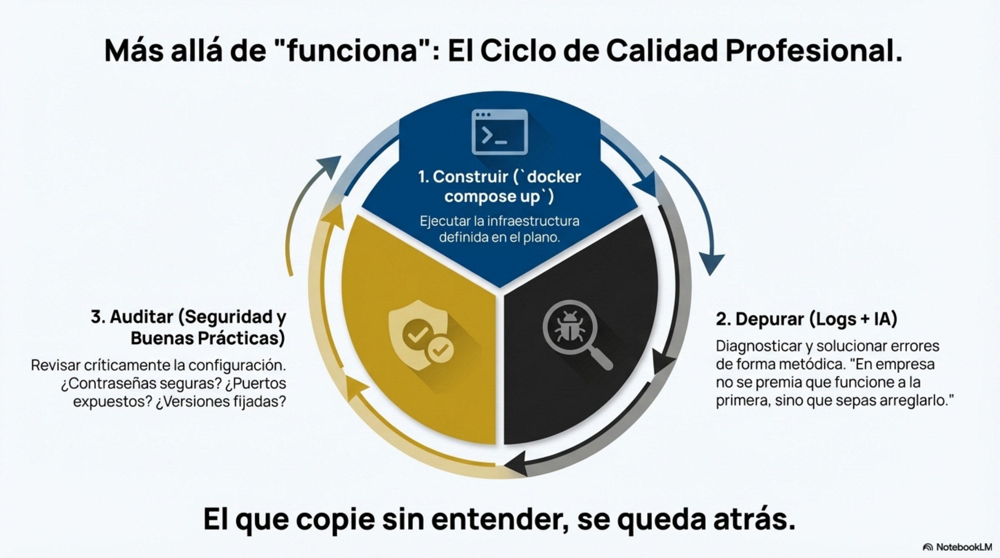
*Figura: el ciclo de calidad profesional — construir, depurar y auditar — con la IA como asistente en cada fase. Origen: presentación de diapositivas de la carpeta.*

### 5.3. Paso 1: generación del archivo docker-compose.yml

El material propone pedir a la herramienta de IA un `docker-compose.yml` que levante
WordPress con MariaDB. El *prompt* de ejemplo que da la guía, resumido, es:

> Actúa como perfil DevOps sénior. Genera un `docker-compose.yml` para WordPress + MariaDB.
> Requisitos: WordPress accesible en `http://localhost:8080`; base de datos MariaDB;
> volúmenes para la base de datos y para `wp-content`; variables de entorno correctas;
> `depends_on` entre servicios; comentarios explicativos en el archivo. Devuelve solo el
> `docker-compose.yml` y una breve explicación.

Principio asociado: **la calidad del resultado depende mucho de la calidad del prompt**
(ser específico, indicar rol, requisitos y formato de salida).

### 5.4. Paso 2: ejecución y depuración

Los pasos que describe el material:

1. Copiar la salida de la IA y guardarla en un archivo `docker-compose.yml` en el
   directorio de trabajo.
2. Abrir una terminal en ese directorio y levantar los servicios en segundo plano.
3. Si el arranque falla —algo probable—, **leer los logs de error** y usar la IA como
   asistente de depuración, con un prompt del tipo: *"Este es mi `docker-compose.yml` y
   este es el error del log. Identifica la causa raíz y dime el cambio mínimo para
   solucionarlo."*

Mentalidad que subraya el material: *en empresa no se premia que funcione a la primera,
sino saber arreglarlo*. La depuración —leer logs, aislar la causa raíz, aplicar el cambio
mínimo— es una habilidad central.

### 5.5. Paso 3: auditoría técnica del entorno

Con el entorno ya funcionando, el trabajo no termina: hay que revisarlo con mirada de
**auditoría técnica**. El material propone pedir a la IA que revise el mismo archivo que
generó (*"Audita este `docker-compose.yml`. Detecta riesgos técnicos y propón mejoras
concretas."*). Problemas habituales que debería sacar a la luz:

- **Credenciales inseguras:** contraseñas escritas directamente en el archivo.
- **Puertos de la base de datos expuestos** públicamente a la máquina anfitriona.
- **Falta de políticas de reinicio automático** (`restart: always`) para que los servicios
  se recuperen tras un fallo.
- **Versiones de imágenes no fijadas:** usar `wordpress:latest` en lugar de una versión
  concreta como `wordpress:6.4`.

### 5.6. Cierre del taller

Con la infraestructura desplegada y auditada queda sentada la base sobre la que opera el
negocio. La guía anticipa como continuación natural instalar WooCommerce, crear productos
reales y preparar la integración con el ERP.

> **Ejemplo actual — Generar y auditar infraestructura con IA.** Asistentes como GitHub
> Copilot, ChatGPT o Claude se usan a diario para redactar borradores de
> `docker-compose.yml`, `Dockerfile` o configuraciones de Nginx. El flujo profesional es
> el mismo que describe el material: pedir el borrador, revisarlo línea a línea, probarlo
> y después pedir una auditoría de seguridad del propio archivo.

> **En las noticias — IA generativa y seguridad de la configuración.** Diversos análisis
> de los últimos años advierten de que el código de infraestructura sugerido por
> asistentes de IA **reproduce con frecuencia malas prácticas** presentes en los datos con
> los que se entrenaron: contraseñas por defecto, puertos abiertos, imágenes sin versión
> fijada. Es la razón por la que la revisión humana y la auditoría posterior son
> imprescindibles.

### Ideas clave de esta sección
- La IA genera borradores; la arquitectura, la validación y la responsabilidad son de la persona.
- Regla firme: no se acepta ninguna línea de configuración que no se pueda explicar.
- Un buen prompt indica rol, requisitos concretos y formato de salida.
- Depurar es leer logs, encontrar la causa raíz y aplicar el cambio mínimo.
- La auditoría busca credenciales expuestas, puertos abiertos, ausencia de `restart` y versiones sin fijar.

---

## 6. Visión de sistema y rol profesional

El material cierra recordando que lo construido no es "una instalación de WordPress", sino
la base de una **arquitectura de comercio electrónico profesional**, donde la
infraestructura (Docker) y la plataforma de ventas (WordPress/WooCommerce) no son fines en
sí mismos, sino **componentes de un SGE mayor cuyo centro es el ERP**.

### 6.1. Síntesis del ecosistema tecnológico

Cada pieza tiene un papel definido:

- **WordPress:** el CMS que sirve de base técnica y de gestión de contenido.
- **WooCommerce:** el plugin que transforma el CMS en un canal de ventas activo (el
  front-office).
- **Docker:** la herramienta que garantiza un entorno de desarrollo aislado, reproducible
  y consistente.
- **Odoo:** el sistema maestro (back-office) que centraliza y gobierna la gestión real del
  negocio: inventario, facturación, clientes y procesos internos.
- **IA:** un acelerador técnico y copiloto que, usado con criterio, aumenta la
  productividad y la velocidad de desarrollo.

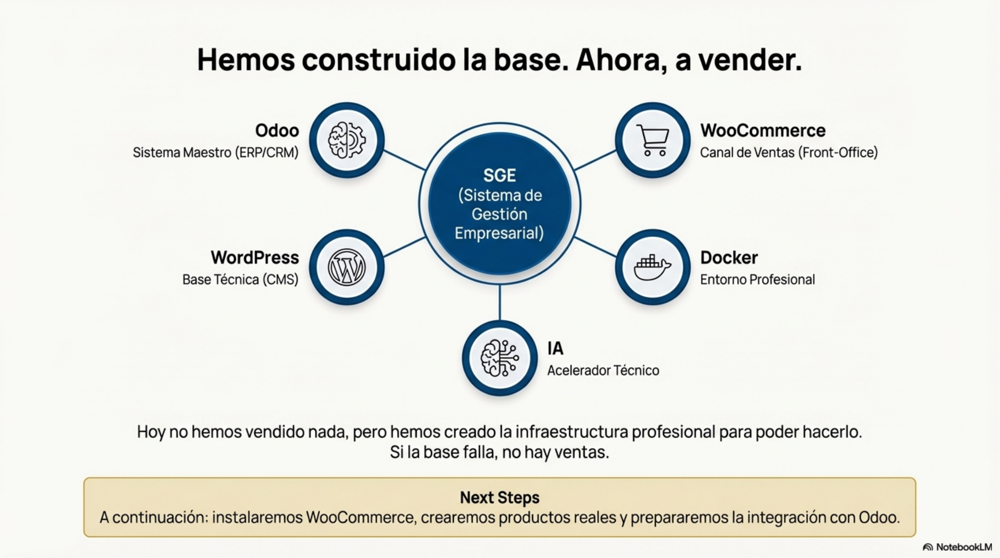
*Figura: las cinco piezas del ecosistema y su relación con el Sistema de Gestión Empresarial. Origen: presentación de diapositivas de la carpeta.*

### 6.2. El rol profesional en la empresa

El material describe estas tareas como lo que hace habitualmente un perfil junior en
muchas empresas: **montar entornos de desarrollo, mantener aplicaciones existentes, depurar
errores leyendo logs y revisar configuraciones**. El valor no está en la capacidad de
generar código, sino en la de **dirigir la herramienta y validar críticamente sus
resultados**. Mensaje final del material: quien sabe usar IA y entiende lo que genera va un
paso por delante; quien copia sin entender se queda atrás.

> **Ejemplo actual — Pasarelas de pago en una tienda española.** Una tienda típica en
> España integra **Redsys** (el sistema que usan la mayoría de bancos españoles) y, con
> frecuencia, **PayPal**, **Bizum**, **Stripe** o financiación tipo Klarna o SeQura. Cada
> pasarela confirma el pago y devuelve a la tienda la señal para crear el pedido: es
> exactamente el punto donde arranca el flujo hacia el ERP descrito en la sección 2.

> **En las noticias — Autenticación reforzada y seguridad de los pagos.** La normativa
> europea de servicios de pago (PSD2) exige **autenticación reforzada de cliente (SCA)**
> en las compras online, que las pasarelas implementan mediante 3-D Secure 2 (habitualmente
> una confirmación adicional del banco). En paralelo, el estándar **PCI DSS 4.0** ha ido
> entrando en vigor para el tratamiento de datos de tarjeta. Ambos afectan directamente al
> diseño del proceso de compra y a las integraciones de una tienda.

### Ideas clave de esta sección
- El objetivo real es un SGE con el ERP en el centro; tienda, CMS y contenedores son componentes.
- WordPress (base), WooCommerce (canal), Docker (entorno), Odoo (maestro), IA (acelerador).
- El perfil técnico aporta valor dirigiendo y validando herramientas, no solo produciendo código.

---

## Glosario rápido

| Término | En una frase |
| --- | --- |
| SGE / SGE empresarial | Sistema de Gestión Empresarial: conjunto integrado de aplicaciones (ERP, CRM, canales de venta) que gobierna los procesos de una empresa. |
| Comercio electrónico (e-commerce) | Aplicación transaccional que vende productos o servicios y gestiona catálogo, clientes, pedidos, pagos, envíos e impuestos. |
| Front-office | Dominio de cara a la clientela; el canal por el que se generan las ventas (la tienda online). |
| Back-office | Dominio interno; el sistema maestro que gestiona inventario real, facturación, contabilidad y CRM (el ERP). |
| ERP | Sistema que integra la gestión interna de la empresa; en el material, la fuente única de verdad para stock, clientes y finanzas. |
| CRM | Gestión de la relación con la clientela; función incluida en el back-office. |
| Fuente de verdad | Sistema que se considera autoridad sobre un dato; para stock, clientes y finanzas es el ERP. |
| Pedido | Intención de compra confirmada; no es un documento contable. |
| Factura | Documento contable oficial; en esta arquitectura la genera el ERP, no la tienda. |
| Integración | Comunicación automática entre sistemas para que las entidades de uno tengan correspondencia en el otro. |
| CMS | Gestor de contenidos: aplicación web para crear y administrar un sitio sin programarlo desde cero (ejemplo: WordPress). |
| Core (WordPress) | Motor del CMS: usuarios, roles, panel de administración, publicación y APIs internas. |
| Tema (*theme*) | Capa de presentación de WordPress: estructura visual y estilos; sin lógica de negocio. |
| Plugin | Extensión que añade funcionalidad sin modificar el código del core (ejemplo: WooCommerce). |
| WooCommerce | Plugin que convierte WordPress en tienda online; hereda su base de datos, rendimiento y seguridad. |
| `post` / `post_meta` | Tablas donde WordPress guarda casi todo: el elemento genérico y sus atributos clave-valor. |
| EAV (Entity–Attribute–Value) | Modelo de datos muy flexible basado en pares atributo-valor; costoso en consultas a gran escala. |
| Docker | Plataforma de contenedores para ejecutar aplicaciones de forma aislada, portable y reproducible. |
| Contenedor | Entorno de ejecución aislado que empaqueta una aplicación con sus dependencias y comparte el kernel del anfitrión. |
| Máquina virtual (VM) | Emulación de un ordenador completo con su propio sistema operativo invitado; más pesada y lenta que un contenedor. |
| Imagen | Plantilla de solo lectura a partir de la cual se crean contenedores; se referencia con nombre y versión (`wordpress:6.4`), y el taller recomienda fijar esa versión en lugar de `latest`. |
| Volumen | Mecanismo que mapea un directorio del anfitrión dentro del contenedor para dar persistencia a los datos. |
| Efímero | Que se crea y se destruye con facilidad y sin conservar estado; así son los contenedores por diseño. |
| `docker-compose` | Herramienta que define y ejecuta aplicaciones multicontenedor con un archivo YAML. |
| `docker-compose.yml` | Archivo YAML que actúa de plano: declara servicios, redes y volúmenes. |
| Servicio (compose) | Cada contenedor definido en el archivo compose (por ejemplo, `wordpress` y `db`). |
| `depends_on` | Directiva de Compose, exigida en el `docker-compose.yml` del taller, que declara que un servicio necesita otro; su efecto es condicionar el orden de arranque. |
| `restart: always` | Política que reinicia un contenedor automáticamente si se detiene por un fallo. |
| Entornos (desarrollo / pruebas / producción) | Copias equivalentes del sistema para desarrollar, validar y explotar; Docker busca que se comporten igual. |
| Prompt | Instrucción que se da a una herramienta de IA; su calidad condiciona la del resultado. |
| Auditoría técnica | Revisión crítica de una configuración para detectar riesgos (credenciales, puertos, versiones, reinicios). |
| Pasarela de pago | Servicio que procesa el cobro y devuelve a la tienda la confirmación que dispara la creación del pedido. |

## Preguntas de repaso

1. ¿Por qué se afirma que una tienda online es un sistema de gestión y no "una web bonita"? Enumera sus áreas de responsabilidad.
2. Diferencia front-office y back-office e indica qué sistema actúa como fuente de verdad y para qué datos.
3. Describe los cuatro pasos del flujo de un pedido, desde la compra hasta la factura.
4. ¿Qué significa "pedido ≠ factura" en esta arquitectura?
5. Completa la correspondencia: Pedido → …, Cliente → …, Stock referencial → …, Factura → … (en el ERP de ejemplo).
6. ¿Cuáles son las tres capas de WordPress y qué responsabilidad tiene cada una?
7. ¿Por qué el tema no debe contener lógica de negocio?
8. Explica el modelo `post` / `post_meta` (EAV) y su principal inconveniente a gran escala.
9. ¿Qué quiere decir que "WooCommerce es un plugin, no una aplicación aparte" y qué hereda de WordPress?
10. ¿Por qué el abuso de plugins es un riesgo empresarial?
11. Enumera tres diferencias entre una máquina virtual y un contenedor Docker.
12. ¿Qué son los volúmenes y qué problema resuelven?
13. ¿Qué define un archivo `docker-compose.yml` y en qué formato está escrito?
14. Enumera las tres normas para el uso profesional de la IA que fija el material.
15. Cita cuatro riesgos habituales que debería detectar una auditoría de un `docker-compose.yml`.
16. Según el material, ¿en qué reside el valor profesional al trabajar con IA?

Respuestas

1. Porque gestiona procesos de negocio, no solo presentación. Áreas: productos, clientes, pedidos, pagos, envíos e impuestos (sección 1).
2. El front-office es el canal de venta de cara a la clientela; el back-office es la gestión interna. La fuente de verdad es el ERP, para stock, clientes y finanzas (sección 2.2).
3. Compra de la clientela en la tienda; creación del pedido tras confirmar el pago; integración: el pedido viaja al ERP; gestión en el ERP: descuenta stock, gestiona envío, genera factura y actualiza el CRM (sección 2.3).
4. Que el pedido es una intención de compra confirmada, no un documento contable; la factura la emite el ERP (sección 2.3).
5. Sales Order; Partner; Inventory (maestro); Accounting (sección 2.3).
6. Core (funcionalidades esenciales: usuarios, roles, panel, publicación, APIs internas), Temas (presentación: estructura y estilos) y Plugins (funcionalidades añadidas sin tocar el core) (sección 3.1).
7. Para que cambiar de aspecto no rompa la tienda: la lógica vive en el core y en los plugins (sección 3.1).
8. Casi todo se guarda como `post` y sus atributos en `post_meta` con pares clave-valor (EAV); es muy flexible, pero recuperar información completa exige consultas complejas y puede crear cuellos de botella de rendimiento a gran escala (sección 3.1).
9. Que se ejecuta dentro de WordPress y hereda su base de datos (posts/`post_meta`), su rendimiento, sus vulnerabilidades de seguridad y su ecosistema de plugins (sección 3.2).
10. Cada plugin es código de terceros ejecutándose en el sistema: añade posibles fallos de rendimiento, vulnerabilidades, incompatibilidades al actualizar y complejidad de mantenimiento (sección 3.2).
11. La VM emula hardware completo con SO invitado; el contenedor comparte el kernel del anfitrión. La VM pesa gigabytes y arranca en minutos; el contenedor pesa megabytes y arranca en segundos. La VM reserva RAM/CPU fijas; el contenedor consume solo lo necesario (sección 4.1).
12. Mecanismos que mapean un directorio del anfitrión dentro del contenedor; dan persistencia a los datos porque los contenedores son efímeros (sección 4.1).
13. Los servicios (contenedores), las redes y los volúmenes de una aplicación multicontenedor; está en formato YAML (sección 4.2).
14. La IA es una herramienta y no piensa por la persona; hay que entender cada línea generada; la responsabilidad final es de quien desarrolla (sección 5.2).
15. Credenciales inseguras en el archivo; puertos de la base de datos expuestos al anfitrión; falta de `restart: always`; versiones de imagen no fijadas (`latest` en vez de una versión concreta) (sección 5.5).
16. En dirigir la herramienta y validar críticamente sus resultados, no en producir código (sección 6.2).

## Bibliografía y fuentes

- *De la tienda al ERP: arquitectura empresarial moderna. Integrando WooCommerce y Odoo con un stack profesional* [Diapositivas]. (s. f.). Departamento de Informática, IES Puerto de la Cruz – Telesforo Bravo.
- *Utilización de herramientas para la creación y mantenimientos de una tienda online* (Tema 6) [Apuntes del módulo Sistemas de Gestión Empresarial]. (s. f.). Departamento de Informática, IES Puerto de la Cruz – Telesforo Bravo.
